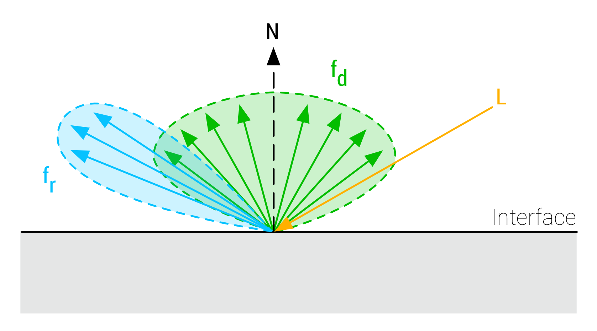
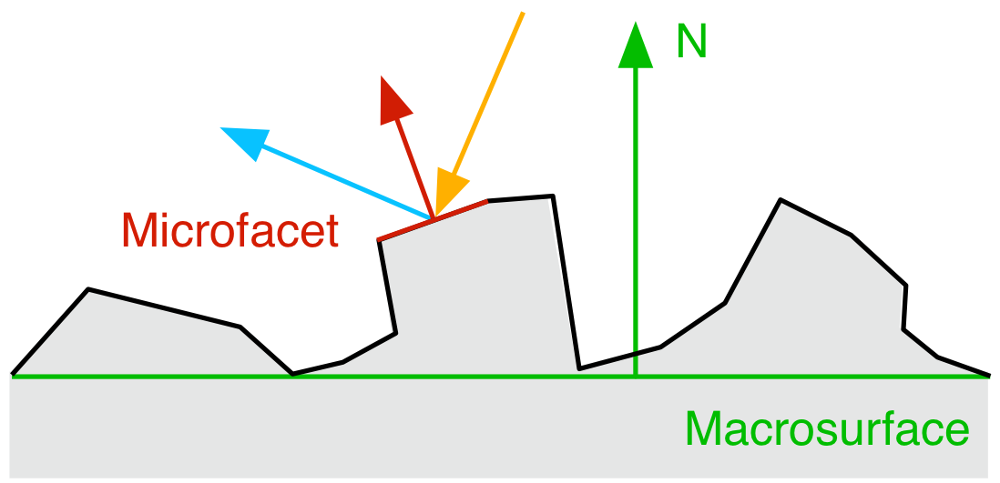
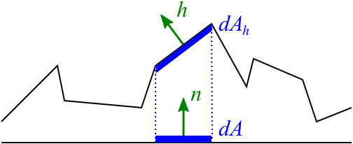
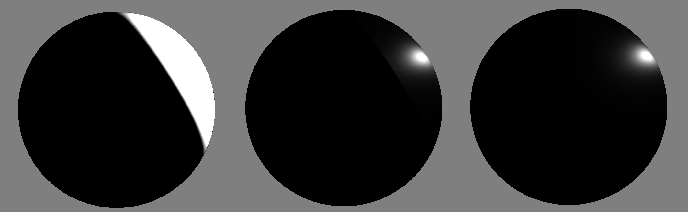
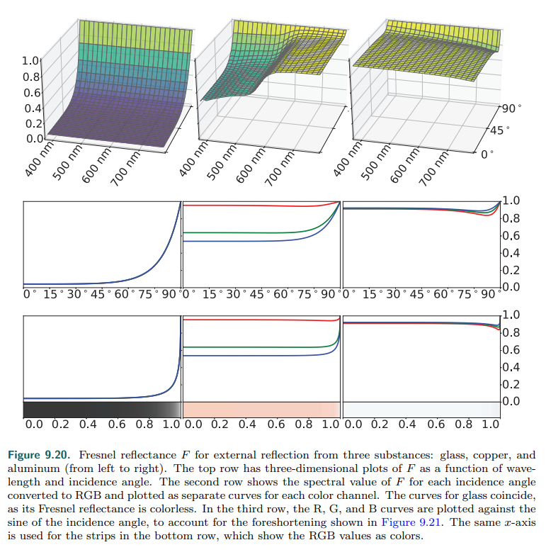
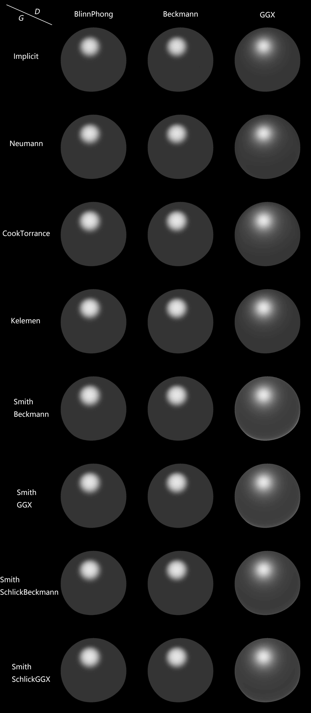

BRDF公式参考
# 摘要
本文将介绍几种渲染中常用的BRDF公式，包括Diffuse和Specular，以及相关理论。
# 理论介绍
## BRDF
BRDF(Bidirectional Reflectance Distribution Function)表示的是出射光线的辐射率radiance与入射光线的辐照度irradiance之间的比值，公式为：
$$
f({\bf{l}},{\bf{v}})=\frac{dL_o({\bf{v}})}{dE({\bf{l}})}
$$
其中，${\bf{v}}$表示视角方向，即出射光线方向，${\bf{l}}$表示入射光线方向。有一个很常被问到的问题是，为什么BRDF是radiance与irradiance的比值，而不是radiance比radiance或者irradiance？这里给出一个我个人觉得比较合理的解释，那就是BRDF的定义来自于渲染方程（没错又是渲染方程），其单位自然取决于渲染方程需要的单位。 我们先看一下渲染方程是怎么写的：
$$
L_o({\bf{v}})=\int_\Omega f({\bf{l}},{\bf{v}})\otimes L_i({\bf{l}})\cos\theta_id\omega_i
$$
左边是出射光线的radiance，右边积分里面分别是BRDF、入射光线radiance、cosine角度，然后对立体角进行积分。radiance的单位是$W/m^2sr$，irradiance的单位是$W/m^2$那么BRDF的单位就是radiance/(radiance*立体角) = radiance/irradiance，即$sr^{-1}$。

闲话少说。在光栅化渲染中，对BRDF的近似通常是将其分解为两部分：

- diffuse部分，记为$f_d$
- specular部分，记为$f_s$

这里为了行文通顺，就不采用中文译名漫反射、高光了，直接用英语。这两个分量的示意图如下：



diffuse表示对各个方向均匀反射的光线部分，specular表示遵循反射定律朝特定方向反射的光线部分。二者的物理意义不同，计算起来也非常不一样。

但是实际上，diffuse和specular仅仅是对真实物体的近似。物理上，光线打在物体表面，只会有两种物理现象——反射和折射。反射部分就是specular，这个比较好理解。折射部分则进入了物体内部，经过在物体内部的多次反射，最终在距离入射点一定距离的地方折射出物体，此时出射光线的方向近似随机的，也就是diffuse部分。


顺便一提，这种光线折射进入物体表面多次反射最终折射出去的现象，称为次表面散射。用diffuse来近似次表面散射现象的方法是比较“偷懒”的，但是也是比较高效的。完整的次表面散射算法可以用来模拟皮肤的通透效果，但是也会复杂得多。

再说回diffuse部分。这里就可以引入金属conductor和介电质dielectric的一个不同了。conductor是没有次表面散射现象的，也就是没有diffuse分量。但是dielectric有。通常我们可以用`metallic`来表示物体的金属性，后面会提到怎么用它来控制diffuse和specular分量。

## 微表面理论
现实世界中的表面通常不是平整的——至少不是物理意义上的绝对平整，而是有微小的起伏的。既然不是绝对平整，那么specular也不会完美地遵循反射定律。为了表示这种粗糙的表面，就有了微表面理论（microfacet theory）。微表面理论是说，承认宏观层面平整的表面在微观层面会有起伏，这些起伏使得微观层面的法向不完全等于宏观层面表现出来的法向，同时还会存在一定程度的自遮挡（如下图）。为了表示这种微观层面的不平整，我们使用粗糙度roughness和概率函数来表示微观层面的法向分布。



基于微表面理论的BRDF函数表示为：
$$
f_x({\bf{l}},{\bf{v}}) = \frac{1}{\mid{\bf{n}}\cdot{\bf{v}}\mid\mid{\bf{n}}\cdot{\bf{l}}\mid}\int_\Omega D({\bf{m}},\alpha)G({\bf{v}},{\bf{l}},{\bf{m}})f_m({\bf{v}},{\bf{l}},{\bf{m}})({\bf{v}}\cdot{\bf{m}})({\bf{l}}\cdot{\bf{m}})d{\bf{m}}
$$
其中，${\bf{n}}$表示该点的（宏观）法向方向，$f_x$既可以表示diffuse分量，也可以表示specular分量，二者的差别在于$f_m$的选取。

$D$表示微表面分布，或者称为法向分布函数（NDF，normal distribution function）。

$G$表示微表面的可见性，visibility或shadow-masking。

$D$和$G$的详细介绍放在后面讲specular的时候一起说。接下来就具体看一下对于diffuse和specular，BRDF的具体形式，以及对应的shader实现。

# Specular BRDF
对于specular分量来说，$f_m$是一个遵循菲涅尔反射定律的镜面BRDF项，因此$f_r$可以写为：
$$
f_r({\bf{l}},{\bf{v}}) = \frac{D({\bf{h}},\alpha)G({\bf{v}},{\bf{l}},\alpha)F({\bf{v}},{\bf{h}},F_0)}{4({\bf{n}}\cdot{\bf{v}})({\bf{n}}\cdot{\bf{l}})}
$$
其中，$\alpha$取决于我们前面提到的粗糙度roughness，具体为
$$
\alpha = roughness^2
$$
$\alpha$将多次被用到。

${\bf{h}}$表示half vector，是${\bf{v}}$和${\bf{l}}$的平均。

$F_0$会在后面详细介绍。

shader实现：
```
// N     = normal;
// V     = normalize(camPos - WorldPos);
// L     = normalize(LightPos - WorldPos));
// H     = normalize(V + L);
// NdotV = saturate(dot(N, V));
// NdotL = saturate(dot(N, L));
// NdotH = saturate(dot(N, H));
// LdotH = saturate(dot(L, H));
// VdotH = saturate(dot(V, H));
vec3 SpecularBRDF(float NdotV, float NdotL, float NdotH, float LdotH, float VdotH, vec3 F0, float roughness) {
    float r   = roughness * roughness;

    float D = Distribution(NdotH, r);
    float V = Geometry(NdotV, NdotL, r);
    vec3  F = Fresnel(VdotH, F0);

    return D * V * F / (4 * NdotV * NdotL);
}
```

接下来具体看$f_r$中每个分量的可能形式都有哪些。
## 法向分布函数 D
法向分布函数$D$描述的是法向的分布概率，既然是概率分布，那么第一反应是$D$应该满足：
$$
\int_\Omega D({\bf{h}})d\omega_h = 1
$$
但是真的是这样的吗？我们仔细推导一下。



如上图所示，假设宏观表面$A$的法向为${\bf{n}}$，微观表面$A_h$的法向为${\bf{h}}$，从微观层面，有：
$$
dA=({\bf{n}}\cdot{\bf{h}})dA_h
$$
另一方面，由于D描述的是微观表面的法向分布，那么微观上朝向为${\bf{h}}$的法向的概率应该是$D({\bf{h}})\omega_h$，那么在面积为$A$的表面，有：
$$
dA_h=D({\bf{h}})d\omega_hA
$$
以上两式放在一起，可以得到：
$$
dA=A\cdot D({\bf{h}})({\bf{n}}\cdot{\bf{h}})d\omega_h
$$
两边积分，有
$$
\int_A dA = A\int D({\bf{h}})({\bf{n}}\cdot{\bf{h}})d\omega_h \\
1 = \int D({\bf{h}})({\bf{n}}\cdot{\bf{h}})d\omega_h
$$
注意，这里的${\bf{h}}$不是BRDF里面常用的half vector，而是表示微表面的法向。记住这个积分等式，我们来看一下有哪些常用的$D$。
### BlinnPhong
来源[6]，公式：
$$
D_{Blinn}({\bf{h}}, \alpha) = \frac{1}{\pi\alpha^2}({\bf{n}}\cdot{\bf{h}})^{(\frac{2}{\alpha^2} - 2)}
$$
shader实现：
```
float DistributionBlinnPhong(float NdotH, float r) {
    float a = r * r;
    return pow(NdotH, 2.0 / a - 2.0) / (PI * a);
}
```
### Beckmann
来源[5]，公式：
$$
D_{Beckmann}({\bf{h}}, \alpha) = \frac{1}{\pi\alpha^2({\bf{n}}\cdot{\bf{h}})^4}e^{\frac{({\bf{n}}\cdot{\bf{h}})^2-1}{\alpha^2({\bf{n}}\cdot{\bf{h}})^2}}
$$
shader实现：
```
float DistributionBeckmann(float NdotH, float r) {
    float NdotH2   = NdotH * NdotH;
    float r2       = r * r;
    float r2NdotH2 = r2 * NdotH2;
    return exp((NdotH2 - 1) / (r2NdotH2)) / (PI * r2NdotH2 * NdotH2);
}
```
### GGX
来源[3]，公式：
$$
D_{GGX}({\bf{h}}, \alpha) = \frac{\alpha^2}{\pi(({\bf{n}}\cdot{\bf{h}})^2(\alpha^2-1)+1)^2}
$$
shader实现：
```
float DistributionGGX(float NdotH, float r) {
    float a2     = r * r;
    float NdotH2 = NdotH * NdotH;
    float nom    = a2;
    float denom  = (NdotH2 * (a2 - 1.0) + 1.0);
    denom        = PI * denom * denom;
    return nom / max(denom, 0.001);
}
```
其中，前两个公式提出的都比较早，差异不大。$D_{GGX}$相较于前两者运算压力更小，也更平滑。
## 遮挡项 G
遮挡项是用来描述微表面理论的遮挡现象，注意这个遮挡是微观表面的，不是宏观层面的阴影。
### Implicit
来源[7]，公式：
$$
G_{Implicit}({\bf{l}},{\bf{v}},{\bf{h}})=({\bf{n}}\cdot{\bf{l}})({\bf{n}}\cdot{\bf{v}})
$$
shader实现：
```
float GeometryImplicit(float NdotV, float NdotL) {
    return NdotL * NdotV;
}
```
### Neumann
来源[8]，公式：
$$
G_{Neumann}({\bf{l}},{\bf{v}},{\bf{h}})=\frac{({\bf{n}}\cdot{\bf{l}})({\bf{n}}\cdot{\bf{v}})}{\max{({\bf{n}}\cdot{\bf{l}}, {\bf{n}}\cdot{\bf{v}}})}
$$
shader实现：
```
float GeometryNeumann(float NdotV, float NdotL) {
    return (NdotL * NdotV) / max(NdotL, NdotV);
}
```
### Cook-Torrance
来源[9]，公式：
$$
G_{Cook-Torrance}({\bf{l}},{\bf{v}},{\bf{h}})=\min{\left(1, \frac{2({\bf{n}}\cdot{\bf{h}})({\bf{n}}\cdot{\bf{v}})}{{\bf{v}}\cdot{\bf{h}}}, \frac{2({\bf{n}}\cdot{\bf{h}})({\bf{n}}\cdot{\bf{l}})}{{\bf{v}}\cdot{\bf{h}}}\right)}
$$
shader实现：
```
float GeometryCookTorrance(float NdotV, float NdotL, float VdotH, float NdotH) {
    float ct1 = 2 * NdotH * NdotV / VdotH;
    float ct2 = 2 * NdotH * NdotL / VdotH;
    return min(1, min(ct1, ct2));
}
```
### Kelemen
来源[10]，公式：
$$
G_{Neumann}({\bf{l}},{\bf{v}},{\bf{h}})=\frac{({\bf{n}}\cdot{\bf{l}})({\bf{n}}\cdot{\bf{v}})}{({\bf{v}}\cdot{\bf{h}})^2}
$$
shader实现：
```
float GeometryKelemen(float NdotV, float NdotL, float VdotH) {
    return NdotV * NdotL / (VdotH * VdotH);
}
```
### Smith
还有四种使用Smith公式[13]的方法，都是类似的形式：
$$
G({\bf{l}},{\bf{v}},{\bf{h}})=G({\bf{l}})G({\bf{v}})
$$
#### Beckmann
Beckmann[3]的$G_1$定义为
$$
c = \frac{{\bf{n}}\cdot{\bf{v}}}{\alpha\sqrt{1-({\bf{n}}\cdot{\bf{v}})^2}} \\
G_{Beckmann}({\bf{v}}) = 
\begin{cases}
\frac{3.535c+2.181c^2}{1+2.276c+2.577c^2},  & \text{if }c<1.6 \\
1, & \text{if }c\geq1.6
\end{cases}
$$
shader实现：
```
float GeometryBeckmann(float NdotV, float r) {
    float c  = NdotV / (r * sqrt(1 - NdotV * NdotV));
    float c2 = c * c;
    if (c < 1.6)
        return (3.535 * c + 2.181 * c2) / (1 + 2.276 * c + 2.577 * c2);
    else
        return 1.0;
}
float GeometrySmithBeckmann(float NdotV, float NdotL, float r) {
    float ggx2 = GeometryBeckmann(NdotV, r);
    float ggx1 = GeometryBeckmann(NdotL, r);
    return ggx1 * ggx2;
}
```
#### GGX
GGX[3]的$G_1$定义为
$$
G_{GGX}({\bf{v}}) = \frac{2({\bf{n}}\cdot{\bf{v}})}{({\bf{n}}\cdot{\bf{v}})+\sqrt{\alpha^2+(1-\alpha^2)({\bf{n}}\cdot{\bf{v}})^2}}
$$
shader实现：
```
float GeometryGGX(float NdotV, float r) {
    float r2 = r * r;
    return (2 * NdotV) / (NdotV + sqrt(r2 + (1 - r2) * NdotV * NdotV));
}
float GeometrySmithGGX(float NdotV, float NdotL, float r) {
    float ggx2 = GeometryGGX(NdotV, r);
    float ggx1 = GeometryGGX(NdotL, r);
    return ggx1 * ggx2;
}
```
#### Schlick-Beckmann
Schlick[11]的$G_1$定义为
$$
k=\alpha\sqrt{\frac{2}{\pi}} \\
G_{Schlick}({\bf{v}})=\frac{{\bf{n}}\cdot{\bf{v}}}{({\bf{n}}\cdot{\bf{v}})(1-k)+k}
$$
shader实现：
```
float GeometrySchlickBeckmann(float NdotV, float r) {
    float k     = (r)*sqrt(2.0 / PI);
    float nom   = NdotV;
    float denom = NdotV * (1.0 - k) + k;
    return nom / denom;
}
float GeometrySmithSchlickBeckmann(float NdotV, float NdotL, float r) {
    float ggx2 = GeometrySchlickBeckmann(NdotV, r);
    float ggx1 = GeometrySchlickBeckmann(NdotL, r);
    return ggx1 * ggx2;
}
```
#### Schlick-GGX
Schlick-GGX[12]跟Schlick有些类似，$G_1$定义为
$$
k=\frac{\alpha}{2} \\
G_{Schlick}({\bf{v}})=\frac{{\bf{n}}\cdot{\bf{v}}}{({\bf{n}}\cdot{\bf{v}})(1-k)+k}
$$
shader实现：
```
float GeometrySchlickGGX(float NdotV, float r) {
    float k     = r * 0.5;
    float nom   = NdotV;
    float denom = NdotV * (1.0 - k) + k;
    return nom / denom;
}
float GeometrySmithSchlickGGX(float NdotV, float NdotL, float r) {
    float ggx2 = GeometrySchlickGGX(NdotV, r);
    float ggx1 = GeometrySchlickGGX(NdotL, r);
    return ggx1 * ggx2;
}
```
这里面还有一个细节，那就是迪士尼后来提出了对粗糙粗`roughness`做一个remapping，使得它更接近于真实：
$$
\alpha' = (\frac{roughness + 1}{2})^2 \\
$$
其他的部分不变。这样shader实现为：
```
float GeometrySmithSchlickGGX(float NdotV, float NdotL, float roughness) {
    float r = (roughness + 1.0) * 0.5; // remapping roughness
    r = r * r
    float ggx2 = GeometrySchlickGGX(NdotV, r);
    float ggx1 = GeometrySchlickGGX(NdotL, r);
    return ggx1 * ggx2;
}
```
注意，此时`GeometrySmithSchlickGGX`的输入参数不是`r`，而改为了`roughness`。
### 优化
考虑到几乎所有$G$都带有$({\bf{n}}\cdot{\bf{v}})({\bf{n}}\cdot{\bf{l}})$项，可以跟$f_r({\bf{l}},{\bf{v}})$的分母约分，因此在实现时，可以考虑定义
$$
G'=\frac{G}{({\bf{n}}\cdot{\bf{v}})({\bf{n}}\cdot{\bf{l}})}
$$
节省一部分计算。

这样做不只是出于性能的考虑，也是出于精度的考虑。如果${\bf{n}}\cdot{\bf{v}}$和${\bf{n}}\cdot{\bf{l}}$的乘积接近于0，那么specular项的分母会非常小，严重影响其精度，极端的情况下会在过渡区域产生一道割裂的分界线。下图展示了$({\bf{n}}\cdot{\bf{v}})*({\bf{n}}\cdot{\bf{l}})*10$（左）、未优化时（中）、优化后（右）的效果，可以看出左侧两张图的分界线非常吻合。优化后则没有颜色割裂的问题。



## 菲涅尔项 F
菲涅尔项描述的是物体表面的反射、折射现象。一般我们会采用常量$F_0$来计算菲涅尔项$F({\bf{v}},{\bf{h}},F_0)$。

要说明白菲涅尔项，得从光学在介质表面的折射反射现象说起。我们知道光线会在介质表面产生不连续性，具体表现为一部分光线反射——遵循光线反射定律，入射角等于反射角；另一部分光线会折射进入介质——遵循光线折射定律，反射角取决于入射角的大小以及构成交界面的两种材质，即斯涅耳定律（Snell's law）：
$$
n_1\sin(\theta_i)=n_2\sin(\theta_t)
$$
斯涅耳定律描述的仅仅是光线的角度，但是图形学研究的其实是光线的radiance/irradiance，所以我们要更进一步。定义Fresnel reflectance $R_F$为反射光线的radiance占入射光线radiance的比例，$R_F$是入射角$\theta_i$的函数。那么对于入射光线$L_i$，在角度$\theta_i$时反射光线的radiance为$R_F(\theta_i)L_i$。再考虑折射部分，根据能量守恒，没有反射的能量都会被折射（不考虑被吸收的能量），因此折射的**flux**占入射**flux**的比例是$1-R_F$。这里需要强调的是，radiance定义的是“irradiance每立体角”，它的大小跟角度有关系，因此折射光线的radiance $L_t$不能简单用$1-R_F$乘上$L_i$，而要转换角度：
$$
L_t = (1-R_F(\theta_i))\frac{\sin^2\theta_i}{\sin^2\theta_t}L_i
$$
将斯涅耳定律带入上式，得到：
$$
L_t = (1-R_F(\theta_i))\frac{n_2^2}{n_1^2}L_i
$$
介绍了这么多$R_F$的相关知识，其实关键点还是前面说的，$R_F$是入射角$\theta_i$的函数。我们再回头考虑这个$R_F$与入射角$\theta_i$的关系。当$\theta_i=90\degree$的时候，即$R_F(90\degree)$，此时入射光平行于平面，垂直于法向，不存在折射光线，$R_F(90\degree)=1$；当$\theta_i=0\degree$的时候，即$R_F(0\degree)$，此时反射光线占比最低，根据不同的材质这个$R_F(0\degree)$有不同的值，Real-time Rendering[14]给出了常见的材质的$R_F$与$\theta_i$的关系曲线：



为了近似这个曲线，采取的策略是利用$R_F(0\degree)$，也就是前面说的$F_0$：
$$
R_F(\theta_i)\approx R_F(0\degree) + (1-R_F(0\degree))(1-\cos\theta_i)^5
$$
这里有一个默认的假设是，$R_F(90\degree)=1$，如果，$R_F(90\degree)$未知，$R_F(\theta_i)$应该写为：
$$
R_F(\theta_i)\approx R_F(0\degree) + (R_F(90\degree)-R_F(0\degree))(1-\cos\theta_i)^5
$$
这个$R_F(90\degree)$也就是$F_{90}$。

最后，我们看一下$F_0$怎么计算。对于dielectrics来说，$F_0$的值取决于折射率，公式为：
$$
F_0=0.16\cdot reflectance^2
$$
其中，$reflectance$由物体表面的材质定义。

对于dielectric，$F_0$通过金属度metallic和`basecolor`来计算：
$$
F_0=baseColor\cdot metallic
$$
综合dielectrics和dielectric，得到：
```
    vec3 F0 = 0.16 * reflectance * reflectance * (1.0 - metallic) + baseColor.xyz * metallic;
```
说明白了$F_0$，我们接下来看看菲涅尔函数$F$有哪些形式。
### 简单形式
最简单的情况，直接令菲涅尔函数等于$F_0$：
$$
F_{None}({\bf{v}},{\bf{h}})=F_0
$$
shader实现：
```
vec3 Fresnel(vec3 F0) {
    return F0;
}
```
### Schlick
来源[11]，公式：
$$
F_{Schlick}({\bf{v}},{\bf{h}})=F_0+(1-F_0)(1-({\bf{v}}\cdot{\bf{h}}))^5
$$
也就是我们前面说到的对$R_F$的拟合。shader实现：
```
vec3 FresnelSchlick(float VdotH, vec3 F0) {
    return F0 + (1.0 - F0) * pow(1.0 - VdotH, 5.0);
}
```
如果引入$F_{90}$，则变成：
$$
F_{Schlick}({\bf{v}},{\bf{h}})=F_0+(F_{90}-F_0)(1-({\bf{v}}\cdot{\bf{h}}))^5
$$
shader实现：
```
vec3 FresnelSchlick(float VdotH, vec3 F0, vec F90) {
    return F0 + (F90 - F0) * pow(1.0 - VdotH, 5.0);
}
```
对specular来说，$F_{90}$可以从$F_0$计算得来[1]：
```
    float F90 = saturate(dot(F0, vec3(50.0 * 0.33)));
```
### Cook-Torrance
来源[9]，公式：
$$
\begin{aligned}
\eta & =\frac{1+\sqrt{F_0}}{1-\sqrt{F_0}} \\
c & = {\bf{v}}\cdot{\bf{h}} \\
g & = \sqrt{\eta^2+c^2-1} \\
F_{Cook-Torrance}({\bf{v}},{\bf{h}}) & =\frac{1}{2}\left(\frac{g-c}{g+c}\right)^2\left(1+\left(\frac{(g+c)c-1}{(g-c)c+1}\right)^2\right)
\end{aligned}
$$
shader实现：
```
float FresnelCookTorrance(float VdotH, float F0) {
    float sqrtF = sqrt(F0);
    float Eta   = (1.0 + sqrtF) / (1.0 - sqrtF);
    float g     = sqrt(Eta * Eta + VdotH * VdotH - 1.0);
    return 0.5 * pow((g - VdotH) / (g + VdotH), 2) *
           (1 + pow(((g + VdotH) * VdotH - 1.0) / ((g - VdotH) * VdotH + 1.0), 2));
}
```
## 效果对比
下图列出了菲涅尔项取$F_{Schlick}$时，几种不同的$D$和$G$的效果。



注：该图生成时未考虑对几何分布项的优化问题，优化后的颜色过度应该会更加平滑。

可以看出，$D_{GGX}$的过渡性更好，阴影更平滑，$D_{Blinn}$和$D_{Beckmann}$几乎没有差别。
# Diffuse BRDF
相比于繁琐的specular部分，diffuse部分就简单的多。diffuse部分由baseColor和diffuse系数相乘得到，即：
$$
L_d({\bf{v}})={\bf{c}}_{diff}\cdot f_d
$$
shader实现：
```
    vec3 colorDiffuse = baseColor * DiffuseBRDF(NdotV, NdotL, LdotH, roughness);
```
接下来看一下$f_d$的可能取值。
## Lambert
Lambert模型认为既然diffuse是漫反射，不如简单地认为各个方向都是一样的值，即出射光线的radiance与入射光线的角度无关。
$$
f_d = \frac{1}{\pi}
$$
这个实现虽然简单，但是已经足够近似现实了，效果还不错。

shader实现：
```
float DiffuseLambert() {
    return 1.0 / PI;
}
```
## Burley
虽然Lambert模型已经足够接近真实情况，但是它还是不够理想。我们前面提到过，diffuse分量本质上是光线折射进入物体表面，经过多次反射再折射出来的现象，也就是它不是物理上真实存在的一个光学现象。而在讨论specular菲涅尔项的时候又提到过，反射部分会随着入射光线的角度变化，那么折射部分相应的也会随着入射角度变化，既然如此，来自于折射部分的diffuse分量肯定也是会随着入射光线的角度而改变的！也就是说，$f_d$是入射角${\bf{l}}$的函数：$f_d({\bf{l}})$。

同时，$f_d$也应该是出射角${\bf{v}}$的函数[14]：$f_d({\bf{l}},{\bf{v}})$。

再者，前面影响specular分量的参数当中，$roughness$也会影响$f_d$。根据常识，不同粗糙程度的物体的diffuse是有明显的不同的。即$f_d({\bf{l}}, {\bf{v}}, roughness)$。

这里给出一个Disney diffuse BRDF实现[15]，解决了上面提到的几个问题：
$$
\begin{aligned}
f_d({\bf{l}},{\bf{v}}) & = \frac{1}{\pi}F_{Schlick}({\bf{n}},{\bf{l}},1,f_{90})F_{Schlick}({\bf{n}},{\bf{v}},1,f_{90}) \\
F_{Schlick}({\bf{n}},{\bf{l}},f_0,f_{90}) & = F_0+(F_{90}-F_0)(1-({\bf{n}}\cdot{\bf{l}}))^5 \\
f_{90} & = 0.5 + 2\cdot roughness\cdot\cos^2(\theta_d)
\end{aligned}
$$
其中$\theta_d$是光线$L$和half vector $h$的夹角。
shader实现:
```
float FresnelSchlick(float VdotH, float F0, float F90) {
    return F0 + (F90 - F0) * pow(1.0 - VdotH, 5.0);
}
float DiffuseBurley(float NdotV, float NdotL, float LdotH, float roughness) {
    float f90          = 0.5 + 2.0 * roughness * LdotH * LdotH;
    float lightScatter = FresnelSchlick(NdotL, 1.0, f90);
    float viewScatter  = FresnelSchlick(NdotV, 1.0, f90);
    return lightScatter * viewScatter * (1.0 / PI);
}
```
# 未涉及话题...
本文主要集中在BRDF项的各种实现，顺带介绍了BRDF和微表面理论。还有一些与之相关或更深入，但是没有涉及到的方向，例如

1. 辐射度量学基础；
2. 微表面理论的细节；
3. BRDF公式中各项函数的演进；
4. 各向异性BRDF；
5. 环境光等；

篇幅问题，这些方向也无法展开。行文至此，强推图形学届的武林秘籍的目录——*Real-time Rendering*，此书目前已经出到第四版了，文末也给出了电子书链接。本文涉及的话题书中都有比较深入、全面的介绍。即使RTR不能满足你，它还提供了多达1000+篇的参考文献供学习，毕竟“目录”，名副其实。
# 参考资料
1. [Filament文档](https://google.github.io/filament/Filament.html)，Filament是一个Google写的用在Android上的PBR渲染器，它的文档非常完善，特别每个BRDF的理论和实现。同时也可以参考它的源码，对照学习。
2. [Specular BRDF Reference](http://graphicrants.blogspot.com/2013/08/specular-brdf-reference.html)：这个博客列出了几大主流specular BRDF的公式，可以作为参考。
3. [Walter et al. 2007, Microfacet models for refraction through rough surfaces](http://www.cs.cornell.edu/~srm/publications/EGSR07-btdf.pdf)
4. [LearningOpenGL: PBR Theory](https://learnopengl.com/PBR/Theory)：这也是一个不错的学习PBR的教材，有一个PBR的OpenGL实现，以及简单的理论介绍。
5. Beckmann 1963, The scattering of electromagnetic waves from rough surfaces
6. Blinn 1977, Models of light reflection for computer synthesized pictures
7. Hoffman 2013, Background: Physics and Math of Shading
8. Neumann et al. 1999, Compact metallic reflectance models
9. Cook and Torrance 1982, A Reflectance Model for Computer Graphics
10. Kelemen 2001, A microfacet based coupled specular-matte brdf model with importance sampling
11. Schlick 1994, An Inexpensive BRDF Model for Physically-Based Rendering
12. Karis 2013, Real Shading in Unreal Engine 4
13. Smith 1967, Geometrical shadowing of a random rough surface
14. [Real-time Rendering, 4th edition](http://dl.booktolearn.com/ebooks2/computer/graphics/9781138627000_Real_Time_Rendering_4th_Edition_5726.pdf)
15. Brent Burley. 2012. Physically Based Shading at Disney. Physically Based Shading in Film and Game Production, ACM SIGGRAPH 2012 Courses.