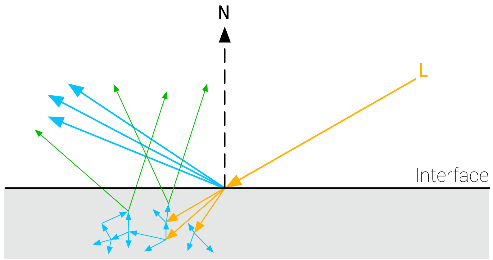

# BRDF公式参考
## 摘要
本文将从渲染方程谈起，介绍实时渲染中常用的几种BRDF公式，相关理论及其代码实现。
## 理论介绍
渲染这个事情解决的是入射光线照射到物体上，反射光线怎么计算的问题。如渲染方程所写：

$$
L_o({\bf{v}})=\int_\Omega f({\bf{l}},{\bf{v}})\otimes L_i({\bf{l}})\cos\theta_id\omega_i
$$

其中，$L_o({\bf{v}})$表示出射光线的radiance；$L_i({\bf{l}})$表示入射光线的radiance；$f({\bf{l}},{\bf{v}})$是BRDF项，表示材质对物体的作用；$\theta_i$是入射角度；积分对象是入射光线，积分范围是$\cos\theta_i>0$的半球面。

渲染方程是一种非常理想的情况，但是由于它包含一个球面积分，在实时计算中是几乎不可能求解出来的。因此，我们需要一些近似的方法求解渲染方程。

### BRDF
BRDF(Bidirectional Reflectance Distribution Function)表示的是出射光线的辐射率radiance与入射光线的辐照度irradiance之间的比值，公式为：

$$
f({\bf{l}},{\bf{v}})=\frac{dL_o({\bf{v}})}{dE({\bf{l}})} = \frac{dL_o({\bf{v}})}{\cos\theta_iL_i({\bf{l}})d\omega_i}
$$

其中，${\bf{v}}$表示视角方向，即出射光线方向，${\bf{l}}$表示入射光线方向。有一个很常被问到的问题是，为什么BRDF是radiance与irradiance的比值，而不是radiance比radiance或者irradiance？这里给出一个我个人觉得比较合理的解释，那就是BRDF的定义来自于渲染方程（没错又是渲染方程），其单位自然取决于渲染方程需要的单位。 我们再看一下渲染方程是怎么写的：

$$
L_o({\bf{v}})=\int_\Omega f({\bf{l}},{\bf{v}})\otimes L_i({\bf{l}})\cos\theta_id\omega_i
$$

左边是出射光线的radiance，右边积分里面分别是BRDF、入射光线radiance、cosine角度，然后对立体角进行积分。radiance的单位是$W/m^2sr$，irradiance的单位是$W/m^2$那么BRDF的单位就是radiance/(radiance*立体角) = radiance/irradiance，即$sr^{-1}$。

在光栅化渲染中，对BRDF的近似通常是将其分解为两部分：

- diffuse部分，记为$f_d$
- specular部分，记为$f_s$

这里为了行文通顺，就不采用中文译名漫反射、高光了，直接用英语。这两个分量的示意图如下：


diffuse表示对各个方向均匀反射的光线部分，specular表示遵循反射定律朝特定方向反射的光线部分。二者的物理意义不同，计算起来也非常不一样。

但是实际上，diffuse和specular仅仅是对真实物体的近似。物理上，光线打在物体表面，只会有两种物理现象——反射和折射。反射部分就是specular，这个比较好理解。折射部分则进入了物体内部，经过在物体内部的多次反射，最终在距离入射点一定距离的地方折射出物体，此时出射光线的方向近似随机的，也就是diffuse部分。



顺便一提，这种光线折射进入物体表面多次反射最终折射出去的现象，称为次表面散射。用diffuse来近似次表面散射现象的方法是比较“偷懒”的，但是也是比较高效的。完整的次表面散射算法可以用来模拟皮肤的通透效果，但是也会复杂得多。

再说回diffuse部分。这里就可以引入金属conductor和介电质dielectric的一个不同了。conductor是没有次表面散射现象的，也就是没有diffuse分量。但是dielectric有。通常我们可以用`metallic`来表示物体的金属性，后面会提到怎么用它来控制diffuse和specular分量。

### 微表面理论
现实世界中的表面通常不是平整的——至少不是物理意义上的绝对平整，而是有微小的起伏的。既然不是绝对平整，那么specular也不会完美地遵循反射定律。为了表示这种粗糙的表面，就有了微表面理论（microfacet theory）。

微表面理论承认宏观层面平整的表面在微观层面会有起伏，这些起伏使得微观层面的法向不完全等于宏观层面表现出来的法向；而每个微小的表面，我们认为它们都是绝对光滑的，光线满足反射定律。如下图。


第一个需要解决的问题是，微观上做到了局部的绝对光滑，宏观上的反射情况怎么表示呢？为解决这个问题，引入法向分布函数$D$，normal distribution function（缩写为NDF），表示微观表面的法向分布。

#### 法向分布函数 D
法向分布函数这个名称有一些迷惑性，因为$D$并不是概率分布函数，而是法向量的分布函数，称为distribution of normals更恰当一些。如果是概率分布，那么$D$应该满足：

$$
\int_\Omega D({\bf{m}})d\omega_m = 1
$$

但是并不是这样的。$D$的真实意义应该是对应法向的微表面投影到宏观表面上的面积的分布。满足：

$$
\int D({\bf{m}})({\bf{n}}\cdot{\bf{m}})d\omega_m = 1
$$

因此，积分$\int_\Omega D({\bf{m}})d\omega_m$必然是大于1的。这也符合常识：微表面的起伏会使得微表面的总面积大于宏观表面的面积，起伏越大微表面面积越大。

如果我们改变上式中的${\bf{n}}$，相应的，面积从投影到宏观表面（垂直于法向量${\bf{n}}$）变为投影到垂直于${\bf{v}}$的平面：

$$
\int D({\bf{m}})({\bf{v}}\cdot{\bf{m}})d\omega_m = {\bf{v}}\cdot{\bf{n}}
$$

如下图所示。


右侧图中的正负号表示当${\bf{v}}\cdot{\bf{m}}$的正负，被遮挡的部分会相互抵消。

虽然积分中被遮挡的部分自行抵消了，但是这里面隐含着一个问题，即$D$中包含的这些被遮挡的微表面，其实是对出射光线没有贡献的，我们只关心没有被遮挡的部分，如下图，这就引入了第二个问题，如何解决自遮挡现象。


#### 遮挡函数 G
对于第二个问题，我们引入遮挡函数（masking function）$G$来描述微表面之间的自遮挡现象，通常也称为可见性（visibility）或者几何项（Geometry）。

$$
\int G_1({\bf{v}},{\bf{m}})D({\bf{m}})({\bf{v}}\cdot{\bf{m}})\chi^+({\bf{v}},{\bf{m}})d\omega_m = {\bf{v}}\cdot{\bf{n}}
$$

其中，$G_1$描述的是从${\bf{v}}$方向看法向为${\bf{m}}$的微表面的可见性。从微观层面来看，$G_1$是一个二值函数，可见/不可见；从宏观层面看$G_1$表示一个统计概率。$\chi^+$表示：

$$
\chi^+(x)=
\begin{cases}
    1, & \text{where $x > 0$} \\ 
    0, & \text{where $x \leq 0$} 
\end{cases}
$$

对于$G_1$应该怎么选取，有一个洞见就是，对于$({\bf{v}}\cdot{\bf{m}})$小于0的微表面，$G_1$必然是0，因为这些微表面不是被其他微表面遮挡不遮挡的问题了，它们压根就不会被看到。

那对于$({\bf{v}}\cdot{\bf{m}})$大于0的微表面，又具有怎样的性质呢？由于我们假设的微表面是一阶不连续的，即相邻的微表面的法向没有相关性，$({\bf{v}}\cdot{\bf{m}})$大于0的微表面的可见性与微表面的法向没有关系，只与视角方向有关。这样，我们可以将$G_1$写为：

$$
G_1({\bf{v}},{\bf{m}})=G_1^{\text{local}}({\bf{v}},{\bf{m}})G_1^{\text{dist}}({\bf{v}})
$$

其中，$G_1^{\text{local}}({\bf{v}},{\bf{m}})$用于筛选$({\bf{v}}\cdot{\bf{m}})$大于0的微表面，记为：

$$
G_1^{\text{local}}({\bf{v}},{\bf{m}})=\chi^+({\bf{v}},{\bf{m}}) \\
$$

而$G_1^{\text{dist}}({\bf{v}})$可以从$D$推导出来：

$$
\begin{aligned}
{\bf{v}}\cdot{\bf{n}} & = \int G_1({\bf{v}},{\bf{m}})D({\bf{m}})({\bf{v}}\cdot{\bf{m}})\chi^+({\bf{v}},{\bf{m}})d\omega_m \\
& = \int G_1^{\text{local}}({\bf{v}},{\bf{m}})G_1^{\text{dist}}({\bf{v}})D({\bf{m}})({\bf{v}}\cdot{\bf{m}})\chi^+({\bf{v}},{\bf{m}})d\omega_m \\
& = G_1^{\text{dist}}({\bf{v}})\int \chi^+({\bf{v}},{\bf{m}})D({\bf{m}})({\bf{v}}\cdot{\bf{m}})d\omega_m \\ 
G_1^{\text{dist}}({\bf{v}}) & = \frac{{\bf{v}}\cdot{\bf{n}}}{\int D({\bf{m}})({\bf{v}}\cdot{\bf{m}})\chi^+({\bf{v}},{\bf{m}})d\omega_m}
\end{aligned}
$$

那么有：

$$
G_1({\bf{v}},{\bf{m}}) = \chi^+({\bf{v}},{\bf{m}}) \frac{{\bf{v}}\cdot{\bf{n}}}{\int D({\bf{m}})({\bf{v}}\cdot{\bf{m}})\chi^+({\bf{v}},{\bf{m}})d\omega_m}
$$

同时，$G_1^{\text{dist}}({\bf{v}})$和$G_1({\bf{v}})$也可以写成如下的形式，[16]给出了详细的推导过程：

$$
\begin{aligned}
G_1^{\text{dist}}({\bf{v}}) & =\frac{1}{1+\Lambda({\bf{v}})} \\
G_1({\bf{v}}) & =\frac{\chi^+({\bf{v}},{\bf{m}})}{1+\Lambda({\bf{v}})}
\end{aligned}
$$

引入函数$\Lambda({\bf{v}})$使得$G_1^{\text{dist}}({\bf{v}})$更简洁。

到这一步，可以看出，只要确定了法向分布函数$D$，就可以求出遮挡函数$G_1$。

到现在为止，我们推导出了$G_1({\bf{v}},{\bf{m}})$的公式，它表示的是从出射光线方向看，微表面的遮挡情况。但是在BRDF中，除了出射光线方向会遮挡，入射光线方向也会被遮挡。两者的遮挡都会影响出射光线。这个描述存在两个方向遮挡的函数为$G_2({\bf{l}},{\bf{v}},{\bf{m}})$，关于怎么用$G_1$构造$G_2$，有比较多的方法。

##### Separable G
最简单的$G_2$，也是最常用的一种smith形式，就是：

$$
\begin{aligned}
G_2({\bf{l}},{\bf{v}},{\bf{m}}) & = G_1({\bf{l}},{\bf{m}}) \cdot G_1({\bf{v}},{\bf{m}})\\
& = \frac{\chi^+({\bf{l}},{\bf{m}})}{1+\Lambda({\bf{l}})}\cdot\frac{\chi^+({\bf{v}},{\bf{m}})}{1+\Lambda({\bf{v}})}
\end{aligned}
$$

这个公式被称为分离的（separable）$G$，因为它确定的遮挡概率只跟微表面的法向有关，而忽略了微表面的高度遮挡。它的误差存在于高度遮挡频繁的情况：

1. 粗糙的表面；
2. 入射角和出射角接近于$90\degree$，即掠射角的情况。

另外可以考虑这样一种特殊情况，当光线入射角度等于出射角度的时候，也就是视角和光源来源一样的时候，理论上$G_2({\bf{l}},{\bf{v}},{\bf{m}})$应该等于$G_1({\bf{v}},{\bf{m}})$，因为入射光线和出射光线的遮挡是一样的。但是在上式的情况下，$G_2=G_1^2$，这就不对了。准确的说，这个形式给出的阴影比实际要强。

尽管不够准确，但是smith形式的$G_2$已经足够模拟真实情况，因此应用非常广泛。

##### Height-correlated G
第二种形式，被称为高度相关的（height-correlated）$G$，

$$
G_2({\bf{l}},{\bf{v}},{\bf{m}})=\frac{\chi^+({\bf{l}},{\bf{m}})\chi^+({\bf{v}},{\bf{m}})}{1+\Lambda({\bf{l}})+\Lambda({\bf{v}})}
$$

这个形式的$G$对于入射光线和出射光线差别较大的情况下，更准确，但是当入射光线和出射光线非常接近的时候，同样有着比实际更强的阴影。具体的推导过程可以参考[16]。

##### Direction-correlated G
第三种形式，是为了解决入射光线和出射光线非常接近时的误差。考虑一种极端的情况，当入射光线和出射光线平行的时候，阴影其实是消失了的。这个现象被称为hotspot effect（热点现象？）。方向相关的（direction-correlated）$G$就是基于这个洞察提出的：

$$
G_2({\bf{l}},{\bf{v}},{\bf{m}}) = \lambda(\phi)G_1({\bf{l}},{\bf{m}}) \cdot G_1({\bf{v}},{\bf{m}})+(1-\lambda(\phi))\min{(G_1({\bf{l}},{\bf{m}}), G_1({\bf{v}},{\bf{m}}))}
$$

其中的$\phi$表示${\bf{l}}$和${\bf{v}}$在垂直于${\bf{n}}$的平面上的夹角（可以理解为球坐标系下$\phi$坐标的差值）。$\lambda(\phi)$的取值决定了$G_2$的形态，当入射角和出射角非常接近的时候，$\lambda(\phi)=0$，此时$G_2$退化到$G_1$的形态。

##### Height-direction-correlated G
第四种形式，高度方向均相关的$G$，

$$
G_2({\bf{l}},{\bf{v}},{\bf{m}})=\frac{\chi^+({\bf{l}},{\bf{m}})\chi^+({\bf{v}},{\bf{m}})}{1+\max(\Lambda({\bf{l}}),\Lambda({\bf{v}}))+\lambda({\bf{l}},{\bf{v}})\min(\Lambda({\bf{l}}),\Lambda({\bf{v}}))}
$$

这个形式是前面两种形式的混合，它既能在入射角和出射角接近的时候退化到$G_1$的形态，也能在入射角和出射角分开的时候逐渐变为高度相关的$G$。唯一需要确定的是$\lambda({\bf{l}},{\bf{v}})$的形式，对此不同的paper有着不同的提议，在此不再展开。

重新回到微表面理论。

至此，基于微表面理论的BRDF函数表示为：

$$
f_x({\bf{l}},{\bf{v}}) = \frac{1}{\mid{\bf{n}}\cdot{\bf{v}}\mid\mid{\bf{n}}\cdot{\bf{l}}\mid}\int_\Omega D({\bf{m}},\alpha)G_2({\bf{v}},{\bf{l}},{\bf{m}})f_m({\bf{v}},{\bf{l}},{\bf{m}})({\bf{v}}\cdot{\bf{m}})({\bf{l}}\cdot{\bf{m}})\chi^+({\bf{v}},{\bf{m}})\chi^+({\bf{l}},{\bf{m}})d{\bf{m}}
$$

其中，${\bf{n}}$表示该点的（宏观）法向方向，${\bf{m}}$表示微观表面的法向。

$D$和$G_2$前面介绍过了，不在赘述。

$f_x$既可以表示diffuse分量，也可以表示specular分量，二者的差别在于$f_m$的选取。

另外一个对$f_m$的理解是，相对于$f_x$表示宏观的BRDF项，$f_m$可以理解为微观的BRDF项。它的物理意义是在微观表面，出射光线的辐射率radiance与入射光线的辐照度irradiance之间的比值：

$$
f_m = \frac{dL_o({\bf{v}}, {\bf{m}})}{{\bf{l}}\cdot{\bf{m}} \cdot L_i({\bf{l}})d\omega_i}
$$

这样，利用微表面理论我们构建了一个绝对光滑的局部表面，通过选取理想情况下的BRDF项$f_m$，我们就可以还原宏观表面的真实的$f_x$。可以说，微表面理论填补了理想表面与真实物体之间的鸿沟，让我们可以用物理理论还原真实物体的情况。

接下来就具体看一下对于diffuse和specular，BRDF的具体形式，以及对应的shader实现。

## Specular BRDF
对于specular分量来说，$f_m$是一个遵循菲涅尔反射定律的镜面BRDF项，此时的$f_m$满足（[3]和[21]有详细的推导）：

$$
f_m({\bf{l}},{\bf{v}},{\bf{m}}) = F({\bf{v}},{\bf{m}})\frac{\delta_{\omega_m}({\bf{h}}, {\bf{m}})}{4({\bf{l}}\cdot{\bf{h}})^2}
$$

${\bf{h}}$表示half vector，是${\bf{v}}$和${\bf{l}}$的平均；这里分母上第一次出现了$4$，这也是后面specular BRDF公式的分母上的$4$的来源。$\delta_{\omega_m}({\bf{s}}, {\bf{o}})$记为：

$$
\int_\Omega g({\bf{o}})\delta_{\omega_o}({\bf{s}}, {\bf{o}})d\omega_o = 
\begin{cases}
g({\bf{s}}), & \text {if $s\in\Omega$} \\ 
0, & \text{otherwise}
\end{cases}
$$

此时，$f_r$可以化简为为：

$$
f_r({\bf{l}},{\bf{v}}) = \frac{D({\bf{h}},\alpha)G({\bf{v}},{\bf{l}},\alpha)F({\bf{v}},{\bf{h}},F_0)}{4({\bf{n}}\cdot{\bf{v}})({\bf{n}}\cdot{\bf{l}})}
$$

其中，$\alpha$取决于我们前面提到的粗糙度roughness，具体为

$$
\alpha = roughness^2
$$

可以理解为$\alpha$是对粗糙度roughness的一个映射，$\alpha$将多次被用到。

菲涅尔项及$F_0$会在后面详细介绍，这里暂时略过。

shader实现：

```C++
// #define saturate(x) clamp(x, 0, 1)
// N     = normal;
// V     = normalize(camPos - WorldPos);
// L     = normalize(LightPos - WorldPos));
// H     = normalize(V + L);
// NdotV = saturate(dot(N, V));
// NdotL = saturate(dot(N, L));
// NdotH = saturate(dot(N, H));
// LdotH = saturate(dot(L, H));
// VdotH = saturate(dot(V, H));
vec3 SpecularBRDF(float NdotV, float NdotL, float NdotH, float LdotH, float VdotH, vec3 F0, float roughness) {
    float r   = roughness * roughness;

    float D = Distribution(NdotH, r);
    float V = Geometry(NdotV, NdotL, r);
    vec3  F = Fresnel(VdotH, F0);

    return D * V * F / (4 * NdotV * NdotL);
}
```

注意，这里的`NdotL`，`NdotV`等都是clamp到0到1的。

接下来具体看$f_r$中每个分量的可能形式都有哪些。
### 法向分布函数 D
这一部分介绍3个法向分布函数的公式，以及一个推广。
#### Beckmann
来源[5]，$D_{Beckmann}$假设微表面的法向分布是以${\bf{n}}$为均值的高斯分布，也即${\bf{h}}$与${\bf{n}}$越接近，反射的光线越多，$D_{Beckmann}$越大。再结合$D_{Beckmann}$的积分约束，求得：

$$
D_{Beckmann}({\bf{h}}, \alpha) = \frac{\chi^+({\bf{n}},{\bf{h}})}{\pi\alpha^2({\bf{n}}\cdot{\bf{h}})^4}e^{\frac{({\bf{n}}\cdot{\bf{h}})^2-1}{\alpha^2({\bf{n}}\cdot{\bf{h}})^2}}
$$

这个公式有一个很致命的缺陷，那就是当roughness接近于1的时候，$D_{Beckmann}$在${\bf{n}}\cdot{\bf{h}}\in[0,1]$区间内，不是单调递增的。表现在渲染上，就是在高光最强的中心点会产生一个暗斑。


shader实现：

```C++
float DistributionBeckmann(float NdotH, float r) {
    float NdotH2   = NdotH * NdotH;
    float r2       = r * r;
    float r2NdotH2 = r2 * NdotH2;
    return exp((NdotH2 - 1) / (r2NdotH2)) / (PI * r2NdotH2 * NdotH2);
}
```

#### BlinnPhong
来源[6]，BlinnPhong公式纯粹是基于经验的，在恰当选取参数的情况下，它的函数曲线非常接近于Beckmann。

BlinnPhong原始的模型是：

$$
D_{Blinn}({\bf{h}}, \alpha) = \chi^+({\bf{n}},{\bf{h}})\frac{\alpha_p + 2}{2\pi}({\bf{n}}\cdot{\bf{h}})^{\alpha_p}
$$

其中，$\alpha_p$表示粗糙系数，或者准确的说，是光滑系数——$\alpha_p$越大，表示物体表面越光滑。

- 当$\alpha_p=\infty$的时候，表示绝对光滑的物体，此时$D_{Blinn}({\bf{h}}, \alpha)$只有在${\bf{h}} = {\bf{n}}$，即入射角等于出射角的时候为$\infty$，否则为0。
- 当$\alpha_p=0$的时候，表示绝对粗糙的物体，$D_{Blinn}({\bf{h}}, \alpha) = \frac{1}{\pi}$，这个式子也是后面会提到的diffuse的式子。

令$\alpha_p = (\frac{2}{\alpha^2} - 2)$，则有：

$$
D_{Blinn}({\bf{h}}, \alpha) = \frac{\chi^+({\bf{n}},{\bf{h}})}{\pi\alpha^2}({\bf{n}}\cdot{\bf{h}})^{(\frac{2}{\alpha^2} - 2)}
$$

这个公式即接近于Beckmann的法向分布公式，也是常用的BlinnPhong形式。

shader实现：

```C++
float DistributionBlinnPhong(float NdotH, float r) {
    float a = r * r;
    return pow(NdotH, 2.0 / a - 2.0) / (PI * a);
}
```

#### GGX
来源[3]，GGX是根据实测数据拟合出来的一个公式：

$$
D_{GGX}({\bf{h}}, \alpha) = \frac{\chi^+({\bf{n}},{\bf{h}})\cdot\alpha^2}{\pi(({\bf{n}}\cdot{\bf{h}})^2(\alpha^2-1)+1)^2}
$$

shader实现：

```C++
float DistributionGGX(float NdotH, float r) {
    float a2     = r * r;
    float NdotH2 = NdotH * NdotH;
    float nom    = a2;
    float denom  = (NdotH2 * (a2 - 1.0) + 1.0);
    denom        = PI * denom * denom;
    return nom / max(denom, 0.001);
}
```

除了这三种公式，还有更多更复杂的法向分布函数D，具体可以参考[17]。但是其实最常用的还是GGX（及其各向异性模式），无论是游戏还是影视行业都比较喜欢用GGX。

#### GTR
Burley通过对Berry（与GGX公式类似，分母上的指数为1）和GGX公式的观察，提出了广义的Trowbridge-Reitz（Generalized-Trowbridge-Reitz，GTR）法线分布函数：

$$
D_{GTR}({\bf{h}}, \alpha) = \frac{c\cdot\chi^+({\bf{n}},{\bf{h}})}{(({\bf{n}}\cdot{\bf{h}})^2(\alpha^2-1)+1)^\gamma}
$$

其中，$c$表示缩放系数，是一个常数；$\gamma$用于控制尾部的形状，当$\gamma=1$的时候，$D_{GTR}$就是Berry公式，当$\gamma=2$的时候，$D_{GTR}$就是$D_{GGX}$。

$\gamma$的取值对$D_{GTR}$的影响如下图所示。


以下是$\gamma=1$和$\gamma=2$时的shader实现：

```C++
float DistributionGTR1(float NdotH, float r)
{
    if (r >= 1) return 1/PI;
    float a2 = r*r;
    float t = 1 + (a2-1)*NdotH*NdotH;
    return (a2-1) / (PI*log(a2)*t);
}

float DistributionGTR2(float NdotH, float r)
{
    float a2 = r*r;
    float t = 1 + (a2-1)*NdotH*NdotH;
    return a2 / (PI * t * t);
}
```

#### 效果对比


可以看出，BlinnPhong和Beckmann的差异不大。而GGX有着更平滑的边缘和更小的峰值。除此之外，GGX运算压力更小，因为它没有指数操作。

### 遮挡项 G
和法向分布函数$D$一样，遮挡项$G$也是入射角、出射角和表面粗糙度的函数。

有些文章会把遮挡项G和BRDF的分母$({\bf{n}}\cdot{\bf{l}})({\bf{n}}\cdot{\bf{v}})$放在一起组成一项约分掉，这也是一种优化思路，因为G通常包含这两个cosine因子。这里我们约定本文的遮挡项$G$是不约分$({\bf{n}}\cdot{\bf{l}})({\bf{n}}\cdot{\bf{v}})$的$G$。

#### Implicit
来源[7]，有些BRDF公式会忽略遮挡项G，将其跟分母上的$({\bf{n}}\cdot{\bf{l}})({\bf{n}}\cdot{\bf{v}})$一起忽略掉，这就有了第一个隐式$G$：

$$
G_{Implicit}({\bf{l}},{\bf{v}},{\bf{h}})=({\bf{n}}\cdot{\bf{l}})({\bf{n}}\cdot{\bf{v}})
$$

它的形态大概是，当且仅当视角和光源都垂直于物体表面的时候，$G_{Implicit}=1$，光源、视角与物体表面法线的夹角越大，$G_{Implicit}$越小，直到衰减为0，这也是很符合常识的。

shader实现：

```C++
float GeometryImplicit(float NdotV, float NdotL) {
    return NdotL * NdotV;
}
```

但是隐式遮挡项$G_{Implicit}$最大的问题在于，它随着视角的衰减速度太快，这会使得高光区域太窄。为了解决这个问题，我们继续看显式的遮挡项$G$。

#### Cook-Torrance
来源[9]，$G_{Cook-Torrance}$解决了$G_{Implicit}$衰减速度太快的问题：

$$
G_{Cook-Torrance}({\bf{l}},{\bf{v}},{\bf{h}})=\min{\left(1, \frac{2({\bf{n}}\cdot{\bf{h}})({\bf{n}}\cdot{\bf{v}})}{{\bf{v}}\cdot{\bf{h}}}, \frac{2({\bf{n}}\cdot{\bf{h}})({\bf{n}}\cdot{\bf{l}})}{{\bf{v}}\cdot{\bf{h}}}\right)}
$$

shader实现：

```C++
float GeometryCookTorrance(float NdotV, float NdotL, float VdotH, float NdotH) {
    float ct1 = 2 * NdotH * NdotV / VdotH;
    float ct2 = 2 * NdotH * NdotL / VdotH;
    return min(1, min(ct1, ct2));
}
```

#### Kelemen
来源[10]，也是解决$G_{Implicit}$衰减速度太快的问题，同时$G_{Kelemen}$比$G_{Cook-Torrance}$的效率更高：

$$
G_{Kelemen}({\bf{l}},{\bf{v}},{\bf{h}})=\frac{({\bf{n}}\cdot{\bf{l}})({\bf{n}}\cdot{\bf{v}})}{({\bf{v}}\cdot{\bf{h}})^2}
$$

shader实现：

```C++
float GeometryKelemen(float NdotV, float NdotL, float VdotH) {
    return NdotV * NdotL / (VdotH * VdotH);
}
```

#### Neumann
来源[8]，$G_{Neumann}$用另一种方式解决了$G_{Implicit}$衰减速度太快的问题：

$$
G_{Neumann}({\bf{l}},{\bf{v}},{\bf{h}})=\frac{({\bf{n}}\cdot{\bf{l}})({\bf{n}}\cdot{\bf{v}})}{\max{({\bf{n}}\cdot{\bf{l}}, {\bf{n}}\cdot{\bf{v}}})}
$$

shader实现：

```C++
float GeometryNeumann(float NdotV, float NdotL) {
    return (NdotL * NdotV) / max(NdotL, NdotV);
}
```

但是，以上三个解决方案也不够完美。前面提到过，遮挡项G应该是入射角、出射角和表面粗糙度的函数，而以上四个G，包括隐式遮挡项都与粗糙度无关。

#### Smith
Smith家族[13]都是采用了前面介绍的$G_1$相乘的形式：

$$
G_2({\bf{l}},{\bf{v}},{\bf{h}})=G_1({\bf{l}})G_1({\bf{v}})
$$

他们之间的区别就是$G_1$的选取不同。

##### Beckmann
Beckmann的$G$是跟$D$一起提出的，前面介绍过$G$是可以从$D$推导出来的，因此Beckmann的$\Lambda$为：

$$
\begin{aligned}
c & = \frac{{\bf{n}}\cdot{\bf{v}}}{\alpha\sqrt{1-({\bf{n}}\cdot{\bf{v}})^2}} \\
\Lambda({\bf{v}}) & = \frac{\text{erf}(c)-1}{2}+\frac{1}{2c\sqrt{\pi}}\exp(-c^2)
\end{aligned}
$$

但是由于有$\text{erf}$函数的存在，计算起来过于复杂，因此通常用如下的近似形式：

$$
\Lambda({\bf{v}}) \approx
\begin{cases}
\frac{1-1.259x+0.396c^2}{3.535c+2.181c^2},  & \text{if }c<1.6 \\
0, & \text{if }c\geq1.6
\end{cases}
$$

因此，Beckmann的$G_1$为

$$
G_{Beckmann}({\bf{v}}) \approx 
\begin{cases}
\frac{3.535c+2.181c^2}{1+2.276c+2.577c^2},  & \text{if }c<1.6 \\
1, & \text{if }c\geq1.6
\end{cases}
$$

shader实现：

```C++
float GeometryBeckmann(float NdotV, float r) {
    float c  = NdotV / (r * sqrt(1 - NdotV * NdotV));
    float c2 = c * c;
    if (c < 1.6)
        return (3.535 * c + 2.181 * c2) / (1 + 2.276 * c + 2.577 * c2);
    else
        return 1.0;
}
float GeometrySmithBeckmann(float NdotV, float NdotL, float r) {
    float ggx2 = GeometryBeckmann(NdotV, r);
    float ggx1 = GeometryBeckmann(NdotL, r);
    return ggx1 * ggx2;
}
```

##### GGX
GGX[3]跟Beckmann类似，都是从法向分布函数推导出来的：

$$
\begin{aligned}
c & = \frac{{\bf{n}}\cdot{\bf{v}}}{\alpha\sqrt{1-({\bf{n}}\cdot{\bf{v}})^2}} \\
\Lambda({\bf{v}}) & = \frac{-1+\sqrt{1+\frac{1}{c^2}}}{2}
\end{aligned}
$$

对应的$G_1$定义为

$$
G_{GGX}({\bf{v}}) = \frac{2({\bf{n}}\cdot{\bf{v}})}{({\bf{n}}\cdot{\bf{v}})+\sqrt{\alpha^2+(1-\alpha^2)({\bf{n}}\cdot{\bf{v}})^2}}
$$

shader实现：

```C++
float GeometryGGX(float NdotV, float r) {
    float r2 = r * r;
    return (2 * NdotV) / (NdotV + sqrt(r2 + (1 - r2) * NdotV * NdotV));
}
float GeometrySmithGGX(float NdotV, float NdotL, float r) {
    float ggx2 = GeometryGGX(NdotV, r);
    float ggx1 = GeometryGGX(NdotL, r);
    return ggx1 * ggx2;
}
```

##### GGX Joint
前面提到的GGX用的是$G_2=G_1*G_1$的separable G，如果用height-correlated G，那么$G_2$变为：

$$
\begin{aligned}
G_{2-GGXJoint}({\bf{l}},{\bf{v}},{\bf{m}}) & =\frac{1}{1+\Lambda({\bf{l}})+\Lambda({\bf{v}})}\\
& =\frac{2({\bf{n}}\cdot{\bf{v}})({\bf{n}}\cdot{\bf{l}})}{({\bf{n}}\cdot{\bf{l}})\cdot\sqrt{\alpha^2+(1-\alpha^2)({\bf{n}}\cdot{\bf{v}})^2} + ({\bf{n}}\cdot{\bf{v}})\cdot\sqrt{\alpha^2+(1-\alpha^2)({\bf{n}}\cdot{\bf{l}})^2}}
\end{aligned}
$$

shader实现：

```C++
float GeometrySmithGGXJoint(float NdotV, float NdotL, float r) {
    float r2 = r * r;
    float Vis_SmithV = NdotL * sqrt(NdotV * (NdotV - NdotV * r2) + r2);
	float Vis_SmithL = NdotV * sqrt(NdotL * (NdotL - NdotL * r2) + r2);
	return 2 * NdotV * NdotL / (Vis_SmithV + Vis_SmithL);
}
```

为了提高计算效率，UE4对GGX Joint方法做了一个近似，公式为：

$$
\begin{aligned}
G_{2-GGXJoint}({\bf{l}},{\bf{v}},{\bf{m}}) & =\frac{1}{1+\Lambda({\bf{l}})+\Lambda({\bf{v}})}\\
& \approx\frac{2({\bf{n}}\cdot{\bf{v}})({\bf{n}}\cdot{\bf{l}})}{({\bf{n}}\cdot{\bf{l}})\cdot(\alpha+(1-\alpha)({\bf{n}}\cdot{\bf{v}})) + ({\bf{n}}\cdot{\bf{v}})\cdot(\alpha+(1-\alpha)({\bf{n}}\cdot{\bf{l}}))}
\end{aligned}
$$

shader实现：

```C++
float GeometryGGXJointApprox(float NdotV, float NdotL, float r) {
    return (NdotV) / (NdotL * (r + (1 - r) * NdotV));
}
float GeometrySmithGGXJointApprox(float NdotV, float NdotL, float r) {
	float Vis_SmithV = NdotL * ( NdotV * ( 1 - r ) + r );
	float Vis_SmithL = NdotV * ( NdotL * ( 1 - r ) + r );
	return 2 * NdotV * NdotL / ( Vis_SmithV + Vis_SmithL );
}
```

##### Schlick-Beckmann
Schlick[11]的$G_1$定义为
$$
k=\alpha\sqrt{\frac{2}{\pi}} \\
G_{Schlick}({\bf{v}})=\frac{{\bf{n}}\cdot{\bf{v}}}{({\bf{n}}\cdot{\bf{v}})(1-k)+k}
$$
shader实现：
```C++
float GeometrySchlickBeckmann(float NdotV, float r) {
    float k     = (r)*sqrt(2.0 / PI);
    float nom   = NdotV;
    float denom = NdotV * (1.0 - k) + k;
    return nom / denom;
}
float GeometrySmithSchlickBeckmann(float NdotV, float NdotL, float r) {
    float ggx2 = GeometrySchlickBeckmann(NdotV, r);
    float ggx1 = GeometrySchlickBeckmann(NdotL, r);
    return ggx1 * ggx2;
}
```
##### Schlick-GGX
Schlick-GGX[12]曾经是UE4所采用的的一个模型，跟Schlick有些类似，$G_1$定义为
$$
k=\frac{\alpha}{2} \\
G_{Schlick}({\bf{v}})=\frac{{\bf{n}}\cdot{\bf{v}}}{({\bf{n}}\cdot{\bf{v}})(1-k)+k}
$$
shader实现：
```C++
float GeometrySchlickGGX(float NdotV, float r) {
    float k     = r * 0.5;
    float nom   = NdotV;
    float denom = NdotV * (1.0 - k) + k;
    return nom / denom;
}
float GeometrySmithSchlickGGX(float NdotV, float NdotL, float r) {
    float ggx2 = GeometrySchlickGGX(NdotV, r);
    float ggx1 = GeometrySchlickGGX(NdotL, r);
    return ggx1 * ggx2;
}
```
这里面还有一个细节，那就是迪士尼后来提出了对粗糙粗`roughness`做一个remapping，使得它更接近于真实：
$$
\alpha' = (\frac{roughness + 1}{2})^2 \\
$$
其他的部分不变。这样shader实现为：
```C++
float GeometrySmithSchlickGGX(float NdotV, float NdotL, float roughness) {
    float r = (roughness + 1.0) * 0.5; // remapping roughness
    r = r * r
    float ggx2 = GeometrySchlickGGX(NdotV, r);
    float ggx1 = GeometrySchlickGGX(NdotL, r);
    return ggx1 * ggx2;
}
```
注意，此时`GeometrySmithSchlickGGX`的输入参数不是`r`，而改为了`roughness`。
#### 优化
考虑到几乎所有$G$都带有$({\bf{n}}\cdot{\bf{v}})({\bf{n}}\cdot{\bf{l}})$项，可以跟$f_r({\bf{l}},{\bf{v}})$的分母约分，因此在实现时，可以考虑定义
$$
G'=\frac{G}{({\bf{n}}\cdot{\bf{v}})({\bf{n}}\cdot{\bf{l}})}
$$
节省一部分计算。

这样做不只是出于性能的考虑，也是出于精度的考虑。如果${\bf{n}}\cdot{\bf{v}}$和${\bf{n}}\cdot{\bf{l}}$的乘积接近于0，那么specular项的分母会非常小，严重影响其精度，极端的情况下会在过渡区域产生一道割裂的分界线。下图展示了$({\bf{n}}\cdot{\bf{v}})*({\bf{n}}\cdot{\bf{l}})*10$（左）、未优化时（中）、优化后（右）的效果，可以看出左侧两张图的分界线非常吻合。优化后则没有颜色割裂的问题。


#### 效果对比
取`roughness = 0.9`，计算球体的遮挡项效果为：


最后一排是常用的几种方法，差异并不大，边缘的过渡也比较好。

### 菲涅尔项 F
菲涅尔项描述的是物体表面的反射、折射现象。一般我们会采用常量$F_0$来计算菲涅尔项$F({\bf{v}},{\bf{h}},F_0)$。

要说明白菲涅尔项，得从光学在介质表面的折射反射现象说起。我们知道光线会在介质表面产生不连续性，具体表现为一部分光线反射——遵循光线反射定律，入射角等于反射角；另一部分光线会折射进入介质——遵循光线折射定律，折射角取决于入射角的大小以及构成交界面的两种材质，即斯涅耳定律（Snell's law）：

$$
n_1\sin(\theta_i)=n_2\sin(\theta_t)
$$

斯涅耳定律描述的仅仅是光线的角度，但是图形学研究的其实是光线的radiance/irradiance，所以我们要更进一步。定义Fresnel reflectance $R_F$为反射光线的radiance占入射光线radiance的比例，$R_F$是入射角$\theta_i$的函数。那么对于入射光线$L_i$，在角度$\theta_i$时反射光线的radiance为$R_F(\theta_i)L_i$。再考虑折射部分，根据能量守恒，没有反射的能量都会被折射（不考虑被吸收的能量），因此折射的**flux**占入射**flux**的比例是$1-R_F$。这里需要强调的是，radiance定义的是“irradiance每立体角”，它的大小跟角度有关系，因此折射光线的radiance $L_t$不能简单用$1-R_F$乘上$L_i$，而要转换角度：
$$
L_t = (1-R_F(\theta_i))\frac{\sin^2\theta_i}{\sin^2\theta_t}L_i
$$
将斯涅耳定律带入上式，得到：
$$
L_t = (1-R_F(\theta_i))\frac{n_2^2}{n_1^2}L_i
$$
介绍了这么多$R_F$的相关知识，其实关键点还是前面说的，$R_F$是入射角$\theta_i$的函数。我们再回头考虑这个$R_F$与入射角$\theta_i$的关系。当$\theta_i=90\degree$的时候，即$R_F(90\degree)$，此时入射光平行于平面，垂直于法向，不存在折射光线，$R_F(90\degree)=1$；当$\theta_i=0\degree$的时候，即$R_F(0\degree)$，此时反射光线占比最低，根据不同的材质这个$R_F(0\degree)$有不同的值，Real-time Rendering[14]给出了常见的材质的$R_F$与$\theta_i$的关系曲线：


为了近似这个曲线，采取的策略是利用$R_F(0\degree)$，也就是前面说的$F_0$：
$$
R_F(\theta_i)\approx R_F(0\degree) + (1-R_F(0\degree))(1-\cos\theta_i)^5
$$
这里有一个默认的假设是，$R_F(90\degree)=1$，如果，$R_F(90\degree)$未知，$R_F(\theta_i)$应该写为：
$$
R_F(\theta_i)\approx R_F(0\degree) + (R_F(90\degree)-R_F(0\degree))(1-\cos\theta_i)^5
$$
这个$R_F(90\degree)$也就是$F_{90}$。

最后，我们看一下$F_0$怎么计算。对于dielectrics来说，$F_0$的值取决于折射率，公式为：
$$
F_0=0.16\cdot reflectance^2
$$
其中，$reflectance$由物体表面的材质定义。

对于dielectric，$F_0$通过金属度metallic和`basecolor`来计算：
$$
F_0=baseColor\cdot metallic
$$
综合dielectrics和dielectric，得到：
```C++
    vec3 F0 = 0.16 * reflectance * reflectance * (1.0 - metallic) + baseColor.xyz * metallic;
```
说明白了$F_0$，我们接下来看看菲涅尔函数$F$有哪些形式。
#### 简单形式
最简单的情况，直接令菲涅尔函数等于$F_0$：
$$
F_{None}({\bf{v}},{\bf{h}})=F_0
$$
shader实现：
```C++
vec3 Fresnel(vec3 F0) {
    return F0;
}
```
#### Schlick
来源[11]，公式：
$$
F_{Schlick}({\bf{v}},{\bf{h}})=F_0+(1-F_0)(1-({\bf{v}}\cdot{\bf{h}}))^5
$$
也就是我们前面说到的对$R_F$的拟合。shader实现：
```C++
vec3 FresnelSchlick(float VdotH, vec3 F0) {
    return F0 + (1.0 - F0) * pow(1.0 - VdotH, 5.0);
}
```
如果引入$F_{90}$，则变成：
$$
F_{Schlick}({\bf{v}},{\bf{h}})=F_0+(F_{90}-F_0)(1-({\bf{v}}\cdot{\bf{h}}))^5
$$
shader实现：
```C++
vec3 FresnelSchlick(float VdotH, vec3 F0, vec F90) {
    return F0 + (F90 - F0) * pow(1.0 - VdotH, 5.0);
}
```
对specular来说，$F_{90}$可以从$F_0$计算得来[1]：
```C++
    float F90 = saturate(dot(F0, vec3(50.0 * 0.33)));
```
#### Cook-Torrance
来源[9]，公式：
$$
\begin{aligned}
\eta & =\frac{1+\sqrt{F_0}}{1-\sqrt{F_0}} \\
c & = {\bf{v}}\cdot{\bf{h}} \\
g & = \sqrt{\eta^2+c^2-1} \\
F_{Cook-Torrance}({\bf{v}},{\bf{h}}) & =\frac{1}{2}\left(\frac{g-c}{g+c}\right)^2\left(1+\left(\frac{(g+c)c-1}{(g-c)c+1}\right)^2\right)
\end{aligned}
$$
shader实现：
```C++
float FresnelCookTorrance(float VdotH, float F0) {
    float sqrtF = sqrt(F0);
    float Eta   = (1.0 + sqrtF) / (1.0 - sqrtF);
    float g     = sqrt(Eta * Eta + VdotH * VdotH - 1.0);
    return 0.5 * pow((g - VdotH) / (g + VdotH), 2) *
           (1 + pow(((g + VdotH) * VdotH - 1.0) / ((g - VdotH) * VdotH + 1.0), 2));
}
```

## Diffuse BRDF
相比于繁琐的specular部分，diffuse部分就简单的多。diffuse部分由baseColor和diffuse系数相乘得到，即：
$$
L_d({\bf{v}})={\bf{c}}_{diff}\cdot f_d
$$
shader实现：
```C++
    vec3 colorDiffuse = baseColor * DiffuseBRDF(NdotV, NdotL, LdotH, roughness);
```
接下来看一下$f_d$的可能取值。
### Lambert
Lambert模型认为既然diffuse是漫反射，不如简单地认为各个方向都是一样的值，即出射光线的radiance与入射光线的角度无关。

$$
f_d = \frac{1}{\pi}
$$

这个实现相当于，采用BlinnPhong的法向分布$D_{Blinn}({\bf{h}}, \alpha) = \frac{1}{\pi}$，同时令遮挡项为隐式形式，并且菲涅尔项为1。虽然简单，但是已经足够近似现实了，效果还不错。

shader实现：

```C++
float DiffuseLambert() {
    return 1.0 / PI;
}
```

虽然Lambert模型已经足够接近真实情况，但是它还是不够理想。我们前面提到过，diffuse分量本质上是光线折射进入物体表面，经过多次反射再折射出来的现象，也就是它不是物理上真实存在的一个光学现象。而在讨论specular菲涅尔项的时候又提到过，反射部分会随着入射光线的角度变化，那么折射部分相应的也会随着入射角度变化，既然如此，来自于折射部分的diffuse分量肯定也是会随着入射光线的角度而改变的！也就是说，$f_d$是入射角${\bf{l}}$的函数：$f_d({\bf{l}})$。

同时，$f_d$也应该是出射角${\bf{v}}$的函数[14]：$f_d({\bf{l}},{\bf{v}})$。因为菲涅尔项考虑的是镜面反射，入射角等于出射角，而diffuse项的入射角不一定等于出射角，因此两个角度都会影响$f_d$。

再者，前面影响specular分量的参数当中，$roughness$也会影响$f_d$。根据常识，不同粗糙程度的物体的diffuse是有明显的不同的。即$f_d({\bf{l}}, {\bf{v}}, roughness)$。

基于这一点洞察，又有一些新的diffuse模型被提出，希望解决Lambert模型的不足。。

### Oren–Nayar
Oren-Nayar模型是对Lambert模型的推广。[18]指出，Lambert模型对于光滑物体或许还成立，但是对于粗糙物体是不正确的。粗糙的物体在光照下会显得很平坦，而Lambert模型没有表现出这种平坦。为了达到这个效果，Oren-Nayar加强了掠射逆反射（入射角和出射角在几乎同一个方向，并且垂直于法向的情形）的强度。

Oren-Nayar公式如下。

$$
\begin{aligned}
f_d & = \frac{1}{\pi}\cdot(A+B\cdot\max{(0, \cos{\phi})}\cdot\sin\alpha\cdot\tan\beta) \\
A & = 1.0-0.5\frac{\alpha}{\alpha+0.33} \\
B & = 0.45\frac{\alpha}{\alpha+0.09} \\
\alpha & = \max{({\bf{l}}\cdot{\bf{n}}, {\bf{v}}\cdot{\bf{n}})} \\
\beta & = \min{({\bf{l}}\cdot{\bf{n}}, {\bf{v}}\cdot{\bf{n}})}
\end{aligned}
$$

其中，$\phi$表示${\bf{l}}{\bf{n}}$平面和${\bf{v}}{\bf{n}}$的夹角。

可以看出，当$roughness-0$的时候，$A=1, B=0$，此时Oren-Nayar模型退化为Lambert模型。

下图[18]展示了真实照片、Lambert模型与Oren-Nayar的对比。


### Hanrahan-Krueger
Hanrahan-Krueger模型[19]其实是源自次表面散射理论，是用于表现次表面散射现象的一个模型。它跟Oren-Nayar模型一样，对掠射角进行了补偿。但是它的补偿过于平坦，没有给出足够强的峰值，也不太完美。

Hanrahan-Krueger模型和Oren-Nayar模型都不太常用，因此不再赘述。

### Burley
Oren–Nayar模型虽然提高了粗糙物体的真实性，但是它对掠射逆反射现象的修正还是不够真实。为了研究真实材料的物理特性，我们需要一个材质数据库。

[MERL BRDF Database](https://www.merl.com/brdf/)就是这样一个数据库。它是由MERL(Mitsubishi Electric Research Laboratories)实验室建立了的，测量并记录了不同角度的光源、观测视角情况下的BRDF数值，考虑到各向异性，每个材质都采样了90（光源）*90（视角）*180（各向异性）三个维度的数据。如果只考虑各向同性材质，可以将BRDF数据压缩到一张图片里。


如上图所示，横轴$\theta_h$表示half vector ${\bf{h}}$与法向量${\bf{n}}$之间的夹角。纵轴表示入射角与${\bf{h}}$的夹角。

Disney通过分析MERL BRDF Database，提出了两个Lambert模型与事实不符的地方：

1. diffuse也会有类似于specular的光斑；
2. 部分材质的diffuse会在掠射角有明显的光环，这个现象即掠射逆反射（grazing retroreflection）；

为了解决这些问题，Disney提出了一个diffuse BRDF公式[15]：

$$
\begin{aligned}
f_d({\bf{l}},{\bf{v}}) & = \frac{1}{\pi}F_{Schlick}({\bf{n}},{\bf{l}},1,f_{90})F_{Schlick}({\bf{n}},{\bf{v}},1,f_{90}) \\
F_{Schlick}({\bf{n}},{\bf{l}},f_0,f_{90}) & = F_0+(F_{90}-F_0)(1-({\bf{n}}\cdot{\bf{l}}))^5 \\
f_{90} & = 0.5 + 2\cdot roughness\cdot\cos^2(\theta_d)
\end{aligned}
$$

其中$\theta_d$是光线$L$和half vector $h$的夹角。这个公式考虑到了入射角和出射角以及粗糙度，并且用类似菲涅尔项的公式（cosine项的五次方）来拟合衰减情况。

shader实现:

```C++
float FresnelSchlick(float VdotH, float F0, float F90) {
    return F0 + (F90 - F0) * pow(1.0 - VdotH, 5.0);
}
float DiffuseBurley(float NdotV, float NdotL, float LdotH, float roughness) {
    float f90          = 0.5 + 2.0 * roughness * LdotH * LdotH;
    float lightScatter = FresnelSchlick(NdotL, 1.0, f90);
    float viewScatter  = FresnelSchlick(NdotV, 1.0, f90);
    return lightScatter * viewScatter * (1.0 / PI);
}
```
## 总结
BRDF作为渲染里边最基础的知识点，发展的已经相对成熟，虽然偶尔也会有一些改进，但是基本上都是在效率与性能之间做权衡。对于基本BRDF公式的选择，UE4和Disney有着各自不同的逻辑：

$$
\begin{array}{c|ccccc}
& \text{Diffuse BRDF} & \text{Distribution} & \text{Visibility} & \text{Fresnel} \\
\hline
\text{UE4}    & Lambert & \text{GGX} & GGX Joint(Approx) & \text{Schlick} \\
\text{Disney} & Burley  & \text{GGX} & GGX               & \text{Schlick}
\end{array}
$$

斜体表示二者不同的部分。可以看出，UE4选择的都是高效的模型，而Disney选择的都是复杂而准确的模型。

个人理解这些差异都是源于UE4和disney应用场景的不同，UE4希望每个模型尽可能高效，因此会拆分开来，针对性优化，比如它单独设计了针对眼睛的Eye模型，专门渲染毛发的Hair模型，专门渲染皮肤的subsurface模型等等。而Disney的诉求在于模型的表达力要足够强，效率反而不那么重要。

## 未涉及话题...
本文主要集中在BRDF项的各种实现，顺带介绍了BRDF和微表面理论。还有一些与之相关或更深入，但是没有涉及到的方向，例如

1. 辐射度量学基础；
2. BSDF，BTDF等BRDF的进阶模型；
3. 各向异性BRDF，subsurface、clearCoat等模型；
4. 环境光、全局光照等；

篇幅问题，这些方向也无法展开。行文至此，强推图形学届的武林秘籍的目录——*Real-time Rendering*，此书目前已经出到第四版了，文末也给出了电子书链接[14]。本文涉及的话题书中都有比较深入、全面的介绍。即使RTR不能满足你，它还提供了多达1000+篇的参考文献供学习，毕竟“目录”，名副其实。

## 参考资料
1. [Filament文档](https://google.github.io/filament/Filament.html)，Filament是一个Google写的用在Android上的PBR渲染器，它的文档非常完善，特别每个BRDF的理论和实现。同时也可以参考它的源码，对照学习。
2. [Specular BRDF Reference](http://graphicrants.blogspot.com/2013/08/specular-brdf-reference.html)：这个博客列出了几大主流specular BRDF的公式，可以作为参考。
3. [Walter et al. 2007, Microfacet models for refraction through rough surfaces](http://www.cs.cornell.edu/~srm/publications/EGSR07-btdf.pdf)
4. [LearningOpenGL: PBR Theory](https://learnopengl.com/PBR/Theory)：这也是一个不错的学习PBR的教材，有一个PBR的OpenGL实现，以及简单的理论介绍。
5. Beckmann 1963, The scattering of electromagnetic waves from rough surfaces
6. Blinn 1977, Models of light reflection for computer synthesized pictures
7. Hoffman 2013, Background: Physics and Math of Shading
8. Neumann et al. 1999, Compact metallic reflectance models
9. Cook and Torrance 1982, A Reflectance Model for Computer Graphics
10. Kelemen 2001, A microfacet based coupled specular-matte brdf model with importance sampling
11. Schlick 1994, An Inexpensive BRDF Model for Physically-Based Rendering
12. Karis 2013, Real Shading in Unreal Engine 4
13. Smith 1967, Geometrical shadowing of a random rough surface
14. [Real-time Rendering, 4th edition](http://dl.booktolearn.com/ebooks2/computer/graphics/9781138627000_Real_Time_Rendering_4th_Edition_5726.pdf)，需要说明的一点是，此书的第四版比第三版增加了很多对BRDF公式的推导和历史介绍，更具有参考价值。
15. Brent Burley. 2012. Physically Based Shading at Disney. Physically Based Shading in Film and Game Production, ACM SIGGRAPH 2012 Courses.
16. [Understanding the Masking-Shadowing Function in Microfacet-Based BRDFs](https://hal.inria.fr/hal-01024289/document)
17. [SIGGRAPH 2013 Course, Background: Physics and Math of Shading](https://blog.selfshadow.com/publications/s2013-shading-course/hoffman/s2013_pbs_physics_math_notes.pdf)
18. [Generalization of Lambert's reflectance model](https://dl.acm.org/doi/10.1145/192161.192213)
19. [Reflection from Layered Surfaces due to Subsurface Scattering](https://cseweb.ucsd.edu/~ravir/6998/papers/p165-hanrahan.pdf)
20. [SIGGRAPH 2013 Course, Physically Based Shading at Disney](https://blog.selfshadow.com/publications/s2012-shading-course/burley/s2012_pbs_disney_brdf_slides_v2.pdf)
21. [PBR Diffuse Lighting for GGX+Smith Microsurfaces](https://twvideo01.ubm-us.net/o1/vault/gdc2017/Presentations/Hammon_Earl_PBR_Diffuse_Lighting.pdf)