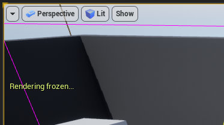

# Culling

## UE4支持的Culling方法和设置
UE4一共支持4中Culling方法。

### Distance culling距离剔除
基于摄像机与actor的距离决定是否剔除，在actor中可以设置：

Min draw distance表示小于这个距离该actor就不在绘制

Desired max draw distance表示（期望）大于这个距离该actor就不在绘制

Current max draw distance表示如果有cull distance volume存在的情况下，实际使用的max draw distance。

另有Actor - Cull Distance Volume，用于设置某个范围内的culling distance。

每个Actor可以在细节面板设置是否支持Cull distance volume：

### View frustum culling视锥体剔除
基于视锥体，剔除视锥体之外的物体。该Culling是**默认开启**的。

可以勾选 显示-高级-视锥体 以显示视锥体的形状。

### Precomputed visibility culling可见性剔除
离线计算某个单元格内不可见的actor，生成离线数据。在实时运行时，根据摄像机所处的位置剔除不可见actor。适用于**中小型关卡**。

### Dynamic occlusion queries动态遮挡查询
遮挡查询用于剔除在相机视锥体内被其他物体遮挡的物体。UE4支持几种遮挡查询方法。

#### 设置物体的边界
首先在编辑器中显示bounds：

选中一个actor，会有一个黄色的球体和蓝色的立方体包裹住该actor，这就是这个actor的bounds。蓝色的立方体即bounding box，用于计算物体的可见性。

在Actor编辑界面，同样可以选中Bounds按钮以显示bounds：

通过修改actor细节面板中的Bound Scale，可以改变它的bounds大小：

或者在Actor编辑界面，更加细粒度地修改坐标轴六个方向的scale值：

物体的bounding box越大，就越不容易被裁剪。这样可以避免相机快速移动时本来可见的物体不可见的artifact，但是会有更多渲染开销。

需要注意的是，蓝色线框表示的bound box是axis-aligned，因此如果mesh在场景中有旋转，那么可能会产生大片空bound，如下面这个mesh。这样会使得culling错误，本可以剔除的物体被错误地留了下来。

#### Hardware occlusion queries 硬件遮挡查询
硬件遮挡查询是默认开启的。可以在 项目设置 - 渲染 - 剔除 中开启或关闭，或用控制台命令`r.AllowOcclusionQueries 1`。

#### Hierarchical Z-Buffer Occlusion 层级Z缓冲遮挡
与硬件遮挡查询类似，但是结果更保守（剔除更少）。可以用控制台命令`r.HZBOcclusion 1`开启或关闭。

#### 其他遮挡查询
面向移动端的Software Occlusion Queries和面向VR设备的Round Robin Occlusion。略过。

## UE4 culling debug tips
### Cull distance volume的使用
将Cull distance volume拖入场景中之后，调整actor的Location/Rotation调整到能完整包围整个子场景即可；然后靠配置cull distance pair来起作用：

Cull distance pair需要反复调整，根据volume内物体的大小设置合适的值。

调试的时候，可以灵活使用 Game view（快捷键G） 与`Freezerendering`命令来查看物体的剔除情况。

具体步骤如下：

1. 添加Cull distance volume到场景中，并设置cull distance pair
   - Cull distance pair中，Size表示待culling的primitive的bounds的最大值，例如下面这个primitive，bound size为36x162x58，所以它的size为162
   - Cull distance表示（与相机）超过这个距离，该primitive就会被剔除，具体的取值需要反复调试
2. 选取一个调试相机位置，将preview相机移动到该位置，进入 Game view，此时预览的效果已经对primitive做了Culling
3. 在控制台输入`Freezerendering`命令，冻结culling状态
4. 此时可以移动相机，近距离活拉高视角观察primitive的culling状态

### Precomputed visibility volume的使用
使用Precomputed visibility volume需要先构建光照，并且按如下设置：

- 开启Project setting - Allow static light
- 关闭World setting - Force no precomputed light
- 开启World setting - Precompute visibility
- 将Precomputed visibility volume拖动到场景中，覆盖摄像机（主角）可以达到的区域。

构建光照，然后构建visibility volume。

可以用控制台命令`r.ShowPrecomputedVisibilityCells 1`显示所有构建好的cell，或者用`r.ShowRelevantPrecomputedVisibilityCells 1`显示摄像机附近的cell。

### Culling相关的统计数据
可以用控制台命令`stat initviews`或如下菜单打开debug信息。

其中，上半部分展示了Culling相关的函数调用的耗时，下半部分展示了各个Culling方法剔除的primitive的数量。需要注意的几条已经标注在截图中。

### 冻结culling
可以通过冻结culling算法，检查场景中被剔除的primitive。

控制台命令：`freezerendering`，冻结时左上角有提示：

冻结后，调整视角，可以看到当前场景中保留下的primitive：

对比完整的场景：

注意：FreezeRendering仅仅冻结了Culling状态，被剔除的primitive虽然不会绘制，但是依然有碰撞、阴影。

### 可视化被遮挡的primitive
可以用控制台命令` `r.VisualizeOccludedPrimitives 1`显示被遮挡的primitive。

被遮挡的primitive会用绿色的方框框起来。

## Reference
[UE文档 - Visibility and culling](https://docs.unrealengine.com/4.26/en-US/RenderingAndGraphics/VisibilityCulling/)

[Epic分享 - Understanding Culling Methods](https://www.youtube.com/watch?v=6WtE3CoFMXU)

