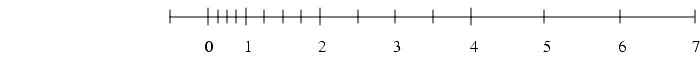
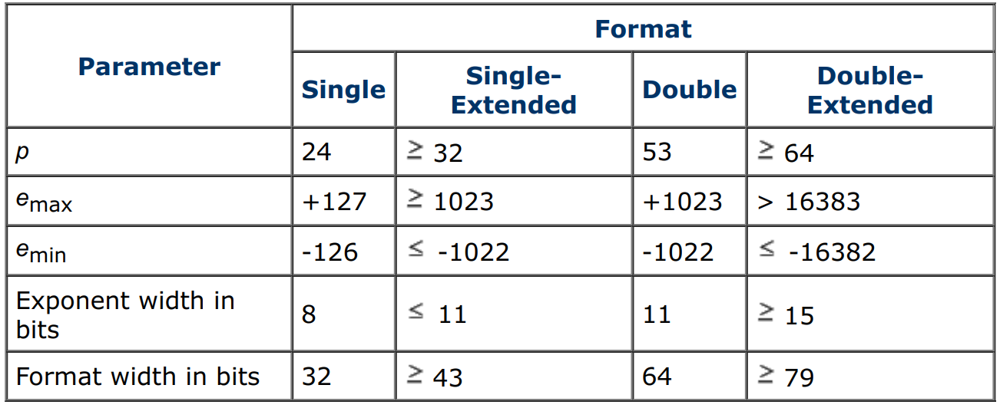
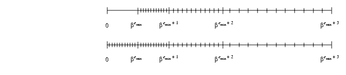

# 关于浮点数，我们应该知道什么
浮点数是计算机常用的一种表示实数的方法。虽然平时感觉不到，但是浮点数的运算、设计会和整数有很大的不一样，了解浮点数的底层原理，有助于调试程序中遇到的一些奇奇怪怪的问题。

本文将从两个方面展开，先介绍浮点数的通用表示形式，讨论浮点数误差等话题，然后介绍IEEE标准对浮点数做了哪些规范。
<!-- 
- 浮点数的通用表示形式
- 为什么要用浮点数，还有哪些替代方案
- 浮点数的误差衡量标准
- IEEE标准对浮点数做了哪些规范
  - 基础定义
  - 特殊记号
  - 异常与处理 -->

## 浮点数的格式
取一个基底$\beta$，一个精度$p$，浮点数根据

$$
\pm d.dd...d\times \beta^e
$$

用$d.dd...d$和$e$表示。其中，$d.dd...d$有$p$位有效数字。更准确的记法应该是：

$$
\pm (d_0+d_1\beta^{-1}+...+d_{p-1}\beta^{-(p-1)})\beta^e, (0\leq d_i<\beta)
$$

利用这个记法，可以在**一定精度范围内**表示实数。之所以要强调**一定精度范围内**，是因为将某个范围内的无穷多的实数映射到有限域上，一定会存在精度损失。这个跟整数的表示很不一样，因为在规定了范围以后，整数域里整数的数目是固定的。

对于这个表示法，有几个细节需要注意

1. 整数部分只有一位，这一位如果是零，则这个浮点数被称为“未归一化的”，如果非零则称为“归一化的”。如果不归一化，一个浮点数会有很多种（理论上无穷多种）记法。
2. 基底$\beta$可以取任何值，但是考虑到人的习惯以及计算机的特性，通常取2，10或16。
3. 正负号是通过额外的标记位表示的，不计入$d.dd...d$和$e$之内。这一点在后面会提到。

举个例子，如果我们取$\beta = 2, p=3$，那么在$e\in [-1,2]$时，一共可以表示16个归一化的浮点数：

### 浮点数的误差
讨论浮点数时，一个避不开的话题就是误差。为什么浮点数一定会有误差？因为计算机通常采用$\beta = 2$，有些十进制下可以精确表示的数字是无法在计算机中精确表示的。例如十进制下的小数$0.1$就无法被基底为2的浮点数精确表示，无论精度取多少。

除了表示上带来的误差，运算时也会带来一定的误差。考虑$\beta = 10,p=3$时，以下这则减法运算：

$$
\begin{aligned}
x & = 2.15 \times 10^{12} \\
y & = 1.25 \times 10^{-5} \\
x - y & = 2.15 \times 10^{12} - 0.0000000000000000125 \times 10^{12} \\
& = 2.1499999999999999875 \times 10^{12} \\
& = 2.15 \times 10^{12}
\end{aligned}
$$

类似的例子不胜枚举。因此，我们需要一套标准来衡量浮点数的误差，并且研究什么时候会产生误差，以及如何消除它。

#### 相对误差
在介绍相对误差之前，需要引入两个对误差的度量方式。

第一种是ulp。ulp的全称是units in the last place，即浮点数最低位表示的单位，$\beta ^{-(p-1)}$。当我们把一个实数表示为浮点数的时候，考虑到四舍五入（当然这不是唯一的舍入方法，后续会谈到），可能的最大误差是$0.5ulp$。如果浮点数时归一化的，那么浮点数的误差满足：

$$
\frac{1}{2}\beta^{-p} \le \frac{1}{2}ulp \le \frac{\beta}{2}\beta^{-p}
$$

ulp的一个缺陷或者也是它的一个特点是，它是浮点数精度的函数，如果用ulp来表示误差，相当于对精度做了一个归一化。

另一个度量方式是epsilon，记为$\epsilon = (\beta / 2)\beta^{-p}$。如果说ulp描述的是浮点数的精度，那么epsilon描述的就是浮点数的误差。它的值刚好是浮点数的误差上界，因此它也被称为machine epsilon，意思是该表示方式下的机器误差。

相对误差定义为，实数与它对应的浮点数的差值比上实数自身。记为$|x-\bar{x}|/x$。这个定义比较好理解。举例来说，假设实数$3.14159$，表示为浮点数为$3.14\times 10^0$，那么该表示法的相对误差为$.00159/3.14159\approx .0.0005$，考虑到$\epsilon=5\times 10^{-3}=.005$，相对误差也可以记为$0.1\epsilon$。

相对误差和ulp/epsilon有一个很根本的不同。考虑这个例子：如果实数$x=12.35$，令它的浮点数为$1.24 \times 10^1$。这个表示法引入的误差是$0.5ulp = 0.8\epsilon$。现在计算$8x$这个乘法，精确值是$8x = 7 \times 12.35 = 98.8$，而如果用浮点数计算，结果为$1.24 \times 10^1 \times 8 = 9.92 \times 10^1$。此时的相对误差没有变，但是记为$4ulp$。也就是说，如果用ulp或者epsilon来表示相对误差，经过四则运算后相对误差可能会上下摇摆$\beta$倍。

### Guard digits
前面曾经提到，浮点数的一大误差来源于运算。两个指数位差异较大的浮点数在运算时，会先将指数位统一，**舍入**到最近的浮点数（对齐精度到$p$位），此时便会引入误差。例如$10.1-9.93$这个实数运算：

$$
\begin{aligned}
x & = 1.01 \times 10^1 \\
y & = 9.93 \times 10^0 = 0.99 \times 10^1 \\
x - y & = .02 \times 10^1
\end{aligned}
$$

相较于准确的结果$0.17$，此时的误差有30ulp！

对于这个问题，比较完美的解决方案是在统一指数位的时候，不对浮点数进行近似。但是这样做的话其中一个操作数的精度可能会远超$p$，对运算不利。折中的方案就是，增加一位额外的Guard digit，即舍入后的浮点数的精度不再是$p$，而是$p+1$。数学上可以证明，一位guard digit可以使得相对误差降低到$2\epsilon$。

$$
\begin{aligned}
x & = 1.01 \times 10^1 \\
y & = 9.93 \times 10^0 = 0.993 \times 10^1 \\
x - y & = .017 \times 10^1 \\
& = 1.7 \times 10^{-1}
\end{aligned}
$$

### 舍入规则
关于舍入规则，最常用的方法是四舍五入。但是如果仔细想一下，这个方法是有问题的。比如$0.5$距离$0$和$1$的距离明明是一样远，为什么要“入”到$1$而不是“舍”到$0$呢？一个勉强能接受的说法是，在“四舍五入”中，有5个数字${0,1,2,3,4}$会被舍弃，另外5个数字${5,6,7,8,9}$会进一。

但是在浮点数的运算规则下，四舍五入有一个致命的问题。考虑这样一个例子，取$\beta = 10, p = 3$，并令$x = 1.00, y = -5.55 \times 10^{-1}$，如果采用四舍五入规则，那么

$$
\begin{aligned}
x_0 & = x = 1.00 \\
x_1 & = (x_0 - y) + y \\
& = 1.56 + (- 0.555)\\
& = 1.01
\end{aligned}
$$

此时，$x_1 = x_0 - y + y$，理论上应该得到$x_1 = x_0 = x$，但是结果却是$x_1 \neq x$。其中的原因就是四舍五入制造的误差被累积了，计算结果会不断**向上漂移**。

相应地，如果采取“五舍六入”的规则，在特定的情况下计算结果会不断**向下漂移**。所以看起来“5”这个数字刚好处于一个尴尬的位置，不能全舍也不能全入。

因此浮点数运算通常采用另一个方案——四舍六入五取偶（round to even）。如果需要舍入的位置是数字5，那么根据前一位的奇偶性决定舍入，如果前一位是奇数，则进一，如果是偶数则舍弃，保证舍入后最低位是偶数。

可以证明，如果采用四舍六入五取偶的舍入规则，那么对于浮点数$x$和$y$，运算$x_0 = x, x_1 = (x_0-y)+y, x_2 = (x_1-y)+y...., x_n = (x_{n-1}-y)+y$将始终满足$x_n = x$。

<!-- ### 减少误差
前面提到，浮点数的运算会产生误差，那么一个自然的问题就是，如何减小甚至消除四则运算引入的误差？考虑这样一个例子，一元二次方程的求根公式中有$b^2-4ac$这样一项，

Cancellation在这里应该翻译为“抵消”， -->

## IEEE标准
IEEE对浮点数的定义集中在IEEE-754和IEEE-854两部分，前者被称为IEEE二进制浮点数算术标准，定义了底数为2的单精度和双精度浮点数的细节；后者则将底数拓展为2和10。

关于底数的选取，IEEE-854规定了10为底数的情况是可以理解的，因为这正是人的表示习惯。规定2为底数而不是8或者16或者其他数为底数的原因，可能在于底数越大运算时的摇摆误差越大（$\beta$倍），用2做底数可以一定程度上降低相对误差。

由于10为底数的情况比较少见，这里主要讨论IEEE-754规定的2为底数的情况。

### 基础定义
IEEE-754规定，计算机中存储一个浮点数的时候，需要存储3个部分：指数部分、尾数部分和符号位。

**符号位**指示该浮点数时正的还是负的。将符号位单独列出来会面临一个问题——$\pm0$是两个不同的数。这也是计算机表示整数时不会单独定义符号位的原因。但是在IEEE的定义里，$\pm0$是有意义的，这个后面再说。

**尾数部分**决定了浮点数的精度$p$。IEEE-754规定浮点数都是归一化的，再考虑到底数为2，这意味着浮点数的小数部分一定是以1.xxx开头，所以不会变的整数部分1就不用记录，只需要记录小数点后面的位数部分就可以了。

至于具体用多少位来记录尾数部分，参考下图的第一行。需要注意的是，表中写的单精度浮点数24位、双精度浮点数53位都是包含了符号位的，也就是说实际记录位数部分的位数只有单精度的23位和双精度的52位。

前面分析过，精度$p$越大，误差越小，这也是为什么浮点数的一大半位数（单精度的23/32，双精度的52/64）都用来保存尾数部分。

以单精度浮点数为例，它的machine epsilon是$2^{-23}$，约等于$10^{-7}$，也就是说，单精度浮点数的精度截止到小数点后七位，再往后就不准确了。考虑到浮点数的指数越大，表示实数的颗粒度越大（即相邻两个可表示的数的间隔越远），并且它的指数位有8位，最大指数是127，即$2^127$，约等于$10^{38}$，远大于尾数部分的7位精度。所以尾数部分的精度其实还是并不太够的。IEEE-754做这样的规定，是权衡了表示精度和表示范围后的决定，在使用时，尽可能让浮点数表示接近1的实数，避免特别大或特别小的实数，可以一定程度上减小误差。

**指数部分**
如上表所示，单/双精度浮点数的指数部分一共有8/11位，表中第二三行还列出了支持的最大最小指数。仔细看可以发现，$e_{max}-e_{min}+1\neq 2^{e}$，例如单精度浮点数的$e_{max}-e_{min}+1=254$，而8位二进制数一共可以表示256个不同的数字。这是因为IEEE-754规定了浮点数的一些标记，后面几节会详细提到，例如当$e = e_{max}+1$时，浮点数表示正负无穷大（小数部分为0）或NaN（小数部分不为0）。

关于如何用二进制表示整数（有正有负），常用的方法有三种。第一种方法是令其中一个比特位为符号位，其他的比特位表示一个非负整数；第二种方法是正数部分不变，负数部分映射到正数部分后面，即$[-2^{p-1}, -1] => [2^{p-1}, 2^p - 1]$。

而IEEE-754规定浮点数用第三种方法，即先将整数部分解释为非负的，然后减去一个偏移。对单精度浮点数而言，这个偏移是127，双精度浮点数是1023。

除了规范浮点数的格式，IEEE-754也规定了浮点数需要支持的基本操作，除了加减乘除，也包括求根（square root）、取余（remainder）以及与整数的相互转换。

### 舍入模式
舍入模式（rounding modes）指的是对多余位数的处理方式，维基百科翻译为“数值修约”（好奇怪的名字），这里图省事直译为舍入模式。

前面介绍了四舍六入五取偶的舍入模式，除此之外，IEEE-754还定义了一些其他的方法。

1. round toward 0，直接将尾部截掉
2. round toward $+\infty$，类似于`ceil`函数
3. round toward $-\infty$，类似于`floor`函数

这些方法都比较直接，就不再赘述。

### 特殊记号
除了表示归一化的合法浮点数字，IEEE-754还规定了一些特殊数字。完整的情况如下表所示。

$$
\begin{array}{l|l|l}
    \text{Exponent} & \text{Fraction} & \text{Represents}\\
    \hline
    e = e_{min} - 1 & f = 0 & \pm 0\\
    \hline
    e = e_{min} - 1 & f \neq 0 & 0.f \times 2^{e_{min}}\\
    \hline
    e_{min} \le e \le e_{max} & -- & 1.f \times 2^{e}\\
    \hline
    e = e_{max} + 1 & f = 0 & \pm \infty\\
    \hline
    e = e_{max} + 1 & f \neq 0 & \text{NaN}\\
\end{array}
$$

其中，只有当$e_{min}\le e \le e_{max}$时，表示的是归一化的浮点数（小数部分的整数为1）。而当$e = e_{min} - 1$或$e = e_{max} + 1$时，根据尾数部分的情况，可以表示非归一化的浮点数或一些特殊情况。下面分别介绍这些特殊情况。

#### NaN
Nan是Not a number的缩写，表示当前浮点数时非法的。常遇到的产生NaN的情况包括除数为0、对负数开根号等。设想，如果没有NaN，对非法运算要么抛出异常终止运算，要么返回一个错误的合法浮点数。前者影响程序的正常运行，后者容易埋下不易调试的bug。

下表列出了返回NaN的各种运算情况。当然，对任意一种运算，如果任意一个操作数是NaN，结果必然是NaN。

$$
\begin{array}{r|l}
    \text{Operation} & \text{NaN Produced By} \\
    \hline
    + & \infty + (-\infty) \\
    \times & 0 \times \infty \\
    / & 0/0, \infty/\infty \\
    \% & x \% 0, \infty \% y \\
    \sqrt{} & \sqrt{x}(\text{when } x < 0) \\
\end{array}
$$

#### 无穷大
无穷大的存在是为了处理溢出（overflow）的情况。向上溢出就会产生正无穷，向下溢出会产生负无穷。0除以0会返回NaN，但是非零数除以0会返回无穷大，根据被除数的正负返回正负无穷大。可能产生无穷大的算式或者无穷大参与的算式在运算法则上跟数学的极限概念一致，也比较容易理解，因此不再一一举例。

#### 有符号的数字0
IEEE-754规定的特殊数字当中有一项可能不容易理解，那就是$\pm0$。当$e=e_{min}-1, f=0$时，根据符号位的正负，浮点数表示的是$\pm0$。

那么第一个问题就是，为什么要分别表示两种符号的0，它们不是相等的吗？确实，IEEE-754规定了$+0 = -0$。考虑这样一种运算$1/(1/x) = x$，如果$x=-\infty$，等式有是不成立的。这里面的问题在于，如果0没有符号，那么$x=-\infty$时，$1/x$这个运算就丢掉了符号，只得到0，此时计算$1/0$，就会得到错误的$+\infty$。

类似于$1/x$，另一个利用有符号0的场景是$\log x$函数。我们可以令$\log +0 = -\infty$，令$\log -0 = NaN$来表现该函数在原点处的不连续性。

当然有符号的0也会存在一些无法解决问题。例如，前面提到了IEEE-754规定了$+0 = -0$，但是对于$x = y <=>1/x=1/y$这两个等价的等式来说，如果$x=+0, y=-0$，它是不成立的。

#### 非归一化浮点数
对于归一化的浮点数，可以表示的大于零的最小实数是$2^{e_{min}}$，所有小于这个实数的值都被认为是0。而非归一化浮点数填补了$(0,2^{e_{min}})$这个区间，可以表示$0.b_1b_2...b_{p-1}\times 2^{e_{min}}$。注意这里的指数位是$2^{e_{min}}$而不是$2^{e_{min}-1}$。如下图所示。上面的数轴表示归一化浮点数所能表示的各个实数在数轴上的位置，而下图添加上非归一化浮点数之后，可以看到$(0,2^{e_{min}})$区间过渡更平滑了。

有了非归一化的浮点数，可以处理一些原本会underflow的情况了。例如取$\beta = 10, p = 3, e_{min} = -98$，对于数字$x = 6.87 \times 10^{-97}, y = 6.81 \times 10^{-97}$，它们的差值$x - y = 6.0 \times 10^{-99}$，已经小于归一化浮点数的表示范围了。如果没有非归一化浮点数，就会出现$x - y = 0$但$x\neq y$的问题。有了归一化浮点数，可以表示为$x-y=0.6\times 10^{-98}\neq 0$。

但是这仍然不意味着可以用$x==y$来判断浮点数是否相等。非归一化浮点数虽然被IEEE-754规定了下来，但是并不是所有的硬件都相应的支持了。因此，如果要判断浮点数是否相等，还是应该手动设置比较精度$\epsilon$，然后判断两个数的差值的绝对值是否小于$\epsilon$。这样程序的行为更可控。

## 总结
本文抛砖引玉地介绍了浮点数的一些知识，以及IEEE标准的一些规定。事实上，IEEE-754对浮点数做了异常详尽的规范，本文介绍的这些仅仅是冰山一角，甚至仅仅是[1]的冰山一角，[1]还对许多定理做了证明，篇幅原因本文一概略过了。如果希望完整了解建议直接阅读[1]或者IEEE-754文档。

## 参考文献
[1] [What Every Computer Scientist Should Know About Floating-Point Arithmetic](https://docs.oracle.com/cd/E19957-01/806-3568/ncg_goldberg.html#1129)

