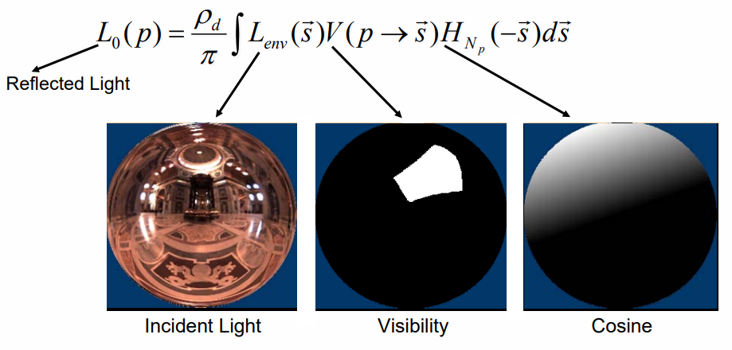
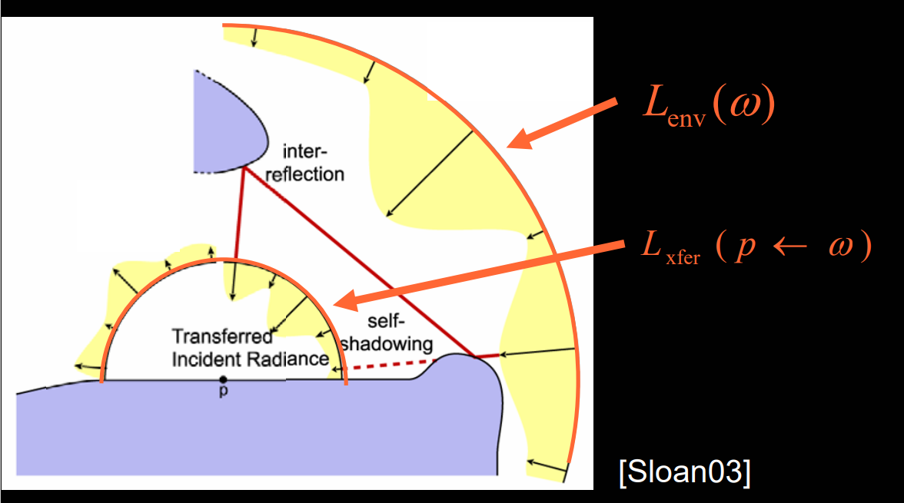

# 摘要
PRT（precomputed radiance transfer）的全称很长，Precomputed radiance transfer for real-time rendering in dynamic, low-frequency lighting environments，强行翻译一下大概是`基于预计算辐射率传播函数的动态低频环境光场景的实时渲染`，论文[1]对它的定义是：
```
real-time method for rendering diffuse and glossy objects in low-frequency lighting environments that captures soft shadows, interreflections, and caustics
```
关键词：
- real-time
- diffuse and glossy
- low-frequency lighting
- shadows interreflections and caustics

这里需要补充一下的是，在PRT之前，实时渲染的一大难题就是解决阴影和互反射问题，caustics现象就更不用说了，难上加难。主要难点在于这些物理现象要求对每个点的半球面求解入射光线的积分（渲染方程），这实在是一个很难实时完成的任务。PRT算法的核心有两个

1. 将环境光照用基底编码，如球谐光照方法；
2. 将入射光映射为包含阴影、反射等信息的transferred radiance，预先计算、存储起来，在实时渲染时将其直接应用到实时光照上；

在这个思想的指导下，可以大大简化实时渲染过程时的计算量，使实时成为可能。
# 球谐光照
在正式介绍PRT之前，有必要先补充一下球谐光照和球谐函数的相关知识。
球谐函数（spherical harmonics）本身是来自物理学的一个概念，是对定义在球面上的函数的分解，类似于傅里叶变换是对一维函数的分解一样。傅里叶变换将一维函数分解为不同频率的正弦函数的累加，而球谐函数将球面上的函数分解为一组（无穷多个）标准正交的基底的累加。具体的公式可以参考[3]，这里就不详细介绍和推导了。

那为什么会突然提到球谐函数呢？因为环境光表示的是三维空间中各个方向上的光线，刚好可以看做是定义在球面上的函数，有了这一层“关系”，我们就可以利用球谐函数，将环境光参数化，既方便存储也方便使用。参数化的时候会有一个近似，因为如果完整地表示环境光，需要无穷多个球谐参数。这很明显是不可能的。好在绝大部分参数表示的都是高频光照，作用不是很大，可以忽略掉。对于常用的低频光照，3~5阶（9~25个)球谐系数就足够了。

球谐函数有很多优良特性，对我们后续推导PRT会有帮助，简单介绍一下。

## 标准正交性（orthonormal）
这个就无需赘述了：
$$
\begin{cases}
\int y_iy_j=1& {i=j}\\
\int y_iy_j=0& {i\not=j}
\end{cases}
$$
## 旋转不变性（rotational invariance）
物理意义是当环境光旋转（或者模型旋转）的时候，通过简单地矩阵变换就可以获得新的环境光系数。

如果我们有旋转操作$R$，那么如果我们有一个定义在单位球面上的原函数$f(s)$，设旋转过后的函数是$g(s)$，也就是：
$$
g(s)=R(f(s))
$$
那么同时有：
$$
g(s)=f(R(s))
$$
## Product projection
这个性质暂时没找到准确的翻译，它的意思假设两个球面函数$a(s)$和$b(s)$的乘积是$c(s)$，即$c(s)=a(s)b(s)$，那么$c(s)$的球谐系数$c_i$可以看做是$b_i$经过变换$\hat{a}$后的值：
$$
\begin{aligned}
c_i & = \int a(s)(\sum_j b_jy_j(s))y_i(s)ds \\
& =\sum_j \left(\int a(s)y_i(s)y_j(s)ds\right)b_j \\
& =\sum_j \left(\sum_k a_k\int y_i(s)y_j(s)y_k(s)ds\right)b_j \\
& =\sum_j \hat{a_ij}b_j
\end{aligned}
$$
也就是说，somehow $c(s)$和$b(s)$是线性关系。这个结论可以先记一下，后面会用到。

# 理论推导
接下来参考[2]介绍一下PRT的算法思想。注意，这里我们不再细究辐射度量学的那一套辐照度、辐射度等概念，统称为光线。同时，本文将称呼[1]中的Glossy为镜面反射，与Diffuse漫反射相对应。

## 漫反射部分
算法的推导要从渲染方程讲起。我们首先将光照分为直接光照（$L_0$）、经过一次反射的间接光照（$L_1$）以及更多次反射的间接光照（$L_n$），那么可以写为出射光线$L$可以写为：
$$
L_p=L_p^0(\vec{d})+L_p^1(\vec{d})+...
$$
考虑直接光照项：
$$
L_p^0(\vec{d})=\int_{\Omega}f_r(p,\vec{s}\to\vec{d})L_{env}(\vec{s})V_p(\vec{s})H_{N_p}(-\vec{s})d\vec{s}
$$
其中，$f_r(p,\vec{s}\to\vec{d})$是BRDF函数，$L_{env}(\vec{s})$表示入射光，$V(p\to \vec{s})$表示可见性，即遮挡函数，$H_{N_p}(-\vec{s})$表示cosine项。

由于这里我们只考虑漫反射项，所以可以无视视角的影响，化简为：
$$
L_p^0=\cfrac{\rho_d}{\pi}\int L_{env}(\vec{s})V_p(\vec{s})H_{N_p}(-\vec{s})d\vec{s}
$$
各部分的物理意义如下图：



其中，后两项$V$和$H_{N_p}$是可以预计算的，只有入射光线由于受实时光照的影响，无法预计算。
接下来，我们将环境光$L_{env}$改写为球谐展开的形式：
$$
L_{env}(\vec{s}) \approx \sum_i{l_iy_i(\vec{s})}
$$
其中，$l_i$表示球谐系数，$y_i$表示球谐函数的基底。

那么有：
$$
L_p^0=\cfrac{\rho_d}{\pi} \sum_i l_i\int y_i(\vec{s})V_p(\vec{s})H_{N_p}(-\vec{s})d\vec{s}
$$
到了这一步，我们可以发现积分符号内部的所有项，包括$\rho_d$项都是可以放在预计算过程的，记为$M_p$，带入最初考虑间接光照的渲染方程，有：
$$
\begin{aligned}
L_p & = \sum_i{l_i \left( M_{pi}^0 + M_{pi}^1 + ...\right)} \\
& = \sum_i{l_iM_{pi}}
\end{aligned}
$$
因此，根据预先计算好的$M_p$，在实时渲染时，只需要先对环境光的球谐系数做一轮旋转操作，然后跟$M_p$做内积，就可以求得对应点的出射光线，整个流程异常简单。

## 镜面反射部分
漫反射部分可以这样化简的主要假设是，出射光线与视角无关，但是镜面反射部分就不能这样假设了，根据常识，镜面高光往往在视角与平面法相接近的时候最强，垂直的时候最弱，因此很明显镜面高光与视角有很强的关系，无法直接将漫反射的推导过程推广到镜面反射上。

但是漫反射的推导思路至少可以借鉴一下，那就是尽可能将光照无关项合并起来，作为预计算的输出。那么从物理的角度考虑，我们都可以预计算一些什么呢？是自遮挡项、互反射项。那么既然如此，我们不如定义一个包含自遮挡、互反射项的$L_{xfer}$，即transferred incident radiance。其物理意义就是从点p向外看，看到的视角。如下图所示。



这样，我们在实时渲染的时候，就可以直接用$L_{xfer}$跟BRDF和consine项相乘，省去了计算遮挡、互反射项的麻烦。虽然没法像漫反射那样一个内积一步到位，但至少能够节省一部分实时工作量。而定义$L_{xfer}$的另一个优势是，$L_{xfer}$的球谐系数跟$L_{env}$的球谐系数是线性关系。这一步的推导要靠前面提到的球谐函数的`Product projection`特性。假设他们之间的转换矩阵是$\mathcal{M}$，那么有
$$
L_{xfer} = \mathcal{M}L_{env}
$$
$\mathcal{M}$的物理意义可以理解为，它的每一列定义了$L_{xfer}$在对应的单位球谐基底的光照下的入射光。

$\mathcal{M}$的预计算可以利用最简单的光线追踪的方法来算，当然这样会比较慢，存储的结果也会非常庞大。后面会讲到论文[1]是怎么解决这个问题的。

在实时渲染的时候，有了$\mathcal{M}$，我们可以根据光照情况先计算$L_{xfer}$，然后跟BRDF和consine项相乘，就可以算得对应点的出射光线了。

## 总结
讲了这么多，其实只讲明白了一点：对漫反射可以用一个transfer vector $M$将入射光线（的球谐光照系数）转化为出射光线；对一般情况（或者说是高光部分），可以用一个transfer matrix $\mathcal{M}$将入射光线（的球谐光照系数）转化为包含自遮挡、互反射的transferred incident radiance。

对于漫反射部分，渲染公式为：
$$
\begin{aligned}
L_{DU}(p) & =\cfrac{\rho_d}{\pi}\int L_{env}(\vec{s})H_{N_p}(-\vec{s})d\vec{s} \\
L_{DS}(p) & =\cfrac{\rho_d}{\pi}\int L_{env}(\vec{s})V_p(\vec{s})H_{N_p}(-\vec{s})d\vec{s} \\
L_{DI}(p) & =L_{DS}(p) + \cfrac{\rho_d}{\pi}\int \overline{L}_{env}(\vec{s})H_{N_p}(-\vec{s})(1-V_p(\vec{s}))d\vec{s}
\end{aligned}
$$
第一个公式$L_{DU}(p)$表示不考虑遮挡的漫反射项，其中没有visibility $V$项。

第二个公式$L_{DS}(p)$表示考虑遮挡的漫反射项。

第三个公式$L_{DI}(p)$表示考虑互反射项（interreflections）的漫反射项，这个公式的思路是说，入射光线除了直接光照（即$L_{DS}(p)$），还有来自物体自身的其他部分的反射光，后者的可见性刚好是$1-V$，入射光$\overline{L}_{env}$是其他部分的出射光线。利用这个思路，可以用迭代的方式利用上一轮的结果计算本轮的$L_{DI}(p)$。这个思路的一条假设是光照和几何都是均匀变化的，前者$L_{DS}(p)$可以认为是光照造成的（light-dependent），后者可以认为是几何造成的（geometry-dependent）。

镜面反射部分：
$$
\begin{aligned}
L_{GU}(p) & =\int L_{env}(\vec{s})G(s,R,r)d\vec{s} \\
L_{GS}(p) & =\int L_{env}(\vec{s})G(s,R,r)V_p(\vec{s})d\vec{s} \\
L_{GI}(p) & =L_{GS}(p) + \int \overline{L}_{env}(\vec{s})G(s,R,r)(1-V_p(\vec{s}))d\vec{s}
\end{aligned}
$$
思路跟漫反射部分一样，只不过这里我们用高光核$G(s,R,r)$表示BRDF项和consine项。

需要预计算的transfer vector/matrix为：
$$
\begin{aligned}
M_p^{DU}(\vec{s}) & = H_{N_p}(\vec{s}) \\
M_p^{DU}(\vec{s}) & = H_{N_p}(\vec{s})V_p(\vec{s}) \\
\mathcal{M}_p^{GS}(L_{env}, \vec{s}) & = L_{env}(\vec{s})V_p(\vec{s})
\end{aligned}
$$
这里需要说明一点的是，$\mathcal{M}_p^{GS}$公式里面的$L_{env}$其实是对应的球谐系数，具体的算法接下来会讲，这里对公式有个大概的认知就可以。

# 预计算过程
预计算的过程非常类似渲染，只不过预计算的输出结果不是像素点最终的颜色，而是transfer vector/matrix。初始化的时候先将transfer vector/matrix置0，然后利用subpass迭代更新。

还有一个注意点是，预计算过程并没有将每个点都算一遍，而是做了一轮采样，非采样点则需要在渲染的时候利用周围的采样点差值得到。同样，采样点上的光线入射方向$s_d$也是采样过的（每个点大概是10k~30k个方向），以此模拟球面积分。

预计算的第一个subpass计算直接光照，更新公式如下，都是根据前面推导的公式来的。
$$
\begin{aligned}
\left(M_p\right)_i^0 & += \cfrac{\rho_d}{\pi} V_p(s_d)H_{N_p}(s_d)y_i(s_d) \\
\left(\mathcal{M}_p\right)_{ij}^0 & += V_p(s_d)y_j(s_d)y_i(s_d)
\end{aligned}
$$
接下来需要多次迭代计算间接光照：
$$
\begin{aligned}
\left(M_p\right)_i^b & += \cfrac{\rho_d}{\pi} (1-V_p(s_d))\left(M_q\right)_i^{b-1}H_{N_p}(s_d) \\
\left(\mathcal{M}_p\right)_{ij}^b & += (1-V_p(s_d))\left(\sum_k \alpha_k \left(G_{r_q}^*\right)_k\left(\mathcal{M}_q\right)_{kj}^{b-1}y_k\left(\text{reflect}(-s_d, N_q)\right)\right)y_i(s_d)
\end{aligned}
$$
迭代的终止条件是光照强度小于某个阈值。思路就是前面介绍的，用上一轮的结果作为本轮的输入。

# 实时渲染过程
终于到了实时渲染过程，经过前面一堆铺垫，渲染的过程就很简单了，流程如下：

1. 根据入射光线，计算对应的球谐系数；
2. （如果需要）旋转入射光线的球谐系数；
3. 利用transfer vector/matrix对入射光线进行变换，计算出射光线；
4. 对于镜面反射，还需要乘上BRD项和其他与视角有关的项，得到最终结果；

整个PRT的思路大概就是如此。还有一些细节（比如采样点怎么取，怎么差值等等）没有阐述清楚的，可以参考论文[1]。虽然这是一个很老的算法了，但是它的思路依然有很多可以学习的地方，包括从渲染方程一步步简化到一个非常简介的式子。这也是图形学里面很多算法的思路。学的图形学算法越多，越觉得渲染方程真牛逼。

# Reference
[Precomputed radiance transfer for real-time rendering in dynamic, low-frequency lighting environments](https://dl.acm.org/doi/pdf/10.1145/566570.566612)

[Precomputed Radiance Transfer: Theory and Practice --Siggraph 2005 Course](http://www0.cs.ucl.ac.uk/staff/j.kautz/PRTCourse/)

[球谐光照](https://huailiang.github.io/blog/2019/harmonics/)
