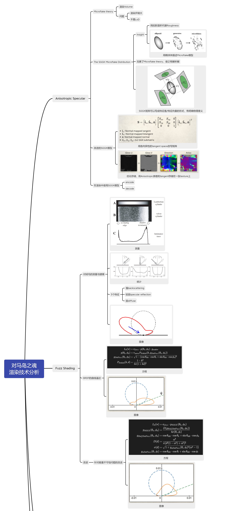
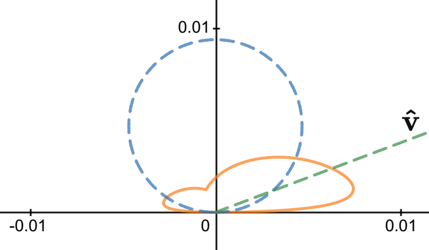

# SIGGRAPH 2020 Course: Samurai Shading in Ghost of Tsushima - part 1
SIGGRAPH 2020 Course: Samurai Shading in Ghost of Tsushima主要分享了《对马岛之魂》这款游戏中的一些图形学技术，包括

- 渲染强各向异性的材质
- 渲染强asperity scattering的材质
- 提升皮肤渲染的准确性
- 更高效地使用detailed map

《对马岛之魂》的背景放在13世纪封建社会的日本，玩家操作一名日本武士，为了解放被蒙古入侵的对马岛的故事。整个游戏的渲染风格不是写实（photorealism），而是风格化的（stylized realism）。用到的渲染管线多数是延迟管线，少许前向管线，具体的划分如下。

- 延迟管线
  - 兰伯特漫反射部分，包括透明材质和asperity scattering部分。
  - 各向同性的GGX高光
- 前向管线
  - 各向异性的GGX高光（SGGX）
  - 各向异性的asperity scattering BRDF
  - 次表面散射等

本文主要介绍分享的前两个部分。

## 各向异性的高光（Anisotropic Specular）
现有的各向异性GGX高光的一个很不方便的地方在于，它的tangent方向必须跟mesh一致。这使得美术对于渲染效果的控制不够精准。为了解决这个问题，《对马岛之魂》改进了了2015年的一篇paper——*The SGGX Microflake Distribution*。

### The SGGX Microflake Distribution
SGGX这篇论文提出了一种名为SGGX的渲染模型，用于volume rendering，比如毛发、纺织物等。这类物体的渲染有一个模型，叫Microflake。

先解释一下Microflake是啥。这个词的中文“微薄片”听起来很奇怪，所以就直接用英文了。搞过PBR的话应该对Microfacet比较熟悉，Microfacet就是微表面，指的是**平面**上的微小凸起，这个Microfacet theory是描述**平面**特性的物理模型，那么与之对应的，Microflake是用来描述**体素**特性的物理模型。如下图所示，每个Microflake都有朝向，会对光线进行反射，微观上Microflake的表现在宏观上就会呈现出光线与体素（例如雾）交互的现象。

在SGGX之前，此类的渲染算法有两个问题

1. 模型复杂，渲染开销大。
2. 不易downsample，进行低分辨率渲染时性价比低。

因此，为了应对现有模型的问题，SGGX是一种便于LoD，也更加简单的模型。

SGGX模型的关键点有两个

1. 提出了用投影面积替代roughness的方案。
2. 提出了用椭球体（ellipsoid）来描述Microflake模型。

下面具体说说这两个关键点的含义。

我们假设体素内充斥着稀疏的Microflake，每个Microflake可以理解为一个微小的**薄片**，当光线打到它的任意一侧后，会遵循镜面反射定律。在这个模型下，当我们计算一束光线在体素内传播这个过程时，需要计算光线如何与Microflake发生碰撞，以及当光线与某一个Microflake发生碰撞后，光路的改变情况。

对此，我们可以借鉴Microfacet理论的推导方法。只不过Microfacet理论里平行光打到凹凸不平的平面上，而Microflake理论是平行光射入体素里。Microfacet理论里每个微小的平面会独立反射光线，微小表面的法线分布情况即宏观的roughness参数；同样，Microflake理论里，光线射入体素里面后，会与每个Microflake片元交互，发生反射。那么在Microflake理论里，如何衡量体素的roughness呢？答案是看每个Microflake在光线方向上的投影，投影面积越大，意味着光线被Microflake反射的概率越大，也就是粗糙度越大。

将Microflake理论中微小薄片在宏观上的投影面积等效于Microfacet理论中的roughness，这是SGGX模型的第一个洞见。接下来的问题是，如何宏观上表示这一堆零散的Microflake，将它们的朝向或者说投影面积用类似于Microfacet理论中的NDF函数表示呢？

这就引出了SGGX理论的第二个洞见——椭球体模型。如下图所示。

将不知到如何分布的一堆Microflake整合为一个完整的椭球体，这一步直觉上是可行的，但是并没有严格的理论论证，只是SGGX理论给出的一个假设。这一假设也是SGGX模型的误差来源。

所以，我们就不经任何严格推理地假设，一块体素中的所有Microflake刚好可以构成一个椭球体，并且这个椭球体在各个方向上的投影刚好等于所有Microflake的投影的总和。那么，相对于Microfacet理论用两个粗糙度系数$\alpha_x$和$\alpha_y$，描述椭球体需要一个3x3的矩阵。

到目前为止，还有一个问题一直没有提到，那就是SGGX究竟为什么叫SGGX？

SGGX的全称是symmetric GGX。GGX是Microfacet理论的一个法向分布模型，它是定义在半球面上的法向分布，这对描述表面属性的Microfacet理论是很好理解的，但是对于描述体素的Microflake理论而言，半球面分布的GGX很明显是不够的。而SGGX则是将半球面上分布的GGX对称到整个球面上，这也是symmetric S的含义。

### 改进的SGGX模型
SGGX模型用一个3x3的矩阵来描述椭球的形状，但是这个3x3的矩阵过于抽象，不太容易将这九个参数跟某个物理量（例如粗糙度之类的）对应起来，因此更实用的一个形式是将这个矩阵分解为特征向量与特征值相乘的形式：

方便起见，我们把这个矩阵称为${\bf{S}}_{eigen}$形式。三个特征向量对应椭球的三个轴，三个特征值对应沿着相应轴的投影面积的平方。这样描述还有一个好处，GGX可以看做是三个特征向量分别为$\vec{t}$、$\vec{b}$、$\vec{n}$的特殊情况，此时对应的特征值分别为$\alpha_x^2$、$\alpha_y^2$、$1$，前两个分别为粗糙度在tangent方向、bitangent方向的分量的平方。

但是凭空出现的这三个椭球的轴太诡异了，还不是我们需要的物理量。因此我们想把它搞成我们熟悉的轴，比如像GGX那样其中一个轴是法向。我们将SGGX的三个轴$\hat\omega_i$稍作旋转，写成这个形式：

我们把这个矩阵称为${\bf{S}}_{norm}$形式。注意，这里的$\vec{t}$、$\vec{b}$、$\vec{n}$向量并不是GGX里面用到的mesh的tangent空间，而是各向异性的tangent空间旋转对齐到normal后的tangent空间。各向异性的tangent空间不同于mesh的tangent空间的地方在于，后者由mesh定义，而前者可以由artist自行定义。这就使得各向异性不再受制于mesh走向，而可以自行决定偏置方向。而且，改写成这个形式以后，椭球体矩阵${\bf{S}}$只需要三个参数（$S_{xx}$、$S_{xy}$、$S_{yy}$）外加法向量。

### 使用SGGX模型
《对马岛之魂》为了支持SGGX模型，并且设计相关材质，自定义了一个Substance Designer node给artist使用。Artist需要指定材质的

- Gloss UV，即在UV方向上的roughness系数
- direction，即椭球体的朝向

然后，encode过程如下。

1. 根据artist指定的normal和2x2各向异性GGX矩阵恢复SGGX矩阵的${\bf{S}}_{norm}$形式

2. 这是获得的矩阵${\bf{S}}$是可以进行线性插值的，可以用于生成mipmap，获得新的差值后的矩阵${\bf{S}}'$
3. 将${\bf{S}}'$恢复成${\bf{S}}_{norm}$形式，先迭代计算向量${\bf{n}}'$，然后用${\bf{n}}'$计算矩阵${\bf{M}}_{{\bf{n}}'}$，最后计算$S_{xx}'$，$S_{xy}'$和$S_{yy}'$。

4. 存储的时候将normal压缩存储在BC5的纹理中，2x2的各向异性矩阵的三个系数$S_{xx}'$，$S_{xy}'$和$S_{yy}'$以如下公式压缩存储在BC7纹理中。

$$
[\sqrt{S_{xx}'}, \frac{1}{2}\frac{S_{xy}'}{\sqrt{S_{xx}'S_{yy}'}} + \frac{1}{2}, \sqrt{S_{yy}'}]
$$

这样两张纹理就足以表达各向异性SGGX的参数了。相较于SGGX论文保存整个3x3矩阵的方式节省了很多空间。

接下来是decode过程。假设各向异性纹理的三个通道分别为$T_x$，$T_y$，$T_z$。

1. 从纹理贴图中恢复$S_{xx}'$，$S_{xy}'$和$S_{yy}'$。

$$
\begin{aligned}
S_{xx}' & = T_x^2 \\
S_{xy}' & = T_x \times (T_y \times 2 - 1) \times T_z \\
S_{yy}' & = T_z^2 \\
\end{aligned}
$$

2. 求解2x2矩阵

$$
\begin{pmatrix}
S_{xx}' & S_{xy}' \\
S_{xy}' & S_{xy}'
\end{pmatrix}
$$
的特征值$\alpha_t^2$和$\alpha_b^2$，以及$\alpha_t\alpha_b$。

$$
\begin{aligned}
\Delta & = \sqrt{(S_{xx}' - S_{yy}')^2 + 4{S_{xy}'}^2} \\
\alpha_t^2 & = \frac{1}{2}(S_{xx}' + S_{yy}' + \Delta) \\
\alpha_b^2 & = \frac{1}{2}(S_{xx}' + S_{yy}' - \Delta) \\ 
\alpha_t\alpha_b & = \sqrt{\alpha_t^2\alpha_b^2}
\end{aligned}
$$

3. 然后计算各向异性的旋转角度的$\sin$和$\cos$值

$$
\begin{aligned}
c & = \sqrt{\frac{1}{2} \times (\frac{S_{xx}' - S_{yy}'}{\Delta} + 1)} \\
s & = \text{Sign}(S_{xy}')\times \sqrt{1 - c^2}
\end{aligned}
$$

4. 最后根据旋转角度和mesh的tangent向量$\vec{t}_m$、bitangent向量$\vec{b}_m$计算各向异性的tangent向量$\vec{t}_a$、bitangent向量$\vec{b}_a$。

$$
\begin{aligned}
\vec{t}_a & = c \times \vec{t}_m + s \times \vec{b}_m \\
\vec{b}_a & = -s \times \vec{t}_m + c \times \vec{b}_m
\end{aligned}
$$

5. 有了$\alpha_t^2$、$\alpha_b^2$、$\alpha_t\alpha_b$以及$\vec{t}_a$、$\vec{b}_a$，可以计算各向异性的NDF了

$$
D(\vec{h}) = \frac{(\alpha_t\alpha_b)^3}{\pi((\vec{t_a}\cdot\vec{h})^2\alpha_b^2+(\vec{b_a}\cdot\vec{h})^2\alpha_t^2+(\vec{n}\cdot\vec{h})^2(\alpha_t\alpha_b)^2)^2}
$$

可以看出，《对马岛之魂》在SGGX实际使用的时候，并没有像论文中提到的那样对矩阵${\bf{S}}$进行直接mipmap差值，这个近似会导致一定的artifact。另一个缺陷在于，当$\alpha_t$和$\alpha_b$一个很大一个很小的时候，效果并不理想，也会产生一定的artifact。

## Fuzz shading
第二部分讲了一个用于渲染毛绒材质的BRDF模型。《对马岛之魂》用这个模型来渲染地面的苔藓和布料。通常搞一个新的BRDF的一般步骤都是测量，分析建模，最后弄一个曲线逼近。建模部分《对马岛之魂》参考了一篇2002年的论文：*The Secret of Velvety Skin*。

### 测量与建模
我们先看一下论文*The Secret of Velvety Skin*的测量和建模结果。

下图展示了实拍的黑色绒布（B）圆柱体的照片，与之对比的是兰伯特圆柱体的理论效果（A）。可以看出绒布的视觉效果完全不遵循兰伯特反射，在A亮的地方B较暗，反之亦然。C图展示了B中各个位置的亮度。

进一步的测量展示出，入射光线和视角的不同会对BRDF的影响，如下图所示。左图展示的是入射光线和视角在同一个方向，同时随着$\theta$变化时的BRDF值（坐标图的纵轴，下同）。这个图可以理解为展示了backscattering的效果，越垂直于法向，backscattering越强。中图展示了入射光线平行于法向时，BRDF强度随视角的变化，即normal incidence。相对而言BRDF变化没有那么剧烈。右图则展示了入射光线和视角在法向的对称两侧（半向量等于法向）时，BRDF的强度随着夹角大小的变化。这个图反映的是完全镜面反射（specular reflection）的效果，可以看出越是接近掠射角（gazing angle），BRDF越强。

最后，*The Secret of Velvety Skin*对绒布的BRDF建模如下图所示。其中的虚线表示兰伯特反射的BRDF，这个模型满足了前面提到的几个观察：backscattering强，specular reflection较强。当然，如果入射角接近normal，图中红色的曲线形状还会有变化。

### 曲线逼近
基于前面观测建模得到的BRDF，《对马岛之魂》搞了一个新的Diffuse BRDF公式：

$$
\begin{aligned}
L_d({\bf{v}}) & ={\bf{c}}_{fuzz}\cdot p(\theta_h, \phi_h) \cdot g_{scatter} \\
p(\theta_h, \phi_h) & = r_{norm} P_{Schlick}(k_{Schlick}, g_{DotFuzz}(\theta_h, \phi_h)) \\
g_{DotFuzz}(\theta_h, \phi_h) & = \sqrt{1-(\cos{\theta_{tilt}} \cdot \cos{\theta_h} + \sin{\theta_{tilt} \cdot \cos{\phi_h}})^2} \\
P_{Schlick}(k, d) & = \frac{1-k^2}{4\pi(1+kd)^2} \\
\end{aligned}
$$

其中，${\bf{c}}_{fuzz}$表示布料的diffuse颜色，$\theta_h$表示半向量$\vec{h}$和法向的夹角，$\phi_h$表示半向量$\vec{h}$和y轴的夹角。$\theta_{tilt}$表示绒毛的朝向与法向的夹角。

这个BRDF公式主要是用于渲染绒布的漫反射的，因此它用于替代兰伯特反射模型$L_{lambert} = c_{diff}\frac{\cos(\theta_l)}{\pi}$。$P_{Schlick}(k, d)$是作者搞出这个BRDF的核心，这个公式是Schlick对Henyey-Greenstein方程的近似实现，为了将视角、入射光线方向和绒布的毛绒方向融合进来，作者引入$g_{DotFuzz}(\theta, \phi)$函数，替代$P_{Schlick}(k, d)$中的$\cos$项$d$。$r_{norm}$项是为了将$P_{Schlick}(k, d)$归一化而引入的，由于$r_{norm}$不存在一个解析解，所以这个函数其实是一个经验函数，它的引入也会导致一定的能量损失。最后$g_{scatter}$项是为了将函数曲线收拢到跟前面的建模曲线类似的情况而添加的，也可以理解为一个经验项。

完整的函数定义和图像可以参考[作者给出的链接](https://www.desmos.com/calculator/hwp7tga0vk)。

函数图像看起来跟模型还是有点相似的，误差主要出现在backscattering部分，但是总体而言已经很接近了。虽然实际使用起来不知道效果怎么样，感觉这么复杂的一个公式会使得计算量暴增。

### 改进
在《对马岛之魂》上线以后，为了解决这个BRDF的能量损失问题，作者又搞出了一个基于SGGX的版本，将前面的$p(\theta, \phi)$替换为$p_{SGGX}(\theta, \phi)$：

$$
\begin{aligned}
L_d({\bf{v}}) & ={\bf{c}}_{fuzz}\cdot p_{SGGX}(\theta_h, \phi_h)\cdot g_{scatter} \\
p_{SGGX}(\theta_h, \phi_h) & = \frac{D(g_{HalfDotFuzz}(\theta_h, \phi_h))}{4\sigma(\theta_l, \phi_l)} \\
g_{HalfDotFuzz}(\theta_h, \phi_h) & = \cos{\theta_{tilt}} \cdot \cos{\theta_h} + \sin{\theta_{tilt} \cdot \cos{\phi_h}} \\
D(d) & = \frac{\alpha_{SGGX}^3}{\pi(d^2(1-\alpha_{SGGX}^2)+\alpha_{SGGX}^2)^3} \\
\sigma(d) & = \sqrt{1+g_{uDotFuzz}(\theta_l, \phi_l)^2(\alpha_{SGGX}^2 - 1)} \\
g_{uDotFuzz}(\theta_l, \phi_l) & = \cos{\theta_{tilt}} \cdot \cos{\theta_l} + \sin{\theta_{tilt} \cdot \cos{\phi_l}} \\
\end{aligned}
$$

其中，$\theta_l$表示光线方向和法向的夹角，$\phi_l$表示光线方向和y轴的夹角。完整图像可以参考[链接](https://www.desmos.com/calculator/botqtjpnus)，具体的推导可以参考作者的PPT，不在赘述。

### 实现细节
在实际实现中，作者表示对模型做了一些近似，包括

- $g_{scatter}$的控制系数$d = 0.5$
- spread = 0.9，即$k_{Schlick} \approx -0.1$，$_{SGGX}\approx0.95$
- 绒毛的朝向$\theta_{tilt}$和顶点的法向一致
- 绒毛的颜色${\bf{c}}_{fuzz}=5\cdot{\bf{c}}_{Lambert}$

同时，引入新的参数`Fuzziness`用于混合Lambert BRDF和Fuzz BRDF，即：

$$
L_{Diffuse} = \text{lerp}(L_{Lambert}, L_{Fuzz}, \text{Fuzziness})
$$

### 效果
下图展示了Fuzziness从0（左）到1（右）渐变时的效果，步长=0.1，实现在UE4上。

# Reference
1. [SIGGRAPH 2020 Course](https://blog.selfshadow.com/publications/s2020-shading-course/)
2. Eric Heitz, Jonathan Dupuy, Cyril Crassin, and Carsten Dachsbacher. The SGGX microflake distribution. ACM Trans. Graph., 34(4), July 2015.
3. Jan Koenderink and Sylvia Pont. The secret of velvety skin. Machine Vision and Applications, 14(4):260–268, 2003.
