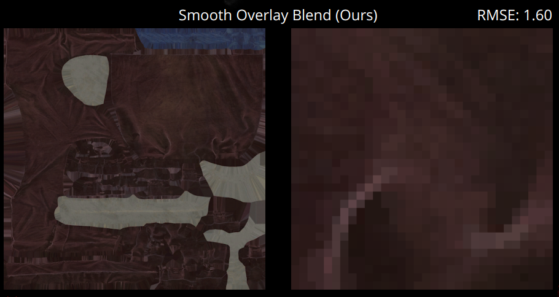

<script type="text/javascript" src="http://cdn.mathjax.org/mathjax/latest/MathJax.js?config=TeX-AMS-MML_HTMLorMML"></script>
<script type="text/x-mathjax-config">
    MathJax.Hub.Config({
      tex2jax: {
     inlineMath: [['$', '$']]}, messageStyle: "none" });
</script>

# SIGGRAPH 2020 Course: Samurai Shading in Ghost of Tsushima - part 2
本文主要介绍SIGGRAPH 2020 Course: Samurai Shading in Ghost of Tsushima分享的后两个部分。


## Skin shading
在皮肤渲染这一块，《对马岛之魂》采用的是预积分（pre-integrated）的方法。在探讨具体的方法之前，我们先了解一下预积分方法背后的理论和原理。

### 基于预积分的皮肤渲染
皮肤是一种有很强的的次表面散射（subsurface scattering）现象的材质，所谓次表面散射现象，指的是光线打在材质表面的时候，有一部分会进入材质内部，在材质内部多次弹射后再离开材质表面，如下图所示。


这个现象如果严格按照物理原理进行实现，应该是在光线出射点对周围一个小范围内的入射光线进行积分，并以一定的比例加到当前出射点的出射光线上。但是在实时渲染中这个方法很明显是不可能实现的。对此，有两个思路可以进行近似，一个思路是将部分积分进行预计算，然后保存成纹理，在实时渲染中直接采样纹理；另一个思路是屏幕空间的次表面散射（screen-space subsurface scattering），具体做法是先正常渲染，然后在屏幕空间做卷积，根据次表面散射成都设置卷积核的大小。相比之下，预积分的方法速度更快，单个pixel shader就可以完成，对管线的修改很有限，便于与其他渲染效果集成，所以更受青睐。

接下来具体看一下预积分方法的思路。首先考虑一个问题，什么情况下皮肤会产生次表面散射现象产生？可以肯定的一点是，当固定的平行光照射在完全平整的表面上的时候，是看不出次表面散射的，因为相邻处产生的折射光线非常平均。只有在这几种情况会有明显的次表面散射现象：

1. mesh曲率变化大
2. normal map上有小的bump
3. 阴影处

这三种情况分别处理，依次对应

1. large-scale feature
2. small-scale feature
3. shadow

#### Scattering and diffuse light
对于大尺度上的次表面散射现象，可以通过积分的预计算，将结果保存成LUT，然后在实时运算时直接读纹理。LUT的两个轴分别表示法向与光线方向的乘积（$N\cdot L$）和曲率。

还是从前面完全平整的表面这个假设开始讨论。如果我们把这个完全平整的表面稍稍弯曲，围成一个半径为$r$的球（各个点的曲率均为$1/r$），此时某个过球心的切面如下图所示。


假设我们要计算其中P点受到周围点的次表面散射的散射值的大小，其中L表示光线的方向，N表示点P的法向。以Q点为例，Q点受到的光照强度应该是$\cos(\theta + x)$。

Q点会对P点有一定的散射率，记为$q(x)$。上图中的圆环上有无数个这样的Q点，把他们都算上，最终P点受到的散射值为

$$
D(\theta,r) = \int^{\pi}_{-\pi}\cos(\theta+x)q(x)dx
$$

有一点需要注意，上式中的$\cos$项不能小于零，因为如果Q点没有光线照射到（即$\cos(\theta+x)<0$）时不会对P点有负的影响。另外这个积分是在圆环上做的，它并不能完全表示整个球面上所有的点对P的影响。但是[1]声称这个误差并不大，可以这样近似。

我们再看一下$q(x)$的取值。考虑到$q(x)$表示Q点对P点的散射率，同理，Q点会对球面上（实际是圆环上）所有点都有一个散射率，而根据能量守恒定律，这些比率加起来恒等于1，因此有：

$$
\int^{\pi}_{-\pi}q(x)dx = 1
$$

接下来我们只要找一个满足上式的$q$就可以了。这里最常用的是diffusion profile $R(d)$，其中$d$表示两点间的距离，在圆环的假设下，$d$可以写为半径和夹角的函数：$d=2r\sin(x/2)$。考虑到$R(d)$在圆环上的积分不为1，我们可以令$q(x) = kR(d)$。这样有：

$$
\int^{\pi}_{-\pi}kR(d)dx = 1
$$

即：

$$
\begin{aligned}
k & = 1 / \int^{\pi}_{-\pi}R(d)dx \\
q(x) & = R(d) / \int^{\pi}_{-\pi}R(d)dx
\end{aligned}
$$

再将这个$q$代入$D(\theta,r)$：

$$
\begin{aligned}
D(\theta,r) & = \int^{\pi}_{-\pi}\cos(\theta+x)q(x)dx \\
& = \int^{\pi}_{-\pi}\cos(\theta+x)\frac{R(d)}{\int^{\pi}_{-\pi}R(d)dx}dx \\
& = \frac{\int^{\pi}_{-\pi}\cos(\theta+x)R(d)dx}{\int^{\pi}_{-\pi}R(d)dx} \\
& = \frac{\int^{\pi}_{-\pi}\cos(\theta+x)R(2r\sin(x/2))dx}{\int^{\pi}_{-\pi}R(2r\sin(x/2))dx}
\end{aligned}
$$

这个最终形式也是我们可以预计算的积分。

在实际应用中，通常会用$N\cdot L$表示$\theta$，用$1/r$代替$r$预计算积分纹理以及在实时采样。$N\cdot L$怎么取下一节再讨论，这里说一下$1/r$怎么计算。如下图所示。


基本原理是，曲率越大，意味着单位$\Delta p$对应的$\Delta N$越大，所以可以简单地利用$\Delta N/\Delta P$来求曲率。当然在对纹理采样的时候，需要将$1/r$归一化到$[0,1]$之间。

```C++
float curve = saturate(length(fwidth(blurNormalDirection)) / length(fwidth(i.posWorld)) * _CurveFactor);
```

#### Scattering and normal maps
前面讨论的积分公式虽然很方便做预计算，但是有一个很致命的问题，那就是它假定了皮肤是一个球体，所有的点都有着相同的曲率。这很明显是不可能的。这个假设使得模型无法用在曲率变化很快的地方。对于这类情况，需要额外进行处理。

好在实际应用中，这类细节不是跟mesh绑定在一起的，mesh通常是粗粒度的，而细节信息则是用normal map来存储。这就使得我们可以通过对normal map做模糊操作，来近似次表面散射现象。由于次表面散射的程度与光线的波长有关，所以RGB三个通道需要有不同的模糊程度。如果对他们分别存储三张模糊过的normal map就太浪费存储了，通常的做法是用原始的normal map和模糊后的normal map做差值，差值系数即次表面散射程度。

用模糊后的normal作为diffuse light的normal，再计算$N\cdot L$，这样就可以在计算diffuse light的时候考虑到细粒度的特征。

#### Shadow scattering
前两部分分别介绍了粗粒度和细粒度特征的处理方法，但是还有一种情况没有涵盖到，那就是阴影。阴影不受mesh和normal map的影响，可能出现在任何地方。在阴影区域，亮部会向暗部扩散次表面散射产生的散射值，将暗部稍稍提亮。基于这个基本的想法，一个最朴素的解决方案是，能不能改变一下阴影的过渡程度，稍微朝亮部的部分偏一下。如下图所示，我们找个映射将左边的伴影过渡转换为右侧，右侧多出来的一段亮部就是次表面散射现象。


这个问题的解决思路跟前面类似，也可以将预计算的结果保存在纹理中。纹理的两个轴分别是原阴影系数和宽度，采样结果是对应RGB通道的修正后的阴影系数。

### 改进
《对马岛之魂》主要做了这三个方面的改进：
1. 对punctual light，采用linear scattering profile或cylindrical integration
2. 对SH lighting LUT，在球面积分时采用radial profile
3. 使用directional curvature表现次表面散射现象。

前面的模型讨论的是平行光照，但是《对马岛之魂》认为，对所有的光照采用同样的计算方法是不合适的，同时提出，对平行光应该采用方向曲率而不是平均曲率，而AO之类的光源可以采用平均曲率计算。下图展示了不同曲率的计算方法在平行光下的区别。图中上面一行表示的是相应的曲率值。可以看出使用方向曲率可以减少不自然的次表面散射现象（比如鼻尖附近）。


方向曲率的使用方法如下。

1. 首先我们需要在mesh的vertex信息中保存曲率张量和平均曲率。曲率张量的计算参考下式，具体的方法参考[3]

$$
\text{II} = 
\begin{bmatrix}
\vec{d_1}, \vec{d_2}
\end{bmatrix}
\begin{bmatrix}
\kappa_1 & 0 \\
0 & \kappa_2 \\ 
\end{bmatrix}
\begin{bmatrix}
\vec{d_1}, \vec{d_2}
\end{bmatrix}^T
$$

其中，$\vec{d_i}$表示主方向，$\kappa_i$表示主方向上的曲率。由于$\text{II}$是一个对称矩阵，所以保存它只需要一个vec3即可。

2. 有了曲率张量，在实时运算是根据光线的方向计算该方向上的曲率：

$$
\kappa_{\vec{I}} = \vec{I}^T\text{II}\vec{I}
$$

3. 然后利用这个方向曲率，采用LUT。

## Detail map
在detail map这部分，《对马岛之魂》采用的是合成纹理的方法，具体来说，是将目标纹理拆分为两部分：


《对马岛之魂》的改进点在于，改进了原有的合成算子$\bigotimes$。原有的算子为：

$$
f_{overlay}(s,d) = 
\begin{cases}
2sd,  & s < 0.5 \\
1-2(1-s)(1-d), & s \geq 0.5
\end{cases}
$$

改进后的是：

$$
f_{os}(s,d) = 
\begin{cases}
2sd,  & s < 0.5 \\
1-2(1-s)(1-d), & s \geq 0.5 \text{ and } d \geq 0.5 \\
\text{lerp}(2sd, s, (2s-1)^2), &s \geq 0.5 \text{ and } d < 0.5
\end{cases}
$$

如果用曲线把精度损失情况可视化出来，是这样的：


渲染效果对比：




数值上有一些提升，虽然看起来不是很明显。

## Reference
1. GPU Pro 2
2. https://zhuanlan.zhihu.com/p/56052015
3. Estimating Curvature and Their Derivatives on Triangle Meshes
 