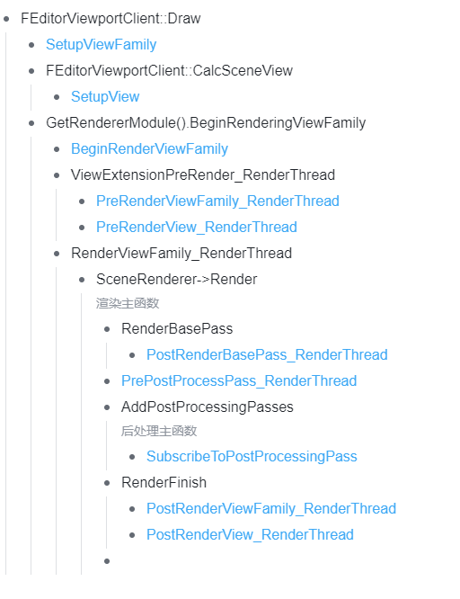

# Scene View Extension
Scene View Extension是引擎提供的一个接口，可以方便地在后处理的某个pass后插入一个pass，相关的接口实现在`Engine\Source\Runtime\Engine\Public\SceneViewExtension.h`。

本文将介绍这套工具的使用方法和实现逻辑。

## 简介
宏观层面，对于这个工具我们应该了解：

1. 仅支持deferred shading path，mobile并没有这个特性。
2. 支持在四个后处理pass后插入，分别是
- MotionBlur
- Tonemap
- FXAA
- VisualizeDepthOfField
3. 这个工具的底层逻辑，是注册一个回调函数，在指定位置调用，该回调函数的签名是：

```C++
FUNC_DECLARE_DELEGATE(FAfterPassCallbackDelegate, FScreenPassTexture /*ReturnSceneColor*/, FRDGBuilder& /*GraphBuilder*/, const FSceneView& /*View*/, const FPostProcessMaterialInputs& /*Inputs*/)
```

即返回值`FScreenPassTexture`，输入参数有三个：`FRDGBuilder`、`FSceneView`和`FPostProcessMaterialInputs`。

4. 除了回调函数提供的三个参数，还可以间接获得的参数包括
- `FViewInfo`：可以从`FSceneView`转换过来：`const FViewInfo* ViewInfo = static_cast<const FViewInfo*>(&View);`。
- `FPostProcessingInputs`：从虚函数`PrePostProcessPass_RenderThread`传入。

## 使用方法
在源码的`Engine\Source\Runtime\Engine\Public\SceneViewExtension.h`文件里，Epic在注释里给出了SceneViewExtension的推荐用法。

**第一步**，创建一个类，继承自`FSceneViewExtensionBase`：

```C++
class FMyExtension : public FSceneViewExtensionBase
{
public:
    FMyExtension( const FAutoRegister& AutoRegister, FYourParam1 Param1, FYourParam2 Param2 )
        : FSceneViewExtensionBase( AutoRegister )
    {
    }
};
```

其中第一个参数一定是`FAutoRegister`，并且要传递给`FSceneViewExtensionBase`。

**第二步**，继承并实现`ISceneViewExtension`的5个纯虚函数，并且在`SubscribeToPostProcessingPass`函数内实现自己需要的渲染逻辑：

```C++
class FMyExtension : public FSceneViewExtensionBase
{
    ...
public:
    /** Scene View extension interface. */
    virtual void SetupViewFamily(FSceneViewFamily& InViewFamily) override {};
    virtual void SetupView(FSceneViewFamily& InViewFamily, FSceneView& InView) override {};
    virtual void BeginRenderViewFamily(FSceneViewFamily& InViewFamily) override {};
    virtual void PreRenderViewFamily_RenderThread(FRHICommandListImmediate& RHICmdList, FSceneViewFamily& InViewFamily) override {};
    virtual void PreRenderView_RenderThread(FRHICommandListImmediate& RHICmdList, FSceneView& InView) override {};
    virtual void SubscribeToPostProcessingPass(EPostProcessingPass PassId, FAfterPassCallbackDelegateArray& InOutPassCallbacks, bool bIsPassEnabled) override
    {
        // TODO: rendering logic here
    };
};
```

如果需要，可以在这个函数里实现开启逻辑，即是否在当前帧开启此Extension：

```C++
class FMyExtension : public FSceneViewExtensionBase
{
    ...
private:
	virtual bool IsActiveThisFrame_Internal(const FSceneViewExtensionContext& Context) const override
    {
        // TODO: active logic here
    };
```

想让Extension在当前帧不生效有两种方法，一种是`IsActiveThisFrame_Internal`函数返回`false`，那么在当前帧里该Extension不会被注册到ViewFamily里，因此不会被调用到任何方法，这样做可以一定程度上节省开销；另一种方法是`IsActiveThisFrame_Internal`函数始终返回`true`，但是在`SubscribeToPostProcessingPass`函数里不注册任何回调函数，这样该Extension也不会生效。

**第三步**，在需要的地方初始化并注册这个类，方法是：

```C++
TSharedRef<FMyExtension,ESPMode::ThreadSafe> MyExtension;
MyExtension = FSceneViewExtensions::NewExtension<FMyExtension>(Param1, Param2);
```

在生命周期结束后，`MyExtension`会自动析构。

UE代码库里面，Pixel Inspector（`Engine\Source\Editor\PixelInspector\`）等好多模块都有利用这一套接口，插件里面有DLSS可以参考。

## 源码剖析
SceneViewExtension接口相关实现在`Engine\Source\Runtime\Renderer\Private\PostProcess\PostProcessing.cpp`均可以找到。除此之外，在渲染的某些环节也有一些接口调用。

### 核心逻辑
负责所有后处理pass的函数`AddPostProcessingPasses`里有一个lambda函数：

```C++
const auto AddAfterPass = [&](EPass InPass, FScreenPassTexture InSceneColor) -> FScreenPassTexture
{
    // In some cases (e.g. OCIO color conversion) we want View Extensions to be able to add extra custom post processing after the pass.

    FAfterPassCallbackDelegateArray& PassCallbacks = PassSequence.GetAfterPassCallbacks(InPass);

    if (PassCallbacks.Num())
    {
        FPostProcessMaterialInputs InOutPostProcessAfterPassInputs = GetPostProcessMaterialInputs(InSceneColor);

        for (int32 AfterPassCallbackIndex = 0; AfterPassCallbackIndex < PassCallbacks.Num(); AfterPassCallbackIndex++)
        {
            FAfterPassCallbackDelegate& AfterPassCallback = PassCallbacks[AfterPassCallbackIndex];
            PassSequence.AcceptOverrideIfLastPass(InPass, InOutPostProcessAfterPassInputs.OverrideOutput, AfterPassCallbackIndex);
            InSceneColor = AfterPassCallback.Execute(GraphBuilder, View, InOutPostProcessAfterPassInputs);
        }
    }

    return MoveTemp(InSceneColor);
};
```

可以看出，这个Lambda函数的功能是检索`PassSequence`的Callback function，如果有符合条件的（当前pass），就取出来执行。

开启后处理的情况下，这个Lambda函数在`AddPostProcessingPasses`里被调用了4次，即前面提到的四个支持的插入位置处：

```C++
if (IsPostProcessingEnabled(View))
{
    ...
    if (PassSequence.IsEnabled(EPass::MotionBlur))
    {
        ...
    }
    SceneColor = AddAfterPass(EPass::MotionBlur, SceneColor);
    ...
    if (PassSequence.IsEnabled(EPass::Tonemap))
    {
        ...
    }
    SceneColor = AddAfterPass(EPass::Tonemap, SceneColor);
    ...
    if (PassSequence.IsEnabled(EPass::FXAA))
    {
        ...
    }
    SceneColor = AddAfterPass(EPass::FXAA, SceneColor);
    ...
    if (PassSequence.IsEnabled(EPass::VisualizeDepthOfField))
    {
        ...
    }
    SceneColor = AddAfterPass(EPass::VisualizeDepthOfField, SceneColor);
    ...
}
```

这里还会涉及到后处理pass的调度问题，不再展开。

同样在函数`AddPostProcessingPasses`里，在具体的PostProcess pass开始前，会遍历所有的`View.Family->ViewExtension`，然后调用他们的`SubscribeToPostProcessingPass`函数，这个函数的作用就是将自定义的callback function注册到`PassSequence`。

```C++
if (IsPostProcessingEnabled(View))
{
    for (int32 ViewExt = 0; ViewExt < View.Family->ViewExtensions.Num(); ++ViewExt)
    {
        for (int32 SceneViewPassId = 0; SceneViewPassId != static_cast<int>(ISceneViewExtension::EPostProcessingPass::MAX); SceneViewPassId++)
        {
            ISceneViewExtension::EPostProcessingPass SceneViewPass = static_cast<ISceneViewExtension::EPostProcessingPass>(SceneViewPassId);
            EPass PostProcessingPass = TranslatePass(SceneViewPass);

            View.Family->ViewExtensions[ViewExt]->SubscribeToPostProcessingPass(
                SceneViewPass,
                PassSequence.GetAfterPassCallbacks(PostProcessingPass),
                PassSequence.IsEnabled(PostProcessingPass));
        }
    }
}
```

例如Pixel inspector的Subscribe函数：

```C++
void FPixelInspectorSceneViewExtension::SubscribeToPostProcessingPass(EPostProcessingPass PassId, FAfterPassCallbackDelegateArray& InOutPassCallbacks, bool bIsPassEnabled)
{
    if (PassId == EPostProcessingPass::FXAA)
    {
        InOutPassCallbacks.Add(FAfterPassCallbackDelegate::CreateRaw(this, &FPixelInspectorSceneViewExtension::PostProcessPassAfterFxaa_RenderThread));
    }
}

FScreenPassTexture FPixelInspectorSceneViewExtension::PostProcessPassAfterFxaa_RenderThread(FRDGBuilder& GraphBuilder, const FSceneView& View, const FPostProcessMaterialInputs& InOutInputs)
{
    ...
}
```

可以看出，当判定到输入的pass是`EPostProcessingPass::FXAA`时，即刚刚结束的pass是FXAA时，添加回调函数`PostProcessPassAfterFxaa_RenderThread`。在回调函数中，可以自定义一个ScreenSpace pass，或者任何其他事情。

### 其他接口
其他几个接口在引擎的调用位置如下图所示，蓝色字体表示SceneViewExtension的函数。



