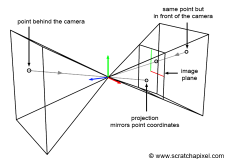
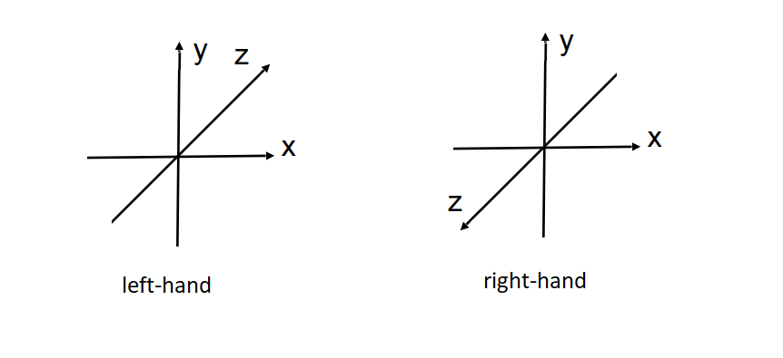
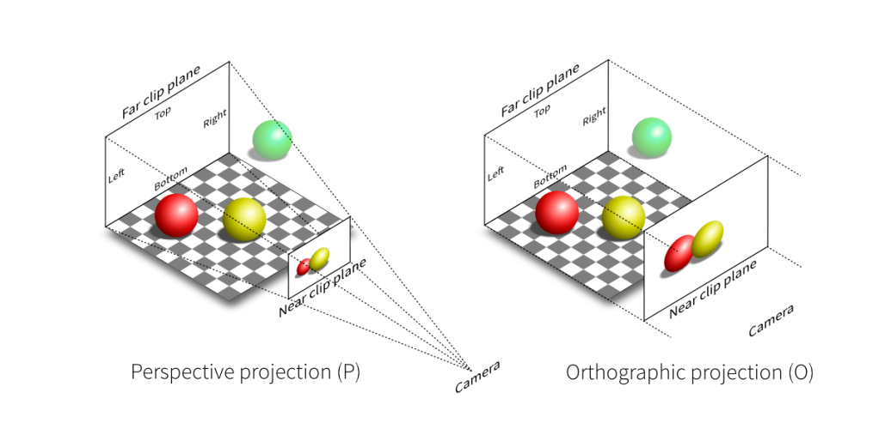
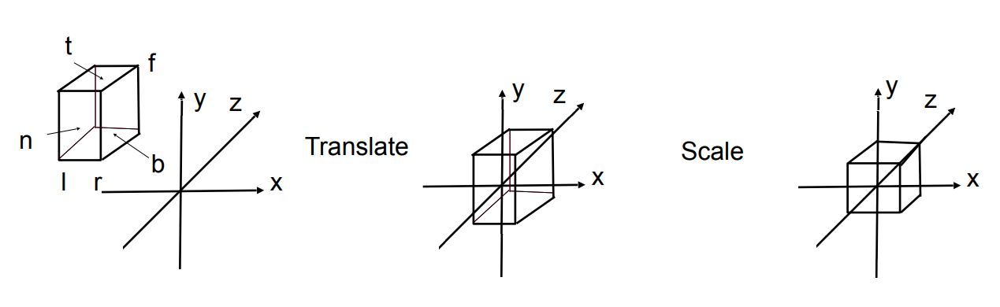
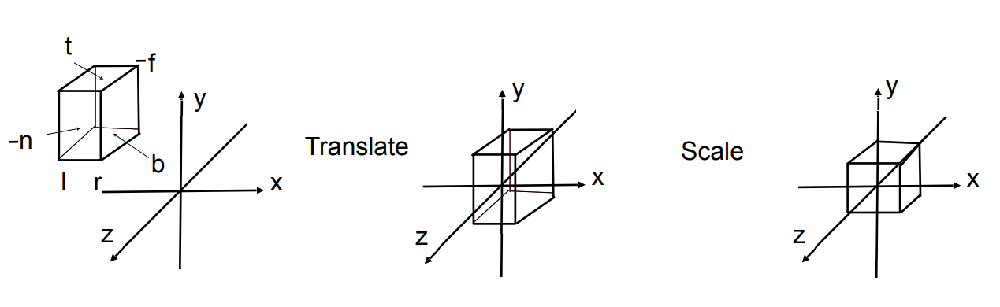
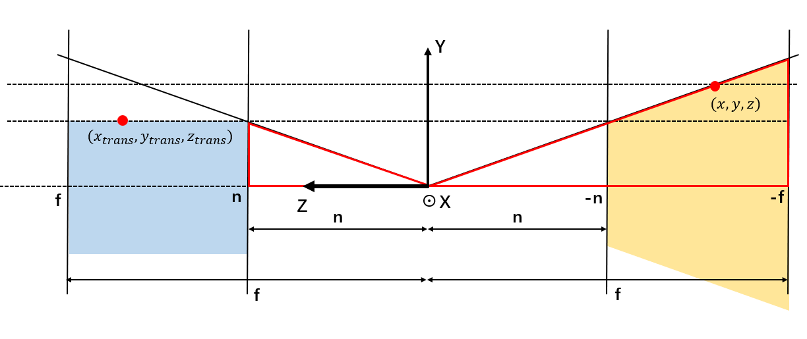
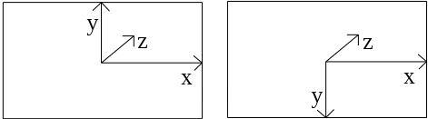

# [WIP]GLM投影矩阵剖析
投影矩阵指的是从视口空间转化到屏幕空间的变换矩阵，即`MVP`中的P矩阵。这个矩阵相比于其他两个更繁琐一些。本文将结合GLM的源码，分析投影矩阵的几种形式及其实现。

## 坐标系统
投影矩阵是从相机空间到标准设备空间（normalized device coordinates, NDC）的变换，这个变换模拟了相机的照相过程，OpenGL采用的模型将采用**右手坐标系**的相机坐标转化为采用**左手坐标系**的NDC坐标。这个转化过程只翻转了z轴，x轴和y轴并没有变。如下图所示（图片来源：[The Perspective and Orthographic Projection Matrix](https://www.scratchapixel.com/lessons/3d-basic-rendering/perspective-and-orthographic-projection-matrix/projection-matrices-what-you-need-to-know-first)）。



投影变换前的空间坐标采用右手坐标系是因为绝大多数三维模型都是用的右手坐标系；投影变换后的矩阵采用了左手坐标系则是基于OpenGL的定义，其他的图形API（例如Vulkan，DirectX等）则不一定。这个“神之一手”的坐标系手性转换会导致投影矩阵的部分系数的正负号发生改变。对于初学图形学的同学来说，最好的办法是不要管OpenGL这个骚操作，直接右手系-右手系、同侧投影做公式推导，方便理解其中的原理，然后再结合OpenGL的特例做推导。

对于纯图形学上的投影矩阵的推导（右手系、同侧投影），建议参考闫令琪老师在[GAMES101 - lecture 4](https://sites.cs.ucsb.edu/~lingqi/teaching/resources/GAMES101_Lecture_04.pdf)的思路，本文的推导借鉴了闫老师的思路，但是细节会不太一样。

<!-- 左右手系坐标轴如下图所示。

 -->

## 源码简介
源码可以在Github上找到：[Github-glm](https://github.com/g-truc/glm/blob/master/glm/ext/matrix_clip_space.inl)。

GLM一共提供了42个不同的计算投影矩阵的函数，先简单分个类：

1. 正交投影矩阵。
```C++
mat<4, 4, T, defaultp> ortho(T left, T right, T bottom, T top)
mat<4, 4, T, defaultp> orthoLH_ZO(T left, T right, T bottom, T top, T zNear, T zFar)
mat<4, 4, T, defaultp> orthoLH_NO(T left, T right, T bottom, T top, T zNear, T zFar)
mat<4, 4, T, defaultp> orthoRH_ZO(T left, T right, T bottom, T top, T zNear, T zFar)
mat<4, 4, T, defaultp> orthoRH_NO(T left, T right, T bottom, T top, T zNear, T zFar)
mat<4, 4, T, defaultp> orthoZO(T left, T right, T bottom, T top, T zNear, T zFar)
mat<4, 4, T, defaultp> orthoNO(T left, T right, T bottom, T top, T zNear, T zFar)
mat<4, 4, T, defaultp> orthoLH(T left, T right, T bottom, T top, T zNear, T zFar)
mat<4, 4, T, defaultp> orthoRH(T left, T right, T bottom, T top, T zNear, T zFar)
mat<4, 4, T, defaultp> ortho(T left, T right, T bottom, T top, T zNear, T zFar)
```

2. 透视投影矩阵，投影到`T left, T right, T bottom, T top, T nearVal, T farVal`六个值定义的box上。
```C++
mat<4, 4, T, defaultp> frustumLH_ZO(T left, T right, T bottom, T top, T nearVal, T farVal)
mat<4, 4, T, defaultp> frustumLH_NO(T left, T right, T bottom, T top, T nearVal, T farVal)
mat<4, 4, T, defaultp> frustumRH_ZO(T left, T right, T bottom, T top, T nearVal, T farVal)
mat<4, 4, T, defaultp> frustumRH_NO(T left, T right, T bottom, T top, T nearVal, T farVal)
mat<4, 4, T, defaultp> frustumZO(T left, T right, T bottom, T top, T nearVal, T farVal)
mat<4, 4, T, defaultp> frustumNO(T left, T right, T bottom, T top, T nearVal, T farVal)
mat<4, 4, T, defaultp> frustumLH(T left, T right, T bottom, T top, T nearVal, T farVal)
mat<4, 4, T, defaultp> frustumRH(T left, T right, T bottom, T top, T nearVal, T farVal)
mat<4, 4, T, defaultp> frustum(T left, T right, T bottom, T top, T nearVal, T farVal)
```

3. 透视投影矩阵，投影到`\pm1`的box上，可以认为是`frustum`的特殊情况。
```C++
mat<4, 4, T, defaultp> perspectiveRH_ZO(T fovy, T aspect, T zNear, T zFar)
mat<4, 4, T, defaultp> perspectiveRH_NO(T fovy, T aspect, T zNear, T zFar)
mat<4, 4, T, defaultp> perspectiveLH_ZO(T fovy, T aspect, T zNear, T zFar)
mat<4, 4, T, defaultp> perspectiveLH_NO(T fovy, T aspect, T zNear, T zFar)
mat<4, 4, T, defaultp> perspectiveZO(T fovy, T aspect, T zNear, T zFar)
mat<4, 4, T, defaultp> perspectiveNO(T fovy, T aspect, T zNear, T zFar)
mat<4, 4, T, defaultp> perspectiveLH(T fovy, T aspect, T zNear, T zFar)
mat<4, 4, T, defaultp> perspectiveRH(T fovy, T aspect, T zNear, T zFar)
mat<4, 4, T, defaultp> perspective(T fovy, T aspect, T zNear, T zFar)
```

1. 透视投影矩阵，用`width`和`height`代替`fov`。
```C++
mat<4, 4, T, defaultp> perspectiveFovRH_ZO(T fov, T width, T height, T zNear, T zFar)
mat<4, 4, T, defaultp> perspectiveFovRH_NO(T fov, T width, T height, T zNear, T zFar)
mat<4, 4, T, defaultp> perspectiveFovLH_ZO(T fov, T width, T height, T zNear, T zFar)
mat<4, 4, T, defaultp> perspectiveFovLH_NO(T fov, T width, T height, T zNear, T zFar)
mat<4, 4, T, defaultp> perspectiveFovZO(T fov, T width, T height, T zNear, T zFar)
mat<4, 4, T, defaultp> perspectiveFovNO(T fov, T width, T height, T zNear, T zFar)
mat<4, 4, T, defaultp> perspectiveFovLH(T fov, T width, T height, T zNear, T zFar)
mat<4, 4, T, defaultp> perspectiveFovRH(T fov, T width, T height, T zNear, T zFar)
mat<4, 4, T, defaultp> perspectiveFov(T fov, T width, T height, T zNear, T zFar)
```

5. 透视投影矩阵的特殊情况，远平面处于无穷远处。
```C++
mat<4, 4, T, defaultp> infinitePerspectiveRH(T fovy, T aspect, T zNear)
mat<4, 4, T, defaultp> infinitePerspectiveLH(T fovy, T aspect, T zNear)
mat<4, 4, T, defaultp> infinitePerspective(T fovy, T aspect, T zNear)
```

6. 对远平面处于无穷远处的一个修正，防止计算出来的z值大于1。可以参考[这个PPT](http://terathon.com/gdc07_lengyel.pdf)的分析。
```C++
mat<4, 4, T, defaultp> tweakedInfinitePerspective(T fovy, T aspect, T zNear, T ep)
mat<4, 4, T, defaultp> tweakedInfinitePerspective(T fovy, T aspect, T zNear)
```

虽然函数很多，但是归根结底只有正交投影和透视投影两种投影矩阵，两个后缀的含义分别是：

- **输入的相机坐标是**`LH`左手坐标系 vs `RH`右手坐标系
- `ZO`变换后深度范围是`0`（zero）到`1`（one） vs `NO`变换后深度范围是`-1`（negative one）到`1`（one）

其中`LH`和`RH`的问题有点容易引起歧义，笔者的理解是`LH`做的是同侧投影，`RH`做的是异侧投影。所以可以理解为输入的**相机坐标**的手性。GLM默认投影变换之后的坐标系（即NDC坐标系）全部变为左手系（适配OpenGL）。`LH`同侧投影时，左手系变换到左手系是不需要翻转z轴的；而`RH`异侧投影时，右手系变换到左手系需要翻转z轴，这个操作跟GLM的实现也对的上，后面还会再提到。

所以简单总结一下，GLM默认投影变换后的坐标系全部是左手系，如果

- 输入的相机坐标是左手系，那么应该调用`LH`为后缀的函数；
- 输入的相机坐标是右手系，那么应该调用`RH`为后缀的函数；

只有单个后缀或没有后缀的函数则采用宏定义调用带后缀的函数，相关的宏定义如下所示。

```C++
#define GLM_CLIP_CONTROL_ZO_BIT		(1 << 0) // ZERO_TO_ONE
#define GLM_CLIP_CONTROL_NO_BIT		(1 << 1) // NEGATIVE_ONE_TO_ONE
#define GLM_CLIP_CONTROL_LH_BIT		(1 << 2) // LEFT_HANDED, For DirectX, Metal, Vulkan
#define GLM_CLIP_CONTROL_RH_BIT		(1 << 3) // RIGHT_HANDED, For OpenGL, default in GLM

#define GLM_CLIP_CONTROL_LH_ZO (GLM_CLIP_CONTROL_LH_BIT | GLM_CLIP_CONTROL_ZO_BIT)
#define GLM_CLIP_CONTROL_LH_NO (GLM_CLIP_CONTROL_LH_BIT | GLM_CLIP_CONTROL_NO_BIT)
#define GLM_CLIP_CONTROL_RH_ZO (GLM_CLIP_CONTROL_RH_BIT | GLM_CLIP_CONTROL_ZO_BIT)
#define GLM_CLIP_CONTROL_RH_NO (GLM_CLIP_CONTROL_RH_BIT | GLM_CLIP_CONTROL_NO_BIT)

#ifdef GLM_FORCE_DEPTH_ZERO_TO_ONE
#	ifdef GLM_FORCE_LEFT_HANDED
#		define GLM_CONFIG_CLIP_CONTROL GLM_CLIP_CONTROL_LH_ZO
#	else
#		define GLM_CONFIG_CLIP_CONTROL GLM_CLIP_CONTROL_RH_ZO
#	endif
#else
#	ifdef GLM_FORCE_LEFT_HANDED
#		define GLM_CONFIG_CLIP_CONTROL GLM_CLIP_CONTROL_LH_NO
#	else
#		define GLM_CONFIG_CLIP_CONTROL GLM_CLIP_CONTROL_RH_NO
#	endif
#endif
```

以正交投影为例：

```C++
mat<4, 4, T, defaultp> ortho(T left, T right, T bottom, T top, T zNear, T zFar)
{
#	if GLM_CONFIG_CLIP_CONTROL == GLM_CLIP_CONTROL_LH_ZO
        return orthoLH_ZO(left, right, bottom, top, zNear, zFar);
#	elif GLM_CONFIG_CLIP_CONTROL == GLM_CLIP_CONTROL_LH_NO
        return orthoLH_NO(left, right, bottom, top, zNear, zFar);
#	elif GLM_CONFIG_CLIP_CONTROL == GLM_CLIP_CONTROL_RH_ZO
        return orthoRH_ZO(left, right, bottom, top, zNear, zFar);
#	elif GLM_CONFIG_CLIP_CONTROL == GLM_CLIP_CONTROL_RH_NO
        return orthoRH_NO(left, right, bottom, top, zNear, zFar);
#	endif
}
```

在调用这些函数前，可以通过定义`GLM_FORCE_DEPTH_ZERO_TO_ONE`和`GLM_FORCE_LEFT_HANDED`来规定具体的矩阵形式，当然也可以直接调用带后缀的形式。

默认不定义任何一个宏的话，GLM会将`GLM_CONFIG_CLIP_CONTROL`定义为`GLM_CLIP_CONTROL_RH_NO`，即输入为右手系坐标系、生成深度范围$[-1,1]$的投影矩阵。

另一个来源自OpenGL的细节是，投影矩阵的近平面near的z值默认是小于远平面far的，即`near < far`。在翻转坐标轴的时候必须记得严格遵循这个细节。

还有一个需要注意的细节是，GLM的矩阵经常是需要传递给shader的，因此和shader一样都采用了列优先的存储方式。即对于矩阵的一个元素`M[x][y]`表示的是矩阵`M`第`x + 1`列第`y + 1`行的元素。

## 公式推导与实现

根据视线是平行还是射出于一点，投影可以分为两种形式，正交投影和透视投影（如下图所示）。具体的公式推导方法，本文采取闫令琪老师在[GAMES101 - lecture 4](https://sites.cs.ucsb.edu/~lingqi/teaching/resources/GAMES101_Lecture_04.pdf)的推导方法，先介绍正交投影，然后利用正交投影推导透视投影。



### 正交投影

简单起见，我们先讨论左手系、深度范围$[-1,1]$的情况。

由于变换前后的坐标系统一致，我们不必要纠结翻转z轴的问题。此时的正交投影，理论上只是将一个axis aligned bounding box通过平移、缩放，放到原点处单位立方体（坐标$[-1,1]$之间）的位置，因此，我们可以将正交投影看做是先平移再缩放。

假设相机视角的范围是$x\in[l,r],y\in[b,t],z\in[n,f]$，如下图所示。



注意，由于`near < far`，z轴应该是朝向屏幕内侧的。

根据这个思路，正交矩阵计算为：

$$
\begin{aligned}
M_{orth-LH-NO} & = 
\begin{pmatrix}
    \frac{2}{r - l} & 0 & 0 & 0 \\
    0 & \frac{2}{t - b} & 0 & 0 \\
    0 & 0 & \frac{2}{f - n} & 0 \\
    0 & 0 & 0 & 1 \\
\end{pmatrix}
\begin{pmatrix}
    1 & 0 & 0 & -\frac{r + l}{2} \\
    0 & 1 & 0 & -\frac{t + b}{2} \\
    0 & 0 & 1 & -\frac{f + n}{2} \\
    0 & 0 & 0 & 1 \\
\end{pmatrix}
\\
& = 
\begin{pmatrix}
    \frac{2}{r - l} & 0 & 0 & -\frac{r + l}{r - l} \\
    0 & \frac{2}{t - b} & 0 & -\frac{t + b}{t - b} \\
    0 & 0 & \frac{2}{f - n} & -\frac{f + n}{f - n} \\
    0 & 0 & 0 & 1 \\
\end{pmatrix}
\end{aligned}
$$

GLM实现：

```C++
mat<4, 4, T, defaultp> orthoLH_NO(T left, T right, T bottom, T top, T zNear, T zFar)
{
    mat<4, 4, T, defaultp> Result(1);
    Result[0][0] = static_cast<T>(2) / (right - left);
    Result[1][1] = static_cast<T>(2) / (top - bottom);
    Result[2][2] = static_cast<T>(2) / (zFar - zNear);
    Result[3][0] = - (right + left) / (right - left);
    Result[3][1] = - (top + bottom) / (top - bottom);
    Result[3][2] = - (zFar + zNear) / (zFar - zNear);
    return Result;
}
```

第二种情况，左手系、深度范围$[0,1]$的情况。

改变深度的映射范围，可以理解为在原来的变换的基础上，再加上一步：$z`= \frac{z+1}{2}$，写成矩阵形式：

$$
\begin{aligned}
M_{orth-LH-ZO} & = 
\begin{pmatrix}
    1 & 0 & 0 & 0 \\
    0 & 1 & 0 & 0 \\
    0 & 0 & \frac{1}{2} & \frac{1}{2} \\
    0 & 0 & 0 & 1 \\
\end{pmatrix}
M_{orth-LH-NO}\\
& = 
\begin{pmatrix}
    1 & 0 & 0 & 0 \\
    0 & 1 & 0 & 0 \\
    0 & 0 & \frac{1}{2} & \frac{1}{2} \\
    0 & 0 & 0 & 1 \\
\end{pmatrix}
\begin{pmatrix}
    \frac{2}{r - l} & 0 & 0 & 0 \\
    0 & \frac{2}{t - b} & 0 & 0 \\
    0 & 0 & \frac{2}{f - n} & 0 \\
    0 & 0 & 0 & 1 \\
\end{pmatrix}
\begin{pmatrix}
    1 & 0 & 0 & -\frac{r + l}{2} \\
    0 & 1 & 0 & -\frac{t + b}{2} \\
    0 & 0 & 1 & -\frac{f + n}{2} \\
    0 & 0 & 0 & 1 \\
\end{pmatrix}
\\
& = 
\begin{pmatrix}
    \frac{2}{r - l} & 0 & 0 & -\frac{r + l}{r - l} \\
    0 & \frac{2}{t - b} & 0 & -\frac{t + b}{t - b} \\
    0 & 0 & \frac{1}{f - n} & -\frac{n}{f - n} \\
    0 & 0 & 0 & 1 \\
\end{pmatrix}
\end{aligned}
$$

其中第一个矩阵

$$
\begin{pmatrix}
    1 & 0 & 0 & 0 \\
    0 & 1 & 0 & 0 \\
    0 & 0 & \frac{1}{2} & \frac{1}{2} \\
    0 & 0 & 0 & 1 \\
\end{pmatrix}
$$

即将$[-1,1]$映射到$[0,1]$的变换矩阵。

GLM的实现：

```C++
mat<4, 4, T, defaultp> orthoLH_ZO(T left, T right, T bottom, T top, T zNear, T zFar)
{
    mat<4, 4, T, defaultp> Result(1);
    Result[0][0] = static_cast<T>(2) / (right - left);
    Result[1][1] = static_cast<T>(2) / (top - bottom);
    Result[2][2] = static_cast<T>(1) / (zFar - zNear);
    Result[3][0] = - (right + left) / (right - left);
    Result[3][1] = - (top + bottom) / (top - bottom);
    Result[3][2] = - zNear / (zFar - zNear);
    return Result;
}
```

第三种情况，右手系、深度范围$[-1,1]$的情况。由于多数情况下物体的坐标都采用右手系，因此这种情况也是经常会用的。



注意，由于此时z轴翻转过来朝向外侧，为了保证`near < far`，远近平面的符号是负的。

这个情况可以从左手系、深度范围$[-1,1]$的情况推导出来，根据前面左右手系的示意图，可以看出GLM默认二者的z轴是相反的，因此从左手系变到右手系只需要翻转z轴：

$$
\begin{aligned}
M_{orth-RH-NO} & = 
\begin{pmatrix}
    1 & 0 & 0 & 0 \\
    0 & 1 & 0 & 0 \\
    0 & 0 & -1 & 0 \\
    0 & 0 & 0 & 1 \\
\end{pmatrix}
M_{orth-LH-NO}\\
& =
\begin{pmatrix}
    1 & 0 & 0 & 0 \\
    0 & 1 & 0 & 0 \\
    0 & 0 & -1 & 0 \\
    0 & 0 & 0 & 1 \\
\end{pmatrix}
\begin{pmatrix}
    \frac{2}{r - l} & 0 & 0 & 0 \\
    0 & \frac{2}{t - b} & 0 & 0 \\
    0 & 0 & \frac{2}{f - n} & 0 \\
    0 & 0 & 0 & 1 \\
\end{pmatrix}
\begin{pmatrix}
    1 & 0 & 0 & -\frac{r + l}{2} \\
    0 & 1 & 0 & -\frac{t + b}{2} \\
    0 & 0 & 1 & -\frac{f + n}{2} \\
    0 & 0 & 0 & 1 \\
\end{pmatrix}
\\
& = 
\begin{pmatrix}
    \frac{2}{r - l} & 0 & 0 & -\frac{r + l}{r - l} \\
    0 & \frac{2}{t - b} & 0 & -\frac{t + b}{t - b} \\
    0 & 0 & -\frac{2}{f - n} & -\frac{f + n}{f - n} \\
    0 & 0 & 0 & 1 \\
\end{pmatrix}
\end{aligned}
$$

代码实现：

```C++
mat<4, 4, T, defaultp> orthoRH_NO(T left, T right, T bottom, T top, T zNear, T zFar)
{
    mat<4, 4, T, defaultp> Result(1);
    Result[0][0] = static_cast<T>(2) / (right - left);
    Result[1][1] = static_cast<T>(2) / (top - bottom);
    Result[2][2] = - static_cast<T>(2) / (zFar - zNear);
    Result[3][0] = - (right + left) / (right - left);
    Result[3][1] = - (top + bottom) / (top - bottom);
    Result[3][2] = - (zFar + zNear) / (zFar - zNear);
    return Result;
}
```

第四种情况，右手系、深度范围$[0,1]$的情况。推导过程与左手系、深度范围$[0,1]$一样。

$$
\begin{aligned}
M_{orth-RH-ZO} & = 
\begin{pmatrix}
    1 & 0 & 0 & 0 \\
    0 & 1 & 0 & 0 \\
    0 & 0 & \frac{1}{2} & \frac{1}{2} \\
    0 & 0 & 0 & 1 \\
\end{pmatrix}
M_{orth-RH-NO}\\
& = 
\begin{pmatrix}
    \frac{2}{r - l} & 0 & 0 & -\frac{r + l}{r - l} \\
    0 & \frac{2}{t - b} & 0 & -\frac{t + b}{t - b} \\
    0 & 0 & -\frac{1}{f - n} & -\frac{n}{f - n} \\
    0 & 0 & 0 & 1 \\
\end{pmatrix}
\end{aligned}
$$

GLM实现：

```C++
mat<4, 4, T, defaultp> orthoRH_ZO(T left, T right, T bottom, T top, T zNear, T zFar)
{
    mat<4, 4, T, defaultp> Result(1);
    Result[0][0] = static_cast<T>(2) / (right - left);
    Result[1][1] = static_cast<T>(2) / (top - bottom);
    Result[2][2] = - static_cast<T>(1) / (zFar - zNear);
    Result[3][0] = - (right + left) / (right - left);
    Result[3][1] = - (top + bottom) / (top - bottom);
    Result[3][2] = - zNear / (zFar - zNear);
    return Result;
}
```

### 透视投影

透视投影要稍微麻烦一点，因为透视投影的视角空间是四棱台，不像正交投影那样是规则的立方体。因此，第一步我们需要现将四棱台的视角空间转换为立方体（该变换记为$M_{pers->orth}$），然后再用正交投影的方法，将其移动到原点。

我们先以输入坐标为右手系为例，推导一下$M_{pers->orth}$矩阵的形式。

定义，$M_{pers->orth}$矩阵变换前的坐标系是右手系，变换后为左手系，即引入了坐标翻转。如下图所示，相机位于坐标原点（相机坐标系），视角朝向右侧，右侧的物体经过投影变换会变到左侧（相机背面）去。


求解$M_{pers->orth}$的基本思想是，我们需要找到变换前的任意一个点的坐标$(x,y,z)$与变换后的对应点的坐标$(x_{trans},y_{trans},z_{trans})$的关系。下图即上图的YOZ平面切面图，我们用这个图解释$(x,y,z)$与$(x_{trans},y_{trans},z_{trans})$的关系。



如上图，黄色区域表示变换前的视锥空间，蓝色区域表示变换后的视锥空间。我们选取任意一个XOY平面上y值最大的点，考虑两个红色的三角形，由于他们是近似三角形，所以有：

$$
\frac{y_{trans}}{n} = \frac{y}{-z}
$$

$z$前面的负号是因为其他三个量都是正的，只有$z$是负的，需要对$z$取绝对值。

同理，如果考虑XOZ平面的截面，有：

$$
\frac{x_{trans}}{n} = \frac{x}{-z}
$$

结合上面两个公式，我们可以认为矩阵$M_{pers->orth}$将其次坐标$(x,y,z,1)$变为了$(\frac{n}{-z}x,\frac{n}{-z}x,z_{unkonwn},1)$，或者可以写为$(nx,nx,z_{unkonwn},-z)$。

此时，我们可以将$M_{pers->orth}$矩阵写为：

$$
\begin{aligned}
M_{pers->orth} & = 
\begin{pmatrix}
    n & 0 & 0 & 0 \\
    0 & n & 0 & 0 \\
    A & B & C & D \\
    0 & 0 & -1 & 0 \\
\end{pmatrix}
\end{aligned}
$$

其中$ABCD$均为未知数。接下来的问题是，求解这四个未知数以计算变换后的深度。对此，我们考虑近平面和远平面上的点。

对于近平面上的任意一个点$(x,y,-n,1)$，变换后是$(nx, ny, n^2, n)$，即

$$
Ax+By-Cn+D = n^2
$$

其中，$x$和$y$可以取任意落在近平面上的值。

同理，对于远平面：

$$
Ax+By-Cf+D = f^2
$$

根据上面两个式子，可以推出：

$$
\begin{aligned}
A & = 0 \\
B & = 0 \\
C & = -(n+f) \\
D & = -nf
\end{aligned}
$$

所以，$M_{pers->orth}$的最终形式为：

$$
\begin{aligned}
M_{pers->orth} & = 
\begin{pmatrix}
    n & 0 & 0 & 0 \\
    0 & n & 0 & 0 \\
    0 & 0 & -(n+f) & -nf \\
    0 & 0 & -1 & 0 \\
\end{pmatrix}
\end{aligned}
$$

到此为止，我们推导出了将视锥空间从棱台转换到立方体的$M_{pers->orth}$矩阵。需要注意的是这个矩阵做了一个z轴的翻转，从右手系转换成了左手系。也就是说输入的坐标系是右手系，为了最终获得左手系坐标系，我们需要再乘上LH的正交投影矩阵，即：

$$
\begin{aligned}
M_{pers-RH-NO} & = M_{orth-LH-NO} M_{pers->orth} \\
& = 
\begin{pmatrix}
    \frac{2}{r - l} & 0 & 0 & -\frac{r + l}{r - l} \\
    0 & \frac{2}{t - b} & 0 & -\frac{t + b}{t - b} \\
    0 & 0 & \frac{2}{f - n} & -\frac{f + n}{f - n} \\
    0 & 0 & 0 & 1 \\
\end{pmatrix}
\begin{pmatrix}
    n & 0 & 0 & 0 \\
    0 & n & 0 & 0 \\
    0 & 0 & -(n+f) & -nf \\
    0 & 0 & -1 & 0 \\
\end{pmatrix}
\\
& = 
\begin{pmatrix}
    \frac{2n}{r - l} & 0 & \frac{r + l}{r - l} & 0 \\
    0 & \frac{2n}{t - b} & \frac{t + b}{t - b} & 0 \\
    0 & 0 & -\frac{f+n}{f - n} & -\frac{2nf}{f - n} \\
    0 & 0 & -1 & 0 \\
\end{pmatrix}
\end{aligned}
$$

GLM的实现：

```C++
mat<4, 4, T, defaultp> frustumRH_NO(T left, T right, T bottom, T top, T nearVal, T farVal)
{
    mat<4, 4, T, defaultp> Result(0);
    Result[0][0] = (static_cast<T>(2) * nearVal) / (right - left);
    Result[1][1] = (static_cast<T>(2) * nearVal) / (top - bottom);
    Result[2][0] = (right + left) / (right - left);
    Result[2][1] = (top + bottom) / (top - bottom);
    Result[2][2] = - (farVal + nearVal) / (farVal - nearVal);
    Result[2][3] = static_cast<T>(-1);
    Result[3][2] = - (static_cast<T>(2) * farVal * nearVal) / (farVal - nearVal);
    return Result;
}
```

同理，对于右手系、深度范围$[0,1]$的变换矩阵：

$$
\begin{aligned}
M_{orth-RH-ZO} & = 
\begin{pmatrix}
    \frac{2}{r - l} & 0 & 0 & -\frac{r + l}{r - l} \\
    0 & \frac{2}{t - b} & 0 & -\frac{t + b}{t - b} \\
    0 & 0 & -\frac{1}{f - n} & -\frac{n}{f - n} \\
    0 & 0 & 0 & 1 \\
\end{pmatrix}
\\
M_{pers-RH-ZO} & = M_{orth-LH-ZO} M_{pers->orth} \\
& = 
\begin{pmatrix}
    \frac{2}{r - l} & 0 & 0 & -\frac{r + l}{r - l} \\
    0 & \frac{2}{t - b} & 0 & -\frac{t + b}{t - b} \\
    0 & 0 & \frac{1}{f - n} & -\frac{n}{f - n} \\
    0 & 0 & 0 & 1 \\
\end{pmatrix}
\begin{pmatrix}
    n & 0 & 0 & 0 \\
    0 & n & 0 & 0 \\
    0 & 0 & -(n+f) & -nf \\
    0 & 0 & -1 & 0 \\
\end{pmatrix}
\\
& = 
\begin{pmatrix}
    \frac{2n}{r - l} & 0 & \frac{r + l}{r - l} & 0 \\
    0 & \frac{2n}{t - b} & \frac{t + b}{t - b} & 0 \\
    0 & 0 & -\frac{f}{f - n} & -\frac{nf}{f - n} \\
    0 & 0 & -1 & 0 \\
\end{pmatrix}
\end{aligned}
$$

GLM的实现：

```C++
mat<4, 4, T, defaultp> frustumRH_ZO(T left, T right, T bottom, T top, T nearVal, T farVal)
{
    mat<4, 4, T, defaultp> Result(0);
    Result[0][0] = (static_cast<T>(2) * nearVal) / (right - left);
    Result[1][1] = (static_cast<T>(2) * nearVal) / (top - bottom);
    Result[2][0] = (right + left) / (right - left);
    Result[2][1] = (top + bottom) / (top - bottom);
    Result[2][2] = farVal / (nearVal - farVal);
    Result[2][3] = static_cast<T>(-1);
    Result[3][2] = -(farVal * nearVal) / (farVal - nearVal);
    return Result;
}
```

【问题】：先投影在同侧，然后乘矩阵$M_{orth-RH-ZO}$为什么不可以？

接下来考虑输入的坐标系是左手系的情况。由于我们前面推导的$M_{pers->orth}$矩阵的输入是右手系坐标系，所以对于左手系的输入情况，需要先将其转换到右手系。

对于左手系、深度范围$[-1,1]$的情况：


#### 远平面的处理

## 应用
### Vulkan使用GLM矩阵
Vulkan vs OpenGL

采用左手系的图形API有OpenGL，$[-1,-1]$点在屏幕的左下角，如下图左；右手系的有Vulkan，$[-1,-1]$点在屏幕的左上角，如下图右。



### 深度的NDC-Linear转换


## Reference

[GAMES101_Lecture_04](https://sites.cs.ucsb.edu/~lingqi/teaching/resources/GAMES101_Lecture_04.pdf)

[glm/matrix_clip_space.inl at master · g-truc/glm](https://github.com/g-truc/glm/blob/master/glm/ext/matrix_clip_space.inl)

[The Perspective and Orthographic Projection Matrix (Projection Matrices: What You Need to Know First)](https://www.scratchapixel.com/lessons/3d-basic-rendering/perspective-and-orthographic-projection-matrix/projection-matrices-what-you-need-to-know-first)

[Projection Matrix Tricks](http://terathon.com/gdc07_lengyel.pdf)

[OpenGL Projection Matrix](http://www.songho.ca/opengl/gl_projectionmatrix.html)

[OpenGL投影矩阵 - 知乎](https://zhuanlan.zhihu.com/p/74726302)
