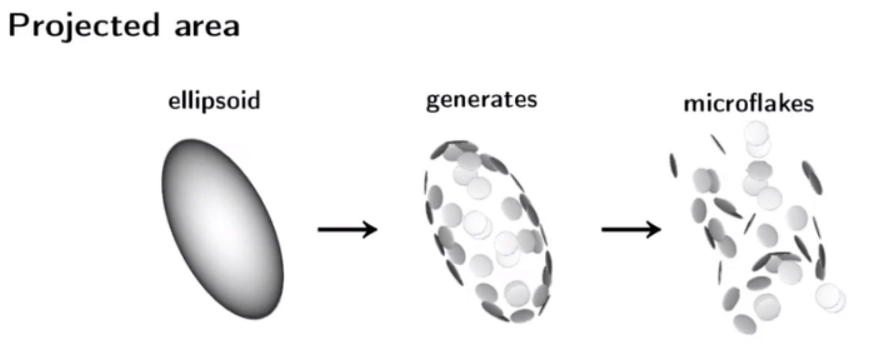
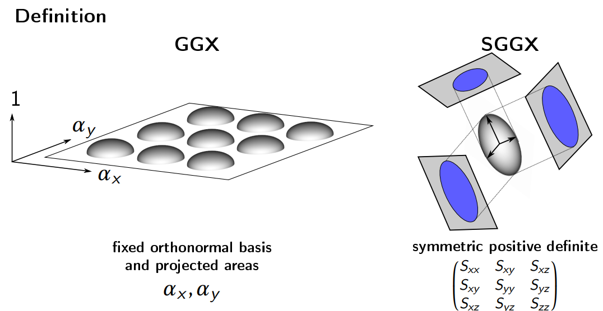
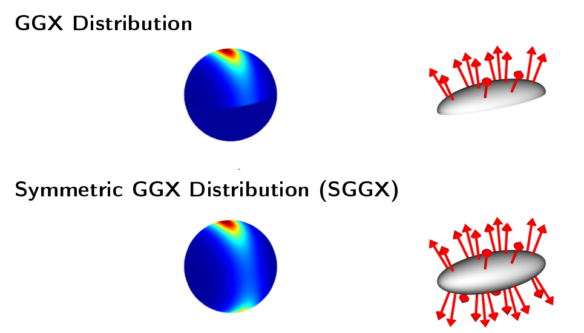

# SIGGRAPH 2020 Course: Samurai Shading in Ghost of Tsushima
这篇分享主要讲了《对马岛之魂》这款游戏中的一些图形学技术，包括

- 渲染强各向异性的材质
- 渲染强asperity scattering的材质
- 提升皮肤渲染的准确性
- 更高效地使用detailed map

《对马岛之魂》的背景放在13世纪封建社会的日本，玩家操作一名日本武士，为了解放被蒙古入侵的对马岛的故事。整个游戏的渲染风格不是写实（photorealism），而是风格化的（stylized realism）。用到的渲染管线多数是延迟管线，少许前向管线，具体的划分如下。

- 延迟管线
  - 兰伯特漫反射部分，包括透明材质和asperity scattering部分。
  - 各向同性的GGX高光
- 前向管线
  - 各向异性的GGX高光（SGGX）
  - 各向异性的asperity scattering BRDF
  - 次表面散射等

整个分享主要分为四个部分，接下来逐个介绍。

## 各向异性的高光（Anisotropic Specular）
现有的各向异性GGX高光的一个很不方便的地方在于，它的tangent方向必须跟mesh一致。这使得美术对于渲染效果的控制不够精准。为了解决这个问题，《对马岛之魂》改进了了2015年的一篇paper——*The SGGX Microflake Distribution*。

### The SGGX Microflake Distribution
SGGX这篇论文提出了一种名为SGGX的渲染模型，用于volume rendering，比如毛发、纺织物等。这类物体的渲染有一个模型，叫Microflake。

先解释一下Microflake是啥。这个词的中文“微薄片”听起来很奇怪，所以就直接用英文了。搞过PBR的话应该对Microfacet比较熟悉，Microfacet就是微表面，指的是**平面**上的微小凸起，这个Microfacet theory是描述**平面**特性的物理模型，那么与之对应的，Microflake是用来描述**体素**特性的物理模型。如下图所示，每个Microflake都有朝向，会对光线进行反射，微观上Microflake的表现在宏观上就会呈现出光线与体素（例如雾）交互的现象。

在SGGX之前，此类的渲染算法有两个问题

1. 模型复杂，渲染开销大。
2. 不易downsample，进行低分辨率渲染时性价比低。

因此，为了应对现有模型的问题，SGGX是一种便于LoD，也更加简单的模型。

SGGX模型的关键点有两个

1. 提出了用投影面积替代roughness的方案。
2. 提出了用椭球体（ellipsoid）来描述Microflake模型。

下面具体说说这两个关键点的含义。

我们假设体素内充斥着稀疏的Microflake，每个Microflake可以理解为一个微小的**薄片**，当光线打到它的任意一侧后，会遵循镜面反射定律。在这个模型下，当我们计算一束光线在体素内传播这个过程时，需要计算光线如何与Microflake发生碰撞，以及当光线与某一个Microflake发生碰撞后，光路的改变情况。

对此，我们可以借鉴Microfacet理论的推导方法。只不过Microfacet理论里平行光打到凹凸不平的平面上，而Microflake理论是平行光射入体素里。Microfacet理论里每个微小的平面会独立反射光线，微小表面的法线分布情况即宏观的roughness参数；同样，Microflake理论里，光线射入体素里面后，会与每个Microflake片元交互，发生反射。那么在Microflake理论里，如何衡量体素的roughness呢？答案是看每个Microflake在光线方向上的投影，投影面积越大，意味着光线被Microflake反射的概率越大，也就是粗糙度越大。

将Microflake理论中微小薄片在宏观上的投影面积等效于Microfacet理论中的roughness，这是SGGX模型的第一个洞见。接下来的问题是，如何宏观上表示这一堆零散的Microflake，将它们的朝向或者说投影面积用类似于Microfacet理论中的NDF函数表示呢？

这就引出了SGGX理论的第二个洞见——椭球体模型。如下图所示。

将不知到如何分布的一堆Microflake整合为一个完整的椭球体，这一步直觉上是可行的，但是并没有严格的理论论证，只是SGGX理论给出的一个假设。这一假设也是SGGX模型的误差来源。

所以，我们就不经任何严格推理地假设，一块体素中的所有Microflake刚好可以构成一个椭球体，并且这个椭球体在各个方向上的投影刚好等于所有Microflake的投影的总和。那么，相对于Microfacet理论用两个粗糙度系数$\alpha_x$和$\alpha_y$，描述椭球体需要一个3x3的矩阵。

到目前为止，还有一个问题一直没有提到，那就是SGGX究竟为什么叫SGGX？

SGGX的全称是symmetric GGX。GGX是Microfacet理论的一个法向分布模型，它是定义在半球面上的法向分布，这对描述表面属性的Microfacet理论是很好理解的，但是对于描述体素的Microflake理论而言，半球面分布的GGX很明显是不够的。而SGGX则是将半球面上分布的GGX对称到整个球面上，这也是symmetric S的含义。

### 改进的SGGX模型
SGGX模型用一个3x3的矩阵来描述椭球的形状，但是这个3x3的矩阵过于抽象，不太容易将这九个参数跟某个物理量（例如粗糙度之类的）对应起来，因此更实用的一个形式是将这个矩阵分解为特征向量与特征值相乘的形式：

三个特征向量对应椭球的三个轴，三个特征值对应沿着相应轴的投影面积的平方。这样描述还有一个好处，GGX可以看做是三个特征向量分别为$\vec{h}$、$\vec{b}$、$\vec{n}$的特殊情况，此时对应的特征值分别为$\alpha_x^2$、$\alpha_y^2$、$1$，前两个分别为粗糙度在tangent方向、bitangent方向的分量的平方。

但是凭空出现的这三个椭球的轴太诡异了，还不是我们需要的物理量。因此我们想把它搞成我们熟悉的轴，比如法向。

## Fuzz shading

## Skin shading

## Detail maps

# Reference
1. The SGGX Microflake Distribution
2. 
