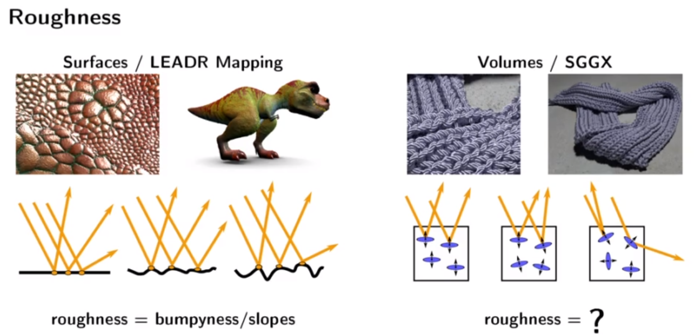

# SIGGRAPH 2020 Course: Samurai Shading in Ghost of Tsushima
这篇分享主要讲了《对马岛之魂》这款游戏中的一些图形学技术，包括

- 渲染强各向异性的材质
- 渲染强asperity scattering的材质
- 提升皮肤渲染的准确性
- 更高效地使用detailed map

《对马岛之魂》的背景放在13世纪封建社会的日本，玩家操作一名日本武士，为了解放被蒙古入侵的对马岛的故事。整个游戏的渲染风格不是写实（photorealism），而是风格化的（stylized realism）。用到的渲染管线多数是延迟管线，少许前向管线，具体的划分如下。

- 延迟管线
  - 兰伯特漫反射部分，包括透明材质和asperity scattering部分。
  - 各向同性的GGX高光
- 前向管线
  - 各向异性的GGX高光（SGGX）
  - 各向异性的asperity scattering BRDF
  - 次表面散射等

整个分享主要分为四个部分，接下来逐个介绍。

## 各向异性的高光（Anisotropic Specular）
现有的各向异性GGX高光的一个很不方便的地方在于，它的tangent方向必须跟mesh一致。这使得美术对于渲染效果的控制不够精准。为了解决这个问题，《对马岛之魂》改进了了2015年的一篇paper——*The SGGX Microflake Distribution*。

### The SGGX Microflake Distribution
SGGX这篇论文提出了一种名为SGGX的渲染模型，用于volume rendering，比如毛发、纺织物等。这类物体的渲染有一个模型，叫Microflake。

先解释一下Microflake是啥。这个词的中文“微薄片”听起来很奇怪，所以就直接用英文了。搞过PBR的话应该对Microfacet比较熟悉，Microfacet就是微表面，指的是**平面**上的微小凸起，这个Microfacet theory是描述**平面**特性的物理模型，那么与之对应的，Microflake是用来描述**体素**特性的物理模型。如下图所示，每个Microflake都有朝向，会对光线进行反射，微观上Microflake的表现在宏观上就会呈现出光线与体素（例如雾）交互的现象。

在SGGX之前，此类的渲染算法有两个问题

1. 模型复杂，渲染开销大。
2. 不易downsample，进行低分辨率渲染时性价比低。

因此，为了应对现有模型的问题，SGGX是一种便于LoD，也更加简单的模型。

SGGX模型的关键点有两个

1. 提出了用投影面积替代roughness的方案。
2. 提出了用椭球体（ellipsoid）来描述Microflake模型。

下面具体说说这两个关键点的含义。

在lod时，材质的一项关键属性是roughness，对roughness的控制决定了下采样之后材质是否会失真。对于Microfacet模型来说，roughness意味着表面的凸起，即粗糙程度；对于Microflake模型来说，roughness应该对应于Microflake薄片在各个方向上的投影。如下图所示。

为什么叫Symmetric GGX？

roughness = projected area on tangent directions

## Fuzz shading

## Skin shading

## Detail maps

# Reference
1. The SGGX Microflake Distribution
