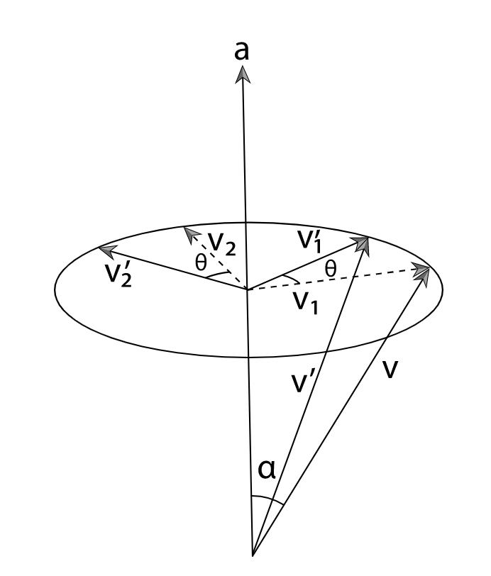
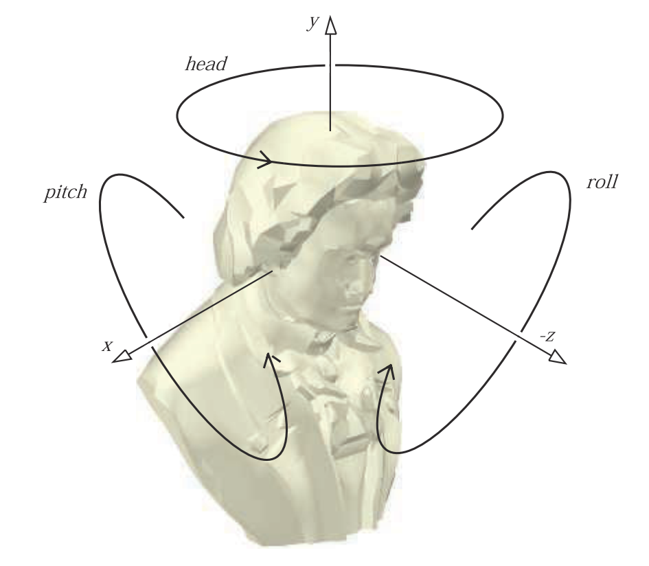
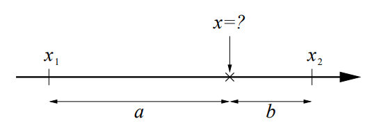

图形学中的矩阵变换
# 摘要
图形学因为要处理三维中的物体，所以经常要用到矩阵变换，包括基础的模型变换（旋转、平移、缩放变换），以及投影变换、视口变换。这其中有很多有意思的数学知识。网络上虽然有很多介绍矩阵变换的博客，但是很多只介绍了基本的矩阵运算，没有深入介绍四元数等高级用法。因此本文将从模型变换入手，介绍图形学中的插值操作，包括四元数等内容。
# 模型变换
模型变换是将一个点（模型）变换到另一个点（模型）的操作。一般我们会把点用齐次坐标（homogeneous notation）表示，所以变换矩阵是$4\times4$的。另一个需要注意的点是，矩阵乘法运算一般情况下不满足交换律，所以变换的顺序很重要，一个直观的例子是原点处的物体先平移再绕原点旋转的结果与先绕原点旋转再平移的结果是不一样的。这里我们约定，平移变换$T$、缩放变换$S$、旋转变换$R$的顺序依次是先缩放再旋转最后平移，表示为：
$$
M=TRS
$$
## 平移变换
平移变换比较自然的一种表示形式是向量——这也是向量的物理意义。假设一个平移操作${\bf{t}}=(t_x, t_y, t_x)$，写为矩阵是：
$$
{\bf{T}}({\bf{t}}) = T(t_x, t_y, t_z) = 
\begin{pmatrix}
    1 & 0 & 0 & t_x \\
    0 & 1 & 0 & t_y \\
    0 & 0 & 1 & t_x \\
    0 & 0 & 0 & 1 \\
\end{pmatrix}
$$
平移矩阵的逆矩阵也很容易求，将${\bf{t}}$取负即可：${\bf{T}}^{-1}({\bf{t}})={\bf{T}}(-{\bf{t}})$。逻辑上比较容易理解。
## 缩放变换
缩放变换用于将$x$、$y$、$z$轴依次按系数$(s_x, s_y, s_y)$进行缩放，缩放矩阵表示为：
$$
{\bf{S}}({\bf{s}}) =
\begin{pmatrix}
    s_x & 0 & 0 & 0 \\
    0 & s_y & 0 & 0 \\
    0 & 0 & s_z & 0 \\
    0 & 0 & 0 & 1 \\
\end{pmatrix}
$$
其逆矩阵${\bf{S}}^{-1}({\bf{s}})={\bf{S}}(1/s_x, 1/s_y, 1/s_z)$。
### 沿任意轴的缩放
TODO
## 旋转变换
旋转变换相较于前两种变换要复杂一些。我们先看简单的形式，假设旋转轴是$x$、$y$、$z$轴，旋转角度为$\phi$，那么旋转矩阵可以写为：
$$
\begin{pmatrix}
    1 & 0 & 0 & 0 \\
    0 & \cos\phi & -\sin\phi & 0 \\
    0 & \sin\phi & \cos\phi & 0 \\
    0 & 0 & 0 & 1 \\
\end{pmatrix} \\
{\bf{R}}_y({\bf{\phi}}) =
\begin{pmatrix}
    \cos\phi & 0 & \sin\phi & 0 \\
    0 & 1 & 0 & 0 \\
    -\sin\phi & 0 & \cos\phi & 0 \\
    0 & 0 & 0 & 1 \\
\end{pmatrix} \\
{\bf{R}}_z({\bf{\phi}}) =
\begin{pmatrix}
    \cos\phi & -\sin\phi & 0 & 0 \\
    \sin\phi & \cos\phi & 0 & 0 \\
    0 & 0 & 1 & 0 \\
    0 & 0 & 0 & 1 \\
\end{pmatrix}
$$
其逆矩阵
$$
{\bf{R}}^{-1}_i(\phi)={\bf{R}}_i(-\phi)={\bf{R}}^{T}_i(\phi)
$$
其他一些有趣的性质包括：
$$
\begin{aligned}
{\bf{R}}_i(0) & = {\bf{I}} \\
{\bf{R}}_i(\phi_1){\bf{R}}_i(\phi_2) & = {\bf{R}}_i(\phi_1 + \phi_2) \\
{\bf{R}}_i(\phi_1){\bf{R}}_i(\phi_2) & = {\bf{R}}_i(\phi_2){\bf{R}}_i(\phi_1)
\end{aligned}
$$
### 绕任意轴的旋转
绕任意轴的旋转看起来会比较复杂，但是仔细分析一下其实并不困难。推导过程主要分两步，

1. 求旋转前后两个向量的关系；
2. 将这个关系转换为矩阵；

假设我们需要将向量${\bf{v}}$绕着轴${\bf{a}}$旋转角度$\theta$，如下图所示。



令${\bf{v}}_c$表示${\bf{v}}$在轴${\bf{a}}$上的投影，即：
$$
{\bf{v}}_c = {\bf{a}}||{\bf{v}}||\cos\alpha={\bf{a}}({\bf{v}}\cdot{\bf{a}})
$$
并且令：
$$
{\bf{v}}_1={\bf{v}}-{\bf{v}}_c \\ 
{\bf{v}}_2={\bf{v}}_1\times{\bf{a}}
$$
则根据${\bf{v}}_1$与${\bf{v}}_1'$、${\bf{v}}_2$与${\bf{v}}_2'$的关系，可以求得：
$$
{\bf{v}}'={\bf{v}}_c+{\bf{v}}_1\cos\theta+{\bf{v}}_2\sin\theta
$$
这样就得到了${\bf{v}}'$与${\bf{v}}$的关系。

接下来，考虑如何将这个向量关系转换为矩阵关系。思路就是，旋转矩阵的每一行相当于对相应坐标轴$(1,0,0)$，$(0,1,0)$，$(0,0,1)$的旋转操作，我们可以分别计算三个坐标轴基底旋转之后的向量，也即旋转矩阵的对应行。
$$
{\bf{R}}_x({\bf{\phi}}) = 
\begin{pmatrix}
    \cos\theta + (1-\cos\theta)a_x^2 & (1-\cos\theta)a_xa_y-a_z\sin\theta & (1-\cos\theta)a_xa_z+a_y\sin\theta & 0 \\
    (1-\cos\theta)a_xa_y+a_z\sin\theta & \cos\theta+(1-\cos\theta)a_y^2 & (1-\cos\theta)a_ya_z-a_x\sin\theta & 0 \\
    (1-\cos\theta)a_xa_z-a_y\sin\theta & (1-\cos\theta)a_ya_z+a_x\sin\theta & \cos\theta+(1-\cos\theta)a_z^2 & 0 \\
    0 & 0 & 0 & 1 \\
\end{pmatrix}
$$
具体的代码实现如下。

```C++
Matrix4x4 Rotate(Float theta, const Vector3f &axis) {
    Vector3f a = Normalize(axis);
    Float sinTheta = std::sin(Radians(theta));
    Float cosTheta = std::cos(Radians(theta));
    Matrix4x4 m = Matrix4x4::Identity();
    // Compute rotation of first basis vector
    m.m[0][0] = a.x * a.x + (1 - a.x * a.x) * cosTheta;
    m.m[0][1] = a.x * a.y * (1 - cosTheta) - a.z * sinTheta;
    m.m[0][2] = a.x * a.z * (1 - cosTheta) + a.y * sinTheta;
    m.m[0][3] = 0;
    // Compute rotations of second basis vector
    m.m[1][0] = a.x * a.y * (1 - cosTheta) + a.z * sinTheta;
    m.m[1][1] = a.y * a.y + (1 - a.y * a.y) * cosTheta;
    m.m[1][2] = a.y * a.z * (1 - cosTheta) - a.x * sinTheta;
    m.m[1][3] = 0;
    // Compute rotations of third basis vector
    m.m[2][0] = a.x * a.z * (1 - cosTheta) - a.y * sinTheta;
    m.m[2][1] = a.y * a.z * (1 - cosTheta) + a.x * sinTheta;
    m.m[2][2] = a.z * a.z + (1 - a.z * a.z) * cosTheta;
    m.m[2][3] = 0;
    return m;
}
```

### 欧拉变换
由于矩阵乘法不满足交换律，因此规定旋转的先后顺序很重要。这里我们介绍比较常用的欧拉变换（Euler Transform）。

如下图所示，假定视角方向是z轴方向，物体的放置为面对z轴负方向，上方向为y轴方向。定义沿x轴正方向的旋转为pitch，沿y轴正方向的旋转为head，z轴正方向的旋转为roll，那么这三个旋转操作可以以此对应到三个旋转矩阵${\bf{R}}_x(p)$，${\bf{R}}_y(h)$，${\bf{R}}_z(r)$。：



欧拉变换定义了这三个旋转的操作顺序为
$$
\begin{aligned}
{\bf{R}}(h,p,r) & ={\bf{R}}_z(r){\bf{R}}_x(p){\bf{R}}_y(h) \\ 
{\bf{R}}(h,p,r) & =
\begin{pmatrix}
    \cos{r}\cos{h}-\sin{r}\sin{p}\sin{h} & -\sin{r}\cos{p} & \cos{r}\sin{h}+\sin{r}\sin{p}\cos{h} & 0 \\
    \sin{r}\cos{h}+\cos{r}\sin{p}\sin{h} & \cos{r}\cos{p} & \sin{r}\sin{h}-\cos{r}\sin{p}\cos{h} & 0 \\
    -\cos{p}\sin{h} & \sin{p} & \cos{p}\cos{h} & 0 \\
    0 & 0 & 0 & 1 \\
\end{pmatrix} \\
\end{aligned}
$$
有了这个约定，就可以顺利的从旋转矩阵提取旋转角度，或者从旋转角度恢复旋转矩阵了。
$$
\begin{aligned}
h & = \arctan(-r_{20}, r_{22}) \\
p & = \arcsin(r_{21}) \\
r & = \arctan(-r_{01}, r_{11})
\end{aligned}
$$
其中，$\arctan(y,x)$表示$y/x$的反正切函数，其值域是$[0,2\pi)$。注意，这里与传统的值域为$(-\pi/2,\pi/2)$的反正切函数不一样。因为我们定义的旋转角度是$2\pi$的范围，传统的反正切函数是无法满足的。而且，考虑$x$与$y$同号/异号的情况下，$y/x$的符号始终为正/负，是无法区分该角度所在的象限的。因此传入两个参数求反正切函数是有必要的。*Real-Time Rendering*将这个改进的反正切函数记为$\rm{atan2}(y,x)$。同时，C++的标准库也内置了这个函数。

代码实现：
```C++
Matrix4x4 Rotate(float h, float p, float r){
	Matrix4x4 rotate;
	float sinh = std::sin(h);
	float cosh = std::cos(h);
	float sinp = std::sin(p);
	float cosp = std::cos(p);
	float sinr = std::sin(r);
	float cosr = std::cos(r);
	rotate(0,0) = cosr*cosh-sinr*sinp*sinh;
	rotate(0,1) = -sinr*cosp;
	rotate(0,2) = cosr*sinh+sinr*sinp*cosh;
	rotate(0,3) = 0;
	rotate(1,0) = sinr*cosh+cosr*sinp*sinh;
	rotate(1,1) = cosr*cosp;
	rotate(1,2) = sinr*sinh-cosr*sinp*cosh;
	rotate(1,3) = 0;
	rotate(2,0) = -cosp*sinh;
	rotate(2,1) = sinp;
	rotate(2,2) = cosp*cosh;
	rotate(2,3) = 0;
	rotate(3,0) = 0;
	rotate(3,1) = 0;
	rotate(3,2) = 0;
	rotate(3,3) = 1;
	return rotate;
}
void RotateDecompose(Matrix4x4 rotate, float& h, float& p, float& r){
	h = std::atan2(-rotate(2,0), rotate(2,2));
	p = std::asin(rotate(2,1));
	r = std::atan2(-rotate(0,1), rotate(1,1));
}
```
# 插值
了解了基本的几种变换，我们再来讨论一下常用的插值操作。

插值（lerp）可以理解为，求两个状态的中间状态。给定状态A和状态B，以及介于0到1的系数t，求位置t的状态
```
C = lerp(A, B, t)
```
比如对位置插值就是求两个点中间某个点。对平移、缩放、旋转做插值就是在平移、缩放、旋转空间求两个状态的中间状态。



从数学上说，给定两个点$x_1$和$x_2$，以及一个比例$t=a/(a+b)$，求$t$时刻的中间状态。

线性插值就是用线性刻度（linear scale）度量$x_1$和$x_2$，即：

$$
\frac{x_2-x}{x-x_1}=\frac{b}{a}=\frac{1-t}{t} \\
x=tx_2 + (1-t) x_1
$$

而对数插值就是用对数刻度（logarithmic scale）度量$x_1$和$x_2$：

$$
\frac{\log{x_2}-\log{x}}{\log{x}-\log{x_1}}=\frac{b}{a}=\frac{1-t}{t} \\
x = x_2^tx_1^{1-t}
$$

这两种插值方式是常用的插值方式，后面会用到。

对平移和缩放操作做插值比较直接，一般的线性插值就足够，如果觉得线性插值过渡不够平滑，可以采用样条曲线或者贝塞尔曲线的方式插值，这个话题超出了本文的范围，因此此处略过。这里主要讨论一下对旋转操作的插值。理想情况下，对旋转操作做插值应该具有以下三种性质。

1. 力矩最小（torque minimization）；
2. 角速度固定（constant angular velocity）；
3. 满足交换律（commutivity）；

力矩最小性质指的是，中间状态划过的轨迹在旋转空间是最短的。这个性质可以类比对点的插值，我们知道两点之间线段最短，因此对两个点的插值轨迹就是连接这两个点的线段。如果把旋转空间投影到平面上，那么中间状态的轨迹也应该是一条线段。

角速度固定指的是如果$t$的变化速度是固定的，那么旋转的速度也应该是固定的。

满足交换律指的是，如果对角度进行连续插值，比如$A$到$B$再到$C$，那么交换插值的顺序（先对$B$到$C$插值）不影响插值结果，前提是插值系数$t$要保持一致。

直观来讲，力矩最小保证了旋转操作走的是最近路线，角速度固定保证了旋转速度不变，交换律能保证连续插值时的稳定性。不幸的是，目前还不存在同时满足这三个性质的对旋转操作的插值方法。

那么可能的对旋转变换的插值方法有哪些呢？

1. 欧拉角线性插值
2. 旋转矩阵线性插值
3. 四元数线性插值
4. 四元数球面插值（对数插值）

前两种方法用到了前面介绍的旋转矩阵和欧拉变换，比较直接。后两种涉及到四元数，我们先看一下四元数是什么。

## 四元数法
四元数（quaternions）早在1843年就被提出，最早是作为一种对复数的拓展。之后1985年被引入图形学，用来表示旋转或描述朝向。相较于矩阵的描述，四元数的优势是可以直接从“围绕任意轴的旋转”的表示中转化过来，更简洁也更直观。


当然它的最大的优势，在于可以对旋转操作平滑插值。这是旋转矩阵做不到的。

## 四元数的球面线性插值

## 四元数的线性插值


# 法向变换

# 未尽事宜
剪切变换（shear transform）

# Reference
[1] [Linear and Logarithmic Interpolation](https://www.cmu.edu/biolphys/deserno/pdf/log_interpol.pdf)

[2] [Understanding Slerp, Then Not Using It](http://number-none.com/product/Understanding%20Slerp,%20Then%20Not%20Using%20It/index.html)

[3] [Practical Parameterization of Rotations Using the Exponential Map](https://www.cs.cmu.edu/~spiff/moedit99/expmap.pdf)

[4] [Quaternions, Interpolation and Animation](https://web.mit.edu/2.998/www/QuaternionReport1.pdf)

[5] [Quaternion calculus as a basic tool in computer graphics](https://link.springer.com/article/10.1007/BF01901476)

