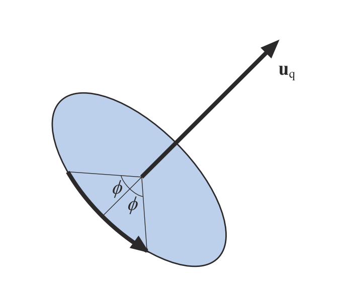

图形学中的矩阵变换

[TOC]

# 摘要
图形学因为要处理三维中的物体，所以经常要用到矩阵变换，包括基础的模型变换（旋转、平移、缩放变换），以及投影变换、视口变换。这其中有很多有意思的数学知识。网络上虽然有很多介绍矩阵变换的博客，但是很多只介绍了基本的矩阵运算，没有深入介绍四元数等高级用法。因此本文将从模型变换入手，介绍图形学中的插值操作，包括四元数等内容。
# 模型变换
模型变换是将一个点（模型）变换到另一个点（模型）的操作。一般我们会把三维点用齐次坐标（homogeneous notation）表示，所以变换矩阵是$4\times4$的。另一个需要注意的点是，矩阵乘法运算一般情况下不满足交换律，所以变换的顺序很重要，一个直观的例子是原点处的物体先平移再绕原点旋转的结果与先绕原点旋转再平移的结果是不一样的。这里我们约定，平移变换$T$、缩放变换$S$、旋转变换$R$的顺序依次是先缩放再旋转最后平移，表示为：
$$
M=TRS
$$
## 平移变换
平移变换比较自然的一种表示形式是向量——这也是向量的物理意义。假设一个平移操作${\bf{t}}=(t_x, t_y, t_x)$，写为矩阵是：
$$
{\bf{T}}({\bf{t}}) = T(t_x, t_y, t_z) = 
\begin{pmatrix}
    1 & 0 & 0 & t_x \\
    0 & 1 & 0 & t_y \\
    0 & 0 & 1 & t_x \\
    0 & 0 & 0 & 1 \\
\end{pmatrix}
$$
平移矩阵的逆矩阵也很容易求，将${\bf{t}}$取负即可：${\bf{T}}^{-1}({\bf{t}})={\bf{T}}(-{\bf{t}})$。逻辑上比较容易理解。
## 缩放变换
缩放变换用于将$x$、$y$、$z$轴依次按系数$(s_x, s_y, s_y)$进行缩放，缩放矩阵表示为：
$$
{\bf{S}}({\bf{s}}) =
\begin{pmatrix}
    s_x & 0 & 0 & 0 \\
    0 & s_y & 0 & 0 \\
    0 & 0 & s_z & 0 \\
    0 & 0 & 0 & 1 \\
\end{pmatrix}
$$
其逆矩阵${\bf{S}}^{-1}({\bf{s}})={\bf{S}}(1/s_x, 1/s_y, 1/s_z)$。
## 旋转变换
旋转变换相较于前两种变换要复杂一些。我们先看简单的形式，假设旋转轴是$x$、$y$、$z$轴，旋转角度为$\phi$，那么旋转矩阵可以写为：
$$
{\bf{R}}_x({\bf{\phi}}) =
\begin{pmatrix}
    1 & 0 & 0 & 0 \\
    0 & \cos\phi & -\sin\phi & 0 \\
    0 & \sin\phi & \cos\phi & 0 \\
    0 & 0 & 0 & 1 \\
\end{pmatrix} \\
{\bf{R}}_y({\bf{\phi}}) =
\begin{pmatrix}
    \cos\phi & 0 & \sin\phi & 0 \\
    0 & 1 & 0 & 0 \\
    -\sin\phi & 0 & \cos\phi & 0 \\
    0 & 0 & 0 & 1 \\
\end{pmatrix} \\
{\bf{R}}_z({\bf{\phi}}) =
\begin{pmatrix}
    \cos\phi & -\sin\phi & 0 & 0 \\
    \sin\phi & \cos\phi & 0 & 0 \\
    0 & 0 & 1 & 0 \\
    0 & 0 & 0 & 1 \\
\end{pmatrix}
$$
其逆矩阵
$$
{\bf{R}}^{-1}_i(\phi)={\bf{R}}_i(-\phi)={\bf{R}}^{T}_i(\phi)
$$
也即：
$$
{\bf{R}}^{T}_i(\phi){\bf{R}}_i(\phi) = {\bf{I}}
$$

其他一些有趣的性质包括：
$$
\begin{aligned}
\text{det}({\bf{R}}(\phi)) & = 1 \\ 
{\bf{R}}_i(0) & = {\bf{I}} \\
{\bf{R}}_i(\phi_1){\bf{R}}_i(\phi_2) & = {\bf{R}}_i(\phi_1 + \phi_2) \\
{\bf{R}}_i(\phi_1){\bf{R}}_i(\phi_2) & = {\bf{R}}_i(\phi_2){\bf{R}}_i(\phi_1)
\end{aligned}
$$
### 绕任意轴的旋转
绕任意轴的旋转看起来会比较复杂，但是仔细分析一下其实并不困难。推导过程主要分两步，

1. 求旋转前后两个向量的关系；
2. 将这个关系转换为矩阵；

假设我们需要将向量${\bf{v}}$绕着轴${\bf{a}}$旋转角度$\theta$，如下图所示。


令${\bf{v}}_c$表示${\bf{v}}$在轴${\bf{a}}$上的投影，即：
$$
{\bf{v}}_c = {\bf{a}}||{\bf{v}}||\cos\alpha={\bf{a}}({\bf{v}}\cdot{\bf{a}})
$$
并且令：
$$
{\bf{v}}_1={\bf{v}}-{\bf{v}}_c \\ 
{\bf{v}}_2={\bf{v}}_1\times{\bf{a}}
$$
则根据${\bf{v}}_1$与${\bf{v}}_1'$、${\bf{v}}_2$与${\bf{v}}_2'$的关系，可以求得：
$$
{\bf{v}}'={\bf{v}}_c+{\bf{v}}_1\cos\theta+{\bf{v}}_2\sin\theta
$$
这样就得到了${\bf{v}}'$与${\bf{v}}$的关系。

接下来，考虑如何将这个向量关系转换为矩阵关系。思路就是，旋转矩阵的每一行相当于对相应坐标轴$(1,0,0)$，$(0,1,0)$，$(0,0,1)$的旋转操作，我们可以分别计算三个坐标轴基底旋转之后的向量，也即旋转矩阵的对应行。
$$
{\bf{R}}_x({\bf{\phi}}) = 
\begin{pmatrix}
    \cos\theta + (1-\cos\theta)a_x^2 & (1-\cos\theta)a_xa_y-a_z\sin\theta & (1-\cos\theta)a_xa_z+a_y\sin\theta & 0 \\
    (1-\cos\theta)a_xa_y+a_z\sin\theta & \cos\theta+(1-\cos\theta)a_y^2 & (1-\cos\theta)a_ya_z-a_x\sin\theta & 0 \\
    (1-\cos\theta)a_xa_z-a_y\sin\theta & (1-\cos\theta)a_ya_z+a_x\sin\theta & \cos\theta+(1-\cos\theta)a_z^2 & 0 \\
    0 & 0 & 0 & 1 \\
\end{pmatrix}
$$
具体的代码实现如下。

```C++
Matrix4x4 Rotate(float theta, const Vector3f &axis) {
    Vector3f a = Normalize(axis);
    float sinTheta = std::sin(Radians(theta));
    float cosTheta = std::cos(Radians(theta));
    Matrix4x4 m = Matrix4x4::Identity();
    // Compute rotation of first basis vector
    m.m[0][0] = a.x * a.x + (1 - a.x * a.x) * cosTheta;
    m.m[0][1] = a.x * a.y * (1 - cosTheta) - a.z * sinTheta;
    m.m[0][2] = a.x * a.z * (1 - cosTheta) + a.y * sinTheta;
    m.m[0][3] = 0;
    // Compute rotations of second basis vector
    m.m[1][0] = a.x * a.y * (1 - cosTheta) + a.z * sinTheta;
    m.m[1][1] = a.y * a.y + (1 - a.y * a.y) * cosTheta;
    m.m[1][2] = a.y * a.z * (1 - cosTheta) - a.x * sinTheta;
    m.m[1][3] = 0;
    // Compute rotations of third basis vector
    m.m[2][0] = a.x * a.z * (1 - cosTheta) - a.y * sinTheta;
    m.m[2][1] = a.y * a.z * (1 - cosTheta) + a.x * sinTheta;
    m.m[2][2] = a.z * a.z + (1 - a.z * a.z) * cosTheta;
    m.m[2][3] = 0;
    return m;
}
```

### 欧拉变换
由于矩阵乘法不满足交换律，因此规定旋转的先后顺序很重要。这里我们介绍比较常用的欧拉变换（Euler Transform）。

如下图所示，假定视角方向是z轴方向，物体的放置为面对z轴负方向，上方向为y轴方向。定义沿x轴正方向的旋转为pitch，沿y轴正方向的旋转为head，z轴正方向的旋转为roll，那么这三个旋转操作可以以此对应到三个旋转矩阵${\bf{R}}_x(p)$，${\bf{R}}_y(h)$，${\bf{R}}_z(r)$。：


欧拉变换定义了这三个旋转的操作顺序为
$$
\begin{aligned}
{\bf{R}}(h,p,r) & ={\bf{R}}_z(r){\bf{R}}_x(p){\bf{R}}_y(h) \\ 
{\bf{R}}(h,p,r) & =
\begin{pmatrix}
    \cos{r}\cos{h}-\sin{r}\sin{p}\sin{h} & -\sin{r}\cos{p} & \cos{r}\sin{h}+\sin{r}\sin{p}\cos{h} & 0 \\
    \sin{r}\cos{h}+\cos{r}\sin{p}\sin{h} & \cos{r}\cos{p} & \sin{r}\sin{h}-\cos{r}\sin{p}\cos{h} & 0 \\
    -\cos{p}\sin{h} & \sin{p} & \cos{p}\cos{h} & 0 \\
    0 & 0 & 0 & 1 \\
\end{pmatrix} \\
\end{aligned}
$$
有了这个约定，就可以顺利的从旋转矩阵提取旋转角度，或者从旋转角度恢复旋转矩阵了。
$$
\begin{aligned}
h & = \arctan(-r_{20}, r_{22}) \\
p & = \arcsin(r_{21}) \\
r & = \arctan(-r_{01}, r_{11})
\end{aligned}
$$
其中，$\arctan(y,x)$表示$y/x$的反正切函数，其值域是$[0,2\pi)$。注意，这里与传统的值域为$(-\pi/2,\pi/2)$的反正切函数不一样。因为我们定义的旋转角度是$2\pi$的范围，传统的反正切函数是无法满足的。而且，考虑$x$与$y$同号/异号的情况下，$y/x$的符号始终为正/负，是无法区分该角度所在的象限的。因此传入两个参数求反正切函数是有必要的。*Real-Time Rendering*将这个改进的反正切函数记为$\rm{atan2}(y,x)$。同时，C++的标准库也内置了这个函数。

代码实现：
```C++
Matrix4x4 Rotate(float h, float p, float r){
	Matrix4x4 rotate;
	float sinh = std::sin(h);
	float cosh = std::cos(h);
	float sinp = std::sin(p);
	float cosp = std::cos(p);
	float sinr = std::sin(r);
	float cosr = std::cos(r);
	rotate(0,0) = cosr*cosh-sinr*sinp*sinh;
	rotate(0,1) = -sinr*cosp;
	rotate(0,2) = cosr*sinh+sinr*sinp*cosh;
	rotate(0,3) = 0;
	rotate(1,0) = sinr*cosh+cosr*sinp*sinh;
	rotate(1,1) = cosr*cosp;
	rotate(1,2) = sinr*sinh-cosr*sinp*cosh;
	rotate(1,3) = 0;
	rotate(2,0) = -cosp*sinh;
	rotate(2,1) = sinp;
	rotate(2,2) = cosp*cosh;
	rotate(2,3) = 0;
	rotate(3,0) = 0;
	rotate(3,1) = 0;
	rotate(3,2) = 0;
	rotate(3,3) = 1;
	return rotate;
}
void RotateDecompose(Matrix4x4 rotate, float& h, float& p, float& r){
	h = std::atan2(-rotate(2,0), rotate(2,2));
	p = std::asin(rotate(2,1));
	r = std::atan2(-rotate(0,1), rotate(1,1));
}
```
## 矩阵分解
前面介绍的基本上是如何生成模型变换矩阵，有时候我们也需要将给定的模型变换矩阵分解为平移、缩放、旋转矩阵。简便起见，我们假设给定的变换矩阵$M$仅包含平移$T$、缩放$S$和旋转$R$三个操作。

### 分离平移操作
平移操作是最容易分解出来的，因为矩阵的第四列的前三项代表的就是平移项。提取出来后将对应的位置置零，得到的矩阵${\bf{M}}'$就是仅包含缩放和旋转的矩阵。
$$
T = (M_{03}, M_{13}, M_{23})
$$

### 分离旋转操作
旋转操作的分解要相对麻烦一些。但是也有很多数值分析的方法，例如QR分解，奇异值分解（SVD），极分解（Polar Decomposition）。对于我们这个应用场景来说，我们希望获得一个正交矩阵R和一个对角线矩阵，极分解是最好的方法。

极分解的问题描述是这样的，给定一个矩阵${\bf{M}}$，计算正交系数${\bf{R}}$使得${\bf{R}}^T{\bf{R}}={\bf{I}}$，且$||{\bf{R}}-{\bf{M}}||_F^2=\sum_{i,j}(R_{ij}-M_{ij})^2$最小。

具体的推导过程在这里就不展开了，有兴趣的读者可以参考[9]的附录部分。这里直接给出近似的数值解：

- 令${\bf{R}}_0={\bf{M}}$
- 计算${\bf{R}}_{i+1}=\frac{1}{2}({\bf{R}}+{\bf{R}}^{-T})$
- 迭代，直到${\bf{R}}_{i+1}-{\bf{R}}_i\approx{\bf{0}}$

得到的${\bf{R}}$就是我们要求的旋转矩阵。

需要注意的一点是，用极分解的前提是待分解的矩阵仅包含旋转操作和缩放操作。

### 分离缩放矩阵
有了前面两步，缩放矩阵只需要用${\bf{M}}'$左乘${\bf{R}}^{-1}$即可：
$$
{\bf{S}}={\bf{R}}^{-1}{\bf{M}}'
$$

### 代码实现
完整的矩阵分解代码实现（参考PBRT）：
```C++
void Decompose(const Matrix4x4 &m, Vector3f *T, Matrix4x4 *Rout, Matrix4x4 *S) {
    // Extract translation _T_ from transformation matrix
    T->x = m.m[0][3];
    T->y = m.m[1][3];
    T->z = m.m[2][3];

    // Compute new transformation matrix _M_ without translation
    Matrix4x4 M = m;
    for (int i = 0; i < 3; ++i) 
        M.m[i][3] = M.m[3][i] = 0.f;
    M.m[3][3] = 1.f;

    // Extract rotation _R_ from transformation matrix
    Float norm;
    int count = 0;
    Matrix4x4 R = M;
    do {
        // Compute next matrix _Rnext_ in series
        Matrix4x4 Rnext;
        Matrix4x4 Rit = Inverse(Transpose(R));
        for (int i = 0; i < 4; ++i)
            for (int j = 0; j < 4; ++j)
                Rnext.m[i][j] = 0.5f * (R.m[i][j] + Rit.m[i][j]);

        // Compute norm of difference between _R_ and _Rnext_
        norm = 0;
        for (int i = 0; i < 3; ++i) {
            Float n = std::abs(R.m[i][0] - Rnext.m[i][0]) +
                      std::abs(R.m[i][1] - Rnext.m[i][1]) +
                      std::abs(R.m[i][2] - Rnext.m[i][2]);
            norm = std::max(norm, n);
        }
        R = Rnext;
    } while (++count < 100 && norm > .0001);
    *Rout = R;

    // Compute scale _S_ using rotation and original matrix
    *S = Matrix4x4::Mul(Inverse(R), M);
}

```

# 插值
了解了基本的几种变换，我们再来讨论一下常用的插值操作。

插值（lerp）可以理解为，求两个状态的中间状态。给定状态A和状态B，以及介于0到1的系数$t=a/(a+b)$，求$t$时刻的状态
```
C = lerp(A, B, t)
```
比如对位置插值就是求两个点中间某个点。对平移、缩放、旋转做插值就是在平移、缩放、旋转空间求两个状态的中间状态。


**线性插值**就是用线性刻度（linear scale）度量$x_1$和$x_2$：

$$
\begin{aligned}
\frac{x_2-x}{x-x_1} & = \frac{b}{a}=\frac{1-t}{t} \\
x & = tx_2 + (1-t) x_1
\end{aligned}
$$

**对数插值**就是用对数刻度（logarithmic scale）度量$x_1$和$x_2$：

$$
\begin{aligned}
\frac{\log{x_2}-\log{x}}{\log{x}-\log{x_1}} & =\frac{b}{a}=\frac{1-t}{t} \\
x & = x_2^tx_1^{1-t}
\end{aligned}
$$

这两种插值方式都是常用的插值方式，后面会用到。

对平移和缩放操作做插值比较直接，一般的线性插值就足够，如果觉得线性插值过渡不够平滑，可以采用样条曲线或者贝塞尔曲线的方式插值，这个话题超出了本文的范围，因此此处略过。这里主要讨论一下对旋转操作的插值。理想情况下，对旋转操作做插值应该具有以下三种性质。

1. 力矩最小（torque minimization）；
2. 角速度固定（constant angular velocity）；
3. 满足交换律（commutivity）；

力矩最小指的是，中间状态划过的轨迹在对应的旋转空间是最短的。这个性质可以类比对点的插值，我们知道两点之间线段最短，因此对两个点的插值轨迹就是连接这两个点的线段。如果把旋转空间投影到平面上，那么中间状态的轨迹也应该是一条线段。

角速度固定指的是如果$t$的变化速度是固定的，那么旋转的速度也应该是固定的。

满足交换律指的是，如果对角度进行连续插值，比如从$A$到$B$再到$C$，那么交换插值的顺序（先从$C$到$B$再到$A$）不影响插值结果，前提是插值系数$t$要保持一致。

注：按照上面的描述[2]，感觉说的更像是结合律。不确定为什么这里被称为交换律。个人理解交换律应该是从$A$到$B$的插值结果等于从$B$到$A$的结果。

直观来讲，力矩最小保证了旋转操作走的是最近路线，角速度固定保证了旋转速度不变，交换律能保证连续插值时的稳定性。不幸的是，目前还不存在同时满足这三个性质的对旋转操作的插值方法。

那么可能的对旋转变换的插值方法有哪些呢？

1. 欧拉角线性插值
2. 旋转矩阵线性插值
3. 四元数线性插值
4. 四元数球面插值
5. 四元数对数插值

前两种方法用到了前面介绍的旋转矩阵和欧拉变换，比较直接，下面给出了具体的实现代码。注意，这里输入的矩阵均是旋转矩阵，从完整的模型矩阵分解得到旋转矩阵可以参考`Decompose`函数。

```C++
Matrix4x4 EulerLerp(Matrix4x4 start, Matrix4x4 end, float t){
    float starth, startp, startr, endh, endp, endr;
    RotateDecompose(start, starth, startp, startr);
    RotateDecompose(end, endh, endp, endr);
    float h = starth + (endh - starth) * ratio;
    float p = startp + (endp - startp) * ratio;
    float r = startr + (endr - startr) * ratio;
    return Rotate(h, p, r);
}

Matrix4x4 MatLerp(Matrix4x4 start, Matrix4x4 end, float t){
    return start + (end - start) * t;
}
```

后三种涉及到四元数，我们先看一下四元数是什么。

## 四元数法
四元数（quaternions）早在1843年就被提出，最早是作为一种对复数的拓展。之后1985年被引入图形学，用来表示旋转或描述朝向。四元数可以与旋转的矩阵描述、欧拉角描述相互转换，最重要的是，用四元数做旋转插值有着其他的两种描述方式不具有的优良特性，后面会具体讲到。

四元数${\bf{\hat{q}}}$定义为：
$$
{\bf{\hat{q}}} = ({\bf{q}}_v, q_w)=iq_x+jq_y+kq_z+q_w \\
i^2=j^2=k^2=-1, jk=-kj=i, ki=-ik=j, ij=-ji=k
$$
其中，$q_w$表示四元数的实部，${\bf{q}}_v$表示四元数的虚部，$i$，$j$，$k$均为虚数单位。

### 四元数的数学性质
对四元数的加减乘操作与向量和虚数的操作法则类似：
$$
\begin{aligned}
{\bf{\hat{q}}}+{\bf{\hat{r}}}& = ({\bf{q}}_v, q_w)+({\bf{r}}_v, r_w) = ({\bf{q}}_v+{\bf{r}}_v, q_w+r_w)\\
s{\bf{\hat{q}}} & = {\bf{\hat{q}}}s \\
& = ({\bf{0}}, s)({\bf{q}}_v, q_w) = (s{\bf{q}}_v, sq_w)\\ 
{\bf{\hat{q}}}{\bf{\hat{r}}} & = (iq_x+jq_y+kq_z+q_w)(ir_x+jr_y+kr_z+r_w) \\
& = i(q_yr_z-q_zr_y+r_wq_x+q_wr_x) \\
& + j(q_zr_x-q_xr_z+r_wq_y+q_wr_y) \\
& + k(q_xr_y-q_yr_x+r_wq_z+q_wr_z) \\
& + q_wr_w - q_xr_x - q_yr_y - q_zr_z \\
& = ({\bf{q}}_v\times{\bf{r}}_v+r_w{\bf{q}}_v+q_w{\bf{r}}_v, q_wr_w-{\bf{q}}_v\cdot{\bf{r}}_v)
\end{aligned}
$$
注意，四元数与标量的乘法满足交换律，但是四元数之间的乘法不满足交换律。这主要是因为向量的叉乘不满足交换律。而四元数之间的乘法是满足结合律的。

共轭操作：
$$
{\bf{\hat{q}}}^*=({\bf{q}}_v, q_w)^*=(-{\bf{q}}_v, q_w)
$$
取模操作：
$$
\begin{aligned}
||{\bf{\hat{q}}}||=n({\bf{\hat{q}}}) & =\sqrt{{\bf{\hat{q}}}{\bf{\hat{q}}}^*}=\sqrt{{\bf{\hat{q}}}^*{\bf{\hat{q}}}} = \sqrt{{\bf{q}}_v\cdot{\bf{q}}_v+q_w^2} \\
& = \sqrt{q_x^2+q_y^2+q_z^2+q_w^2}
\end{aligned}
$$
单位四元数：
$$
{\bf{\hat{i}}}=({\bf{0}}, 1)
$$
逆运算：
$$
{\bf{\hat{q}}}^{-1}=\frac{1}{n({\bf{\hat{q}}})^2}{\bf{\hat{q}}}^*
$$
### 四元数与旋转操作
单位四元数，即满足$n({\bf{\hat{q}}})=1$的四元数${\bf{\hat{q}}}$，可以写为：
$$
{\bf{\hat{q}}}=(\sin\phi{\bf{u}}_q,\cos\phi)=\sin\phi{\bf{u}}_q+\cos\phi
$$
其中${\bf{u}}_q$满足$||{\bf{u}}_q||^2=1$。

这样的单位四元数的物理意义是，围绕轴${\bf{u}}_q$旋转$2\phi$角度的旋转操作。



单位四元数也可以利用公式$\cos\phi+i\sin\phi=e^{i\phi}$改写为：
$$
{\bf{\hat{q}}}=\sin\phi{\bf{u}}_q+\cos\phi=e^{\phi{\bf{u}}_q}
$$
这样我们可以对单位四元数做一些指数、对数操作：
$$
\begin{aligned}
\log{{\bf{\hat{q}}}} & =\log{e^{\phi{\bf{u}}_q}}=\phi{\bf{u}}_q \\
{\bf{\hat{q}}}^t & =(\sin\phi{\bf{u}}_q+\cos\phi)^t \\
& =e^{\phi t {\bf{u}}_q} \\
& =\sin{(\phi t)}{\bf{u}}_q+\cos{\phi t}
\end{aligned}
$$
单位四元数的一个性质是，它的逆等于共轭：
$$
{\bf{\hat{q}}}^{-1}={\bf{\hat{q}}}^*
$$
这个性质对于计算逆来说方便了很多。

对于一个齐次坐标表示的点${\bf{p}}=(p_x, p_y, p_z, p_w)^T$，给定单位四元数${\bf{\hat{q}}}=\sin\phi{\bf{u}}_q+\cos\phi$，那么围绕${\bf{u}}$轴旋转$2\phi$角度的旋转操作可以记为：
$$
{\bf{\hat{q}}}{\bf{\hat{p}}}{\bf{\hat{q}}}^{-1}
$$
其中，${\bf{\hat{p}}}$表示向量${\bf{p}}$的四元数形式。

从旋转的角度来说，${\bf{\hat{q}}}$和$-{\bf{\hat{q}}}$的物理意义是一致的，都代表同一个旋转过程。
### 四元数与矩阵的转换
至此，我们知道了单位四元数所代表的旋转操作的意义，也知道怎么用矩阵表示绕任意轴的旋转操作，因此可以写出单位四元数${\bf{\hat{q}}}=(q_x, q_y, q_z, q_w)$与旋转矩阵$M^q$的相互转换公式：
$$
M^q=
\begin{pmatrix}
    1-2(q_y^2+q_z^2) & 2(q_xq_y-q_wq_z) & 2(q_xq_z+q_wq_y) & 0 \\
    2(q_xq_y+q_wq_z) & 1-2(q_x^2+q_z^2) & 2(q_yq_z-q_wq_x) & 0 \\
    2(q_xq_z-q_wq_y) & 2(q_yq_z+q_wq_x) & 1-2(q_x^2+q_y^2) & 0 \\
    0 & 0 & 0 & 1 \\
\end{pmatrix} \\
$$
从旋转矩阵到四元数：
$$
\begin{aligned}
\text{tr}(M^q) & =4-2(q_x^2+q_y^2+q_z^2) = 4\left(1-\frac{q_x^2+q_y^2+q_z^2}{q_x^2+q_y^2+q_z^2+q_w^2}\right)\\
& = \frac{4q_w^2}{q_x^2+q_y^2+q_z^2+q_w^2} = 4q_w^2 \\
q_w & = \frac{1}{2}\sqrt{\text{tr}(M^q)} \\
q_x & = \frac{m_{21}-m_{12}}{4q_w} \\
q_y & = \frac{m_{02}-m_{20}}{4q_w} \\
q_z & = \frac{m_{10}-m_{01}}{4q_w} \\
\end{aligned}
$$
或
$$
\begin{aligned}
4q_w^2 & = \text{tr}(M^q) \\
4q_x^2 & = m_{00}-m_{11}-m_{22}+m_{33} \\
4q_y^2 & = -m_{00}+m_{11}-m_{22}+m_{33} \\
4q_z^2 & = -m_{00}-m_{11}+m_{22}+m_{33} \\
\end{aligned}
$$
### 四元数的插值方法
对四元数进行插值可以有三种方法，线性插值（记为`lerp`，如果插值后做了归一化操作，则记为`nlerp`），球面插值（记为`slerp`），和对数插值（记为`llerp`）。
$$
\begin{aligned}
\text{lerp}({\bf{\hat{q}}},{\bf{\hat{r}}}, t) & =(1-t){\bf{\hat{q}}}+t{\bf{\hat{r}}} \\ 
\text{slerp}({\bf{\hat{q}}},{\bf{\hat{r}}}, t) & =\frac{\sin{(\phi(1-t))}}{\sin\phi}{\bf{\hat{q}}}+\frac{\sin{(\phi t)}}{\sin\phi}{\bf{\hat{r}}} \\
\cos\phi & = {\bf{\hat{q}}}\cdot{\bf{\hat{r}}} \\
\text{llerp}({\bf{\hat{q}}},{\bf{\hat{r}}}, t) & = {\bf{\hat{q}}}^{1-t}{\bf{\hat{r}}}^t\\
& = \sin{(\phi_q (1-t))}{\bf{u}}_q+\cos{\phi_q (1-t)} + \sin{(\phi_r t)}{\bf{u}}_r+\cos{\phi_r t}
\end{aligned}
$$
几个需要注意的点：
1. 单位四元数进行线性插值以后会变成非单位的四元数，如果继续用它来表示旋转操作的话，需要先归一化。否则插值出来的旋转操作会带有额外的缩放操作。
2. 球面插值看起来跟对数插值有点类似，但是并不是一回事。球面插值的物理意义其实是对角度进行插值，系数$t$正比于插值结果和${\bf{\hat{q}}}$的夹角。插值公式可以从二维的插值推广得来，具体的推导可以参考[2]。
3. 球面插值的物理意义是计算球面上的测地距离，相比于其他两种方式更“平滑”。下图[4]展示了线性插值和球面插值的区别。图a表示插值的两个端点，图b表示线性插值的四等分位置，平分的是两点连线的线段；图c表示球面插值的四等分位置，平分的是两点连成的圆弧。


具体实现：

```C++
Quaternion lerp(const Quaternion &q1, const Quaternion &q2, float t) {
	float scale0 = 1.0f - t;
	float scale1 = ( dot(q1, q2) >= 0.0f ) ? t : -t;
	return scale0 * q1 + scale1 * q2;
}

Quaternion nlerp(const Quaternion &q1, const Quaternion &q2, float t) {
	float scale0 = 1.0f - t;
	float scale1 = ( dot(q1, q2) >= 0.0f ) ? t : -t;
	return normalize(scale0 * q1 + scale1 * q2);
}

Quaternion slerp(const Quaternion &q1, const Quaternion &_q2, float t) {
	Quaternion q2(_q2);

	T cosTheta = dot(q1, q2);
	if (cosTheta < 0) {
		/* Take the short way! */
		q2 = -q2;
		cosTheta = -cosTheta;
	}
	if (cosTheta > .9995f) {
		// Revert to plain linear interpolation
		return normalize(q1 * (1.0f - t) +  q2 * t);
	} else {
		float theta = math::safe_acos(math::clamp(cosTheta, (float) -1.0f, (float) 1.0f));
		float thetap = theta * t;
		Quaternion qperp = normalize(q2 - q1 * cosTheta);
		return q1 * std::cos(thetap) + qperp * std::sin(thetap);
	}
}

Quaternion llerp(const Quaternion &q1, const Quaternion &q2, float t) {
	return (q1.log() * (1.0f - t) + q2.log() * t).exp();
}

```

## 几种插值方法的比较
了解了四元数插值方法，我们再回头讨论一下为什么用四元数对旋转操作插值会更好.

下图展示了五种插值方式的实际效果。
- 左上：欧拉角线性插值
- 右上：旋转矩阵线性插值
- 左中：`lerp`，四元数线性插值（未归一化）
- 右中：`nlerp`，四元数线性插值
- 左下：`slerp`，四元数球面插值
- 右下：`llerp`，四元数对数插值


第一种欧拉角线性插值方法，很明显角速度不是匀速的，这是因为在这个例子中，三个欧拉角都有变化，如果将旋转矩阵拆分为欧拉角形式，再做插值，虽然在三个轴上角速度都是匀速的，但是组合成旋转矩阵它的速度就不一定是匀速的了。

第二种矩阵线性插值方法，可以看出旋转过程中有微弱的缩放效果（窗户被拉伸了）。如果对插值的中间结果做矩阵分解，可以看出始终为单位矩阵的缩放矩阵被改变了！这个副作用很明显是我们所不希望的。PBRT中举的例子是说用旋转矩阵线性插值会导致旋转的物体“变模糊”，这个模糊效果就是缩放矩阵被改变导致的。如下图所示，左侧是静止状态，中间是四元数球面插值的效果，右侧是旋转矩阵线性插值的效果。注意右侧的旋转球在极点位置是模糊的，而且整个球体的边缘由于模糊而显得更大。


第三种和第四种四元数线性插值，未归一化和归一化。最大的问题是角速度也不是固定的。而且未归一化的情形略有缩放感，窗户的高度先被压缩后被拉伸。

第五种四元数球面插值，可以说是这五种方法中最“平稳”的一种了。但是它也不是那么完美——不满足交换律。因为球面插值与两个四元数的夹角有关系，因此是无法满足交换律的。不过对于绝大部分场景而言，交换律并不是必须的。比如在这个简单的示例中其实看不出来它的缺陷。

第六种四元数对数插值，不清楚实现的对不对，总感觉镜头往反方向转似乎某处的符号写反了。找到的资料非常有限，也不确定这个方法有什么实际用途。

下表展示了三种四元数方法所具有的性质[2]。

$$
\begin{array}{c|ccc}
 & \text{力矩最小} & \text{角速度固定} & \text{满足交换律} \\
\hline
\text{四元数线性插值} & \text{Yes} & \text{No} & \text{Yes} \\
\hline
\text{四元数球面插值} & \text{Yes} & \text{Yes} & \text{NO} \\
\hline
\text{四元数对数插值} & \text{NO} & \text{Yes} & \text{Yes} \\
\end{array}
$$

比较不幸的是，虽然我们前面讨论了四元数的方法要比欧拉角、旋转矩阵的方法更优秀，但它也不是完美的。没有一个四元数方法满足所有的三个特性。因此对不同的场景，要选取不同的插值方法。

对于动画系统（animation systems），比如物体或者相机的旋转操作，球面插值是最优选择。而在实时游戏当中，线性插值可以作为一个次优备选，至少线性插值的计算效率更高，虽然它并不是匀速的，但是很多时候用户并不会注意到这个细节。

# 未尽事宜
本文主要介绍了模型变换和四元数的基本概念，并讨论了用单位四元数做旋转插值的几种方案。篇幅所限，有一些话题没有涉及到，但是同样很重要，列举在此：

- 缩放部分：沿任意轴的缩放。
- 剪切变换（shear transform）。
- 插值部分：贝塞尔曲线、样条曲线插值方法。线性插值的缺点是连接处不够平滑，即连续但不可导，而贝塞尔曲线、样条曲线能保证连接处n阶可导。
- 对法向量的变换操作，为保证变换后法向仍然垂直于切平面，法向变换的变换矩阵需要做取逆+转置操作，细节可以参考PBRT或RTR。
- 对球面插值的优化。粗暴的球面插值需要做反三角函数运算，计算代价高。具体的优化措施可以参见[6]。

另外还有几个不太明确的点，同样列举出来，以免误导读者：

- 介绍旋转的插值操作时，提到的三种性质中的结合律，不确定是否正确理解了。找到的资料很有些，而且有些矛盾。可以参考[2][3][4]的介绍。
- 关于四元数对数插值，同样不确定理解是否正确。未找到示例代码，所以实现也可能有问题，主要是因为往反方向转太奇怪了。

欢迎指正！
# Reference
[1] [Linear and Logarithmic Interpolation](https://www.cmu.edu/biolphys/deserno/pdf/log_interpol.pdf)

[2] [Understanding Slerp, Then Not Using It](http://number-none.com/product/Understanding%20Slerp,%20Then%20Not%20Using%20It/index.html)

[3] [Practical Parameterization of Rotations Using the Exponential Map](https://www.cs.cmu.edu/~spiff/moedit99/expmap.pdf)

[4] [Quaternions, Interpolation and Animation](https://web.mit.edu/2.998/www/QuaternionReport1.pdf)

[5] [Quaternion calculus as a basic tool in computer graphics](https://link.springer.com/article/10.1007/BF01901476)

[6] [Slerping Clock Cycles](https://fabiensanglard.net/doom3_documentation/37725-293747_293747.pdf)

[7] [Animating Rotation with Quaternion Curves](https://dl.acm.org/doi/pdf/10.1145/325334.325242)

[8] [Math Magician – Lerp, Slerp, and Nlerp](https://keithmaggio.wordpress.com/2011/02/15/math-magician-lerp-slerp-and-nlerp/)

[9] [Matrix Animation and Polar Decomposition](https://research.cs.wisc.edu/graphics/Courses/838-s2002/Papers/polar-decomp.pdf)

[10] Real-time Rendering, 4th edition.

[11] Physically Based Rendering, 3rd edition.

