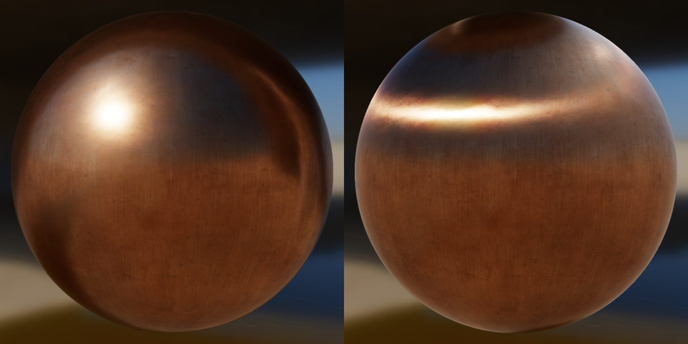
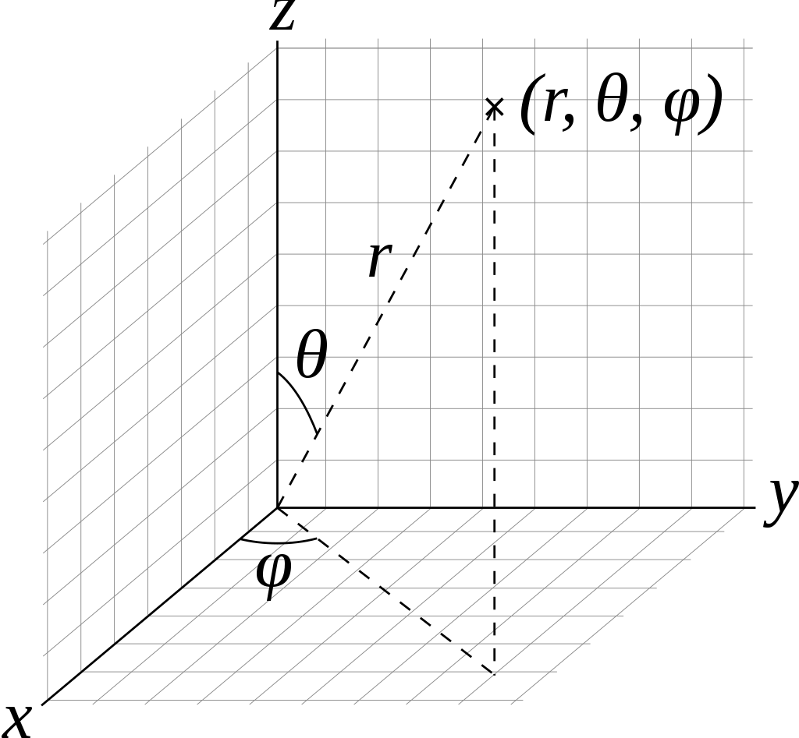

# Shading Model
着色模型（shading model）描述的是材质表面对光线的作用，它的输入是光线、入射角、反射角、材质的属性（例如粗糙度、金属度等），输出是材质的颜色。前面提到的BRDF模型就是shading model的一种，但是BRDF模型过于简单，很多复杂的物理现象无法描述。本文将接着BRDF继续介绍一些更复杂的shading model，以及UE4和Disney的实现。
## 理论
主要介绍对各向异性、次表面、清漆和布料几种物理现象的shading model。
### Anisotropy

左：各向同性金属球；右：各向异性金属球。图片来源：Filament文档。

将各向同性的shading model拓展到各向异性，需要解决两个问题，

1. 需要引入哪些新的参数来描述各向异性？
2. 需要在原有BRDF模型的基础上修改公式的哪些部分来描述各向异性？

对于第一个问题，既然是“各向”异性，必然要分别定义各个方向上的差异的属性，这里的属性一般是粗糙度。方向一般在切平面上选取两个轴，即tangent方向和bitagent方向，他们与normal方向共通构成一组正交基底（TBN坐标系）。对于需要精细控制切平面方向的模型，比如头发，会单独提供切向贴图，指明切向方向，类似于法向贴图。其他情况一般由系统（shader）确定切向方向。所以总结下来，需要额外增加一个参数，将原有的粗糙度替换为tangent和bitangent方向的粗糙度（记为$\alpha_t,\alpha_b$或$\alpha_x,\alpha_y$）。

实际操作中，一般是增加一个`anisotropy`各向异性参数，然后用粗糙度$\alpha$（$\alpha = roughness * roughness$）和`anisotropy`计算tangent/bitangent两个方向上的粗糙度，具体的映射方法有很多。

- Neubelt and Pettine

$$
\begin{aligned}
\alpha_x & = \alpha \\
\alpha_y & = lerp(0, \alpha, 1-anisotropy)
\end{aligned}
$$

- Burley

$$
\begin{aligned}
\alpha_x & = \frac{\alpha}{\sqrt{1-0.9\times anisotropy}} \\
\alpha_y & = \alpha\sqrt{1-0.9\times anisotropy}
\end{aligned}
$$

- Kulla

$$
\begin{aligned}
\alpha_x & = \alpha \times (1+anisotropy) \\
\alpha_y & = \alpha \times (1-anisotropy)
\end{aligned}
$$

对于第二个问题，BRDF公式取决于三个部分，法向分布函数$D$，遮挡项$G$，和表示微观BRDF的菲涅尔项$F$。其中$F$肯定是不会变的，因为各向异性是宏观的现象，不会影响微观表面的性质。至于$D$和$G$，由于$G$都是从$D$推导出来的，因此我们先看一下$D$需要作出怎样的修改。

#### 形状不变性
法向分布函数$D$的形状不变性指的是这样一种特性，改变$D$的粗糙度系数相当于对微表面进行拉伸，而不改变微表面的形状。

要说明白形状不变性，我们引入一个新的函数$P^{22}(x_{\tilde{m}},y_{\tilde{m}})$，描述微表面的法向量${\bf{m}}$的2D斜率分布。其中，${\bf{m}}=(x_m,y_m,z_m)$并且

$$
\begin{aligned}
(x_{\tilde{m}},y_{\tilde{m}}) & =(-\frac{x_m}{z_m},-\frac{y_m}{z_m}) = -\tan\theta_m(\cos\phi_m, \sin\phi_m)\\
{\bf{m}} & =\frac{(-x_{\tilde{m}},-y_{\tilde{m}},1)}{\sqrt{x_{\tilde{m}}^2+y_{\tilde{m}}^2+1}}
\end{aligned}
$$

${\bf{m}}$的球坐标系坐标为$(1,\theta,\phi)$，如下图所示。



既然是分布函数，$P^{22}(x_{\tilde{m}},y_{\tilde{m}})$满足：

$$
\int^\infty_{-\infty}\int^\infty_{-\infty}P^{22}(x_{\tilde{m}},y_{\tilde{m}})dx_{\tilde{m}}dy_{\tilde{m}}=1
$$

并且$P^{22}(x_{\tilde{m}},y_{\tilde{m}})$与$D$的关系为：

$$
D({\bf{m}})=\frac{\chi^+({\bf{n}},{\bf{m}})}{\cos^4\theta_m}P^{22}(x_{\tilde{m}},y_{\tilde{m}})=\frac{\chi^+({\bf{n}},{\bf{m}})}{({\bf{n}}\cdot{\bf{m}})^4}P^{22}(x_{\tilde{m}},y_{\tilde{m}})
$$

考虑到$P^{22}(x_{\tilde{m}},y_{\tilde{m}})$同时也是粗糙度$\alpha$的函数，因此可以写为$P^{22}(x_{\tilde{m}},y_{\tilde{m}},\alpha)$。

满足形状不变性的法向分布函数，它的$P^{22}(x_{\tilde{m}},y_{\tilde{m}},\alpha)$符合这种形式：

$$
\begin{aligned}
P^{22}(x_{\tilde{m}},y_{\tilde{m}},\alpha) & =\frac{1}{\alpha^2}f\left(\frac{\sqrt{x_{\tilde{m}}^2+y_{\tilde{m}}^2}}{\alpha}\right)=\frac{1}{\alpha^2}f\left(\frac{\tan\theta_m}{\alpha}\right) \\
& = \frac{1}{\alpha^2}f\left(\frac{\sqrt{1-({\bf{n}}\cdot{\bf{m}})^2}}{\alpha({\bf{n}}\cdot{\bf{m}})}\right) \\
D({\bf{m}}) & =\frac{\chi^+({\bf{n}},{\bf{m}})}{({\bf{n}}\cdot{\bf{m}})^4}P^{22}(x_{\tilde{m}},y_{\tilde{m}})=\frac{\chi^+({\bf{n}},{\bf{m}})}{\alpha^2({\bf{n}}\cdot{\bf{m}})^4}f\left(\frac{\tan\theta_m}{\alpha}\right) \\
& = \frac{\chi^+({\bf{n}},{\bf{m}})}{\alpha^2({\bf{n}}\cdot{\bf{m}})^4}f\left(\frac{\sqrt{1-({\bf{n}}\cdot{\bf{m}})^2}}{\alpha({\bf{n}}\cdot{\bf{m}})}\right)
\end{aligned}
$$

对于任意大于零的实数$\lambda$，有：

$$
P^{22}(x_{\tilde{m}},y_{\tilde{m}},\alpha)=\frac{1}{\lambda^2}P^{22}(\frac{x_{\tilde{m}}}{\lambda},\frac{y_{\tilde{m}}}{\lambda},\frac{\alpha}{\lambda})
$$

也就是说，改变粗糙度仅相当于对$P^{22}(x_{\tilde{m}},y_{\tilde{m}},\alpha)$进行拉伸。

前面提到的三种法向分布函数：Beckmann、BlinnPhong和GGX，只有BlinnPhong不满足形状不变性。推广的GTR公式也同样不满足形状不变性。

#### 各向异性D和G
对于具有形状不变性性质的法向分布函数$D$，它的形式变为：

$$
D({\bf{m}}) =\frac{\chi^+({\bf{n}},{\bf{m}})}{\alpha_x\alpha_y({\bf{n}}\cdot{\bf{m}})^4}f\left(\frac{\sqrt{\frac{({\bf{t}}\cdot{\bf{m}})^2}{\alpha_x^2}+\frac{({\bf{b}}\cdot{\bf{m}})^2}{\alpha_y^2}}}{({\bf{n}}\cdot{\bf{m}})}\right)
$$

相应的遮挡项$G$，只需要改变$\Lambda({\bf{s}})$中的变量$c$：

$$
c = \frac{{\bf{n}}\cdot{\bf{s}}}{\sqrt{\alpha_x^2({\bf{t}}\cdot{\bf{s}})^2+\alpha_y^2({\bf{b}}\cdot{\bf{s}})^2}}
$$

这里的${\bf{s}}$可以是入射光线${\bf{l}}$，也可以是出射光线${\bf{v}}$。

有了一般的推广形式，我们将其应用到具有形状不变性的Beckmann和GGX模型上，有：

$$
\begin{aligned}
D_{Beckmann}({\bf{h}}, \alpha_x, \alpha_y) & = \frac{\chi^+({\bf{n}},{\bf{h}})}{\pi\alpha_x\alpha_y({\bf{n}}\cdot{\bf{h}})^4}\exp\left(-{\frac{\frac{({\bf{t}}\cdot{\bf{h}})^2}{\alpha_x^2}+\frac{({\bf{b}}\cdot{\bf{h}})^2}{\alpha_y^2}}{({\bf{n}}\cdot{\bf{h}})^2}}\right) \\
D_{GGX}({\bf{h}}, \alpha_x, \alpha_y) & = \frac{\chi^+({\bf{n}},{\bf{h}})}{\pi\alpha_x\alpha_y\left(\frac{({\bf{t}}\cdot{\bf{h}})^2}{\alpha_x^2}+\frac{({\bf{b}}\cdot{\bf{h}})^2}{\alpha_y^2}+({\bf{n}}\cdot{\bf{h}})^2\right)^2}
\end{aligned}
$$

### Clear Coat
Clear Coat模型是多层材质的一种最简单的形式。
### Subsurface

公式：

$$
\begin{aligned}
f_{ss}({\bf{l}},{\bf{v}}) & = \frac{1.25}{\pi}(F_{Subsurface}(\frac{1}{{\bf{n}}\cdot{\bf{l}}+{\bf{n}}\cdot{\bf{v}}}-0.5)+0.5) \\
F_{Subsurface} & = F_{Schlick}({\bf{n}},{\bf{l}},1,f_{90})F_{Schlick}({\bf{n}},{\bf{v}},1,f_{90})\\
F_{Schlick}({\bf{n}},{\bf{l}},f_0,f_{90}) & = f_0+(f_{90}-f_0)(1-({\bf{n}}\cdot{\bf{l}}))^5 \\
f_{90} & = roughness\cdot({\bf{n}}\cdot{\bf{h}})^2
\end{aligned}
$$

### Cloth
公式

$$
\begin{aligned}
G_{Cloth} & =\frac{1}{4*({\bf{n}}\cdot{\bf{v}}+{\bf{n}}\cdot{\bf{l}}-({\bf{n}}\cdot{\bf{v}})({\bf{n}}\cdot{\bf{l}}))} \\
D_{Charlie} & = \frac{(2+\frac{1}{\alpha})\sin^{\frac{1}{\alpha}}\theta}{2\pi}\\
D_{Ashikhmin} & = \frac{1}{\pi(1+4\alpha^2)}\left(1+4\frac{\exp\left(\frac{-\cot^2\theta}{\alpha^2}\right)}{\sin^4\theta}\right) \\
D_{AshikhminApprox} & = \frac{1}{\pi(1+4\alpha^2)}\left(1+\frac{4\alpha^4}{(\cos^2\theta+\alpha^2\sin^2\theta)^2}\right) 
\end{aligned}
$$

其中，$\theta$是${\bf{n}}$和${\bf{h}}$的夹角；

## 实现
着色模型（Shading model）指的是材质如何对入射光线做出反应，可以理解为从入射光线到出射光线的映射函数。前面介绍的[BRDF理论](https://blog.csdn.net/u010281174/article/details/107583637)也是shading model的一部分。除了BRDF，还有BSDF、BTDF模型，统称为BxDF。BxDF的公式的选取决定了shading model的效果。这一节我们将讨论主流的渲染引擎、方法都采用了哪些shading model，以及他们的具体实现是什么。

### UE4
UE4一共支持了13种不同的shading model，用到了9中不同的BxDF model：

- Unlit
- Default Lit
- Subsurface
- Preintegrated Skin
- Clear Coat
- Subsurface Profile
- Two Sided Foliage
- Hair
- Cloth
- Eye
- SingleLayerWater
- Thin Translucent
- From Material Expression


shading model的设置在Material里（如上图），shader层面的控制在文件`Engine\Shaders\Private\ShadingModels.ush`的`IntegrateBxDF`函数里：

```C++
FDirectLighting IntegrateBxDF( FGBufferData GBuffer, half3 N, half3 V, half3 L, float Falloff, float NoL, FAreaLight AreaLight, FShadowTerms Shadow )
{
	switch( GBuffer.ShadingModelID )
	{
		case SHADINGMODELID_DEFAULT_LIT:
		case SHADINGMODELID_SINGLELAYERWATER:
		case SHADINGMODELID_THIN_TRANSLUCENT:
			return DefaultLitBxDF( GBuffer, N, V, L, Falloff, NoL, AreaLight, Shadow );
		case SHADINGMODELID_SUBSURFACE:
			return SubsurfaceBxDF( GBuffer, N, V, L, Falloff, NoL, AreaLight, Shadow );
		case SHADINGMODELID_PREINTEGRATED_SKIN:
			return PreintegratedSkinBxDF( GBuffer, N, V, L, Falloff, NoL, AreaLight, Shadow );
		case SHADINGMODELID_CLEAR_COAT:
			return ClearCoatBxDF( GBuffer, N, V, L, Falloff, NoL, AreaLight, Shadow );
		case SHADINGMODELID_SUBSURFACE_PROFILE:
			return SubsurfaceProfileBxDF( GBuffer, N, V, L, Falloff, NoL, AreaLight, Shadow );
		case SHADINGMODELID_TWOSIDED_FOLIAGE:
			return TwoSidedBxDF( GBuffer, N, V, L, Falloff, NoL, AreaLight, Shadow );
		case SHADINGMODELID_HAIR:
			return HairBxDF( GBuffer, N, V, L, Falloff, NoL, AreaLight, Shadow );
		case SHADINGMODELID_CLOTH:
			return ClothBxDF( GBuffer, N, V, L, Falloff, NoL, AreaLight, Shadow );
		case SHADINGMODELID_EYE:
			return EyeBxDF( GBuffer, N, V, L, Falloff, NoL, AreaLight, Shadow );
		default:
			return (FDirectLighting)0;
	}
}
```

其中的`GBuffer.ShadingModelID`记录当前材质的shading model类型，接下来具体看一下UE支持的这些模型。

#### Default Lit
Default lit是最常用的标准shading model，能够处理基础的直接光照、间接光照，它包含以下参数：

- Base Color
- Metallic
- Specular
- Roughness
- Emissive Color
- Normal
- Ambient Occlusion
<!-- - World Position Offset
- Pixel Depth Offset -->

代码实现如下。UE4的Default Lit模型采用的是Lambert作为Diffuse项，法向分布函数GGX、遮挡项SmithJoint和菲涅尔项Schlick组合成为Specular项。

```C++
FDirectLighting DefaultLitBxDF( FGBufferData GBuffer, half3 N, half3 V, half3 L, float Falloff, float NoL, FAreaLight AreaLight, FShadowTerms Shadow )
{
    // Prepare BxDFContext Context;
    // ...

	FDirectLighting Lighting;
	Lighting.Diffuse  = AreaLight.FalloffColor * (Falloff * NoL) * Diffuse_Lambert( GBuffer.DiffuseColor );

	if( AreaLight.bIsRect )
		Lighting.Specular = RectGGXApproxLTC( GBuffer.Roughness, GBuffer.SpecularColor, N, V, AreaLight.Rect, AreaLight.Texture );
	else
		Lighting.Specular = AreaLight.FalloffColor * (Falloff * NoL) * SpecularGGX( GBuffer.Roughness, GBuffer.Anisotropy, GBuffer.SpecularColor, Context, NoL, AreaLight );

	Lighting.Transmission = 0;
	return Lighting;
}
```

```C++
float3 Diffuse_Lambert( float3 DiffuseColor )
{
	return DiffuseColor * (1 / PI);
}
float3 SpecularGGX( float Roughness, float3 SpecularColor, BxDFContext Context, float NoL, FAreaLight AreaLight )
{
	float a2 = Pow4( Roughness );
	float Energy = EnergyNormalization( a2, Context.VoH, AreaLight );
	
	// Generalized microfacet specular
	float D = D_GGX( a2, Context.NoH ) * Energy;
	float Vis = Vis_SmithJointApprox( a2, Context.NoV, NoL );
	float3 F = F_Schlick( SpecularColor, Context.VoH );

	return (D * Vis) * F;
}
// GGX / Trowbridge-Reitz
// [Walter et al. 2007, "Microfacet models for refraction through rough surfaces"]
float D_GGX( float a2, float NoH )
{
	float d = ( NoH * a2 - NoH ) * NoH + 1;	// 2 mad
	return a2 / ( PI*d*d );					// 4 mul, 1 rcp
}
// Appoximation of joint Smith term for GGX
// [Heitz 2014, "Understanding the Masking-Shadowing Function in Microfacet-Based BRDFs"]
float Vis_SmithJointApprox( float a2, float NoV, float NoL )
{
	float a = sqrt(a2);
	float Vis_SmithV = NoL * ( NoV * ( 1 - a ) + a );
	float Vis_SmithL = NoV * ( NoL * ( 1 - a ) + a );
	return 0.5 * rcp( Vis_SmithV + Vis_SmithL );
}
// [Schlick 1994, "An Inexpensive BRDF Model for Physically-Based Rendering"]
float3 F_Schlick( float3 SpecularColor, float VoH )
{
	float Fc = Pow5( 1 - VoH );					// 1 sub, 3 mul
	//return Fc + (1 - Fc) * SpecularColor;		// 1 add, 3 mad
    
	// Anything less than 2% is physically impossible and is instead considered to be shadowing
	return saturate( 50.0 * SpecularColor.g ) * Fc + (1 - Fc) * SpecularColor;
	
}

```

#### Subsurface
Subsurface model是用来模拟次表面散射现象（subsurface scattering）的模型。次表面散射现象指的是光线穿过材质表面进入材质内部，多次反射后再折射出去的现象，这个物理过程会使得物体看起来有通透感，比如冰川、皮肤等。具体实现上，它依赖于`subsurface color`参数来控制。

- Base Color
- Metallic
- Specular
- Roughness
- Emissive Color
- Opacity
- Normal
- Subsurface Color
- Ambient Occlusion
<!-- - World Position Offset
- Pixel Depth Offset -->


#### Preintegrated Skin
Preintegrated skin模型是Subsurface model在皮肤染情况下的特化，效果类似但是效率更高。参数与Subsurface model一致，不再列举。

#### Clear Coat
Clear coat模型用来模拟表面带有一层半透明薄膜的多层材质。例如汽车的喷漆、可乐瓶等。

- Base Color
- Metallic
- Specular
- Roughness
- Emissive Color
- Normal
- Ambient Occlusion
- Clear Coat
- Clear Coat Roughness

#### Subsurface Profile
Subsurface Profile也是用于渲染皮肤的模型，是Preintegrated Skin模型的加强版，效果更佳真实。

#### Two Sided Foliage
Two Sided Foliage用于渲染较薄的次表面散射材质，例如树叶、花瓣等。它可以模拟光线穿过材质的效果，比Subsurface model更真实。

- Base Color
- Metallic
- Specular
- Roughness
- Emissive Color
- Normal
- Ambient Occlusion
- Subsurface Color


#### Hair
Hair模型用于模拟毛发的渲染效果。

- Base Color
- Scatter
- Specular
- Roughness
- Emissive Color
- Tangent
- Ambient Occlusion
- Backlit
<!-- World Position Offset
Pixel Depth Offset -->


#### Cloth
Cloth模型用于模拟布料效果，特别是布料表面的“绒毛”层。

- Base Color
- Metallic
- Specular
- Roughness
- Emissive Color
- Opacity
- Normal
- Fuzz Color
- Cloth
- Ambient Occlusion
<!-- World Position Offset
Pixel Depth Offset -->

#### Eye
Eye模型用于模拟眼睛的表面，这是一个非常精细、专业的模型。相应的，加入了控制虹膜的参数。

- Base Color
- Metallic
- Specular
- Roughness
- Emissive Color
- Opacity
- Normal
- Ambient Occlusion
- Iris Mask
- Iris Distance
<!-- World Position Offset
Pixel Depth Offset -->

#### others
上面列出的9种shading model，都有对应的BxDF公式。除此之外，还有其他的一些简化模型，这些模型没有单独的BxDF算法，但是也有比较重要的应用场景，因此也被归为shading model。

##### Unlit
Unlit model严格来说不是对入射光线的映射函数，它只有一个参数——

- emissive color

即自发光。通常它是用来展示火焰或者发光体的特效的模型。

##### SingleLayerWater
SingleLayerWater模型用于模拟透明水面的效果，降低使用透明模式混合的开销和复杂度。SingleLayerWater模型与Default Lit模型公用同一套BxDF公式，它的参数比Default Lit多两个：

- Opacity
- Refraction

##### Thin Translucent
Thin Translucent模型用于模拟基于物理原理的半透明材质，能够更真实地还原高光和背景色。Thin Translucent模型与Default Lit模型公用同一套BxDF公式，它的参数比Default Lit多一个：

- Opacity

##### From Material Expression
From Material Expression模型可以将多个shading model合并到单个材质中，

### Disney
Disney对shading model的需求是，不一定严格物理正确，但是要对艺术家直观。Disney设计的原则是：

- 应使用直观的参数，而不是物理类的晦涩参数；
- 参数应尽可能少；
- 参数在其合理范围内应该为0到1；
- 允许参数在有意义时超出正常的合理范围；
- 所有参数组合应尽可能健壮和合理；

Disney同样使用了metallic-roughness模型。

#### Principled BRDF
Disney的Principled BRDF模型包含以下十一个参数，它其实涵盖了UE4的多个shading model。

- baseColor：向量，基础颜色。
- metallic：标量，0表示电介质，1表示金属。
- roughness：标量，粗糙度。
- anisotropic：标量，各向异性程度，0表示各向同性，1表示最大各向异性。
- specular：标量，入射镜面反射量，用于取代折射率。
- specularTint：标量，镜面反射颜色，利用该变量和baseColor可以控制镜面反射颜色。
- subsurface：标量，使用次表面近似控制漫反射形状。
- sheen：标量，光泽度，布料的属性。
- sheenTint：标量，光泽颜色，布料的属性。
- clearcoat：标量，clearCoat的属性。
- clearcoatGloss：标量，clearCoat的属性。

可以看出，Disney将所有的参数都集中在一个模型里面了。我们直接从[源码](https://github.com/wdas/brdf/blob/main/src/brdfs/disney.brdf)分析他们的使用。

准备工作：

```C++
vec3 mon2lin(vec3 x)
{
    return vec3(pow(x[0], 2.2), pow(x[1], 2.2), pow(x[2], 2.2));
}

vec3 BRDF( vec3 L, vec3 V, vec3 N, vec3 X, vec3 Y )
{
    float NdotL = dot(N,L);
    float NdotV = dot(N,V);
    if (NdotL < 0 || NdotV < 0) return vec3(0);

    vec3 H = normalize(L+V);
    float NdotH = dot(N,H);
    float LdotH = dot(L,H);

    vec3 Cdlin = mon2lin(baseColor);
    float Cdlum = .3*Cdlin[0] + .6*Cdlin[1]  + .1*Cdlin[2]; // luminance approx.

    vec3 Ctint = Cdlum > 0 ? Cdlin/Cdlum : vec3(1); // normalize lum. to isolate hue+sat
    vec3 Cspec0 = mix(specular*.08*mix(vec3(1), Ctint, specularTint), Cdlin, metallic);
    vec3 Csheen = mix(vec3(1), Ctint, sheenTint);

	// diffuse

	// subsurface

	// specular

	// sheen

	// clearcoat

    return ((1/PI) * mix(Fd, ss, subsurface)*Cdlin + Fsheen)
        * (1-metallic)
        + Gs*Fs*Ds + .25*clearcoat*Gr*Fr*Dr;
}
```
##### Diffuse
Diffuse部分用的是Disney自己的模型，考虑到了入射角度、出射角度和粗糙度的影响。
```C++
float SchlickFresnel(float u)
{
    float m = clamp(1-u, 0, 1);
    float m2 = m*m;
    return m2*m2*m; // pow(m,5)
}

vec3 BRDF( vec3 L, vec3 V, vec3 N, vec3 X, vec3 Y )
{
	//....
    // Diffuse fresnel - go from 1 at normal incidence to .5 at grazing
    // and mix in diffuse retro-reflection based on roughness
    float FL = SchlickFresnel(NdotL);
	float FV = SchlickFresnel(NdotV);
    float Fd90 = 0.5 + 2 * LdotH*LdotH * roughness;
    float Fd = mix(1.0, Fd90, FL) * mix(1.0, Fd90, FV);
	// ...
}
```

##### Specular
Specular部分分别采用了法向分布函数GGX、遮挡项SmithGGX、菲涅尔项Schlick，并且直接计算的是各向异性的结果。
```C++
float GTR2_aniso(float NdotH, float HdotX, float HdotY, float ax, float ay)
{
    return 1 / (PI * ax*ay * sqr( sqr(HdotX/ax) + sqr(HdotY/ay) + NdotH*NdotH ));
}

float smithG_GGX_aniso(float NdotV, float VdotX, float VdotY, float ax, float ay)
{
    return 1 / (NdotV + sqrt( sqr(VdotX*ax) + sqr(VdotY*ay) + sqr(NdotV) ));
}

vec3 BRDF( vec3 L, vec3 V, vec3 N, vec3 X, vec3 Y )
{
	//....
    // specular
    float aspect = sqrt(1-anisotropic*.9);
    float ax = max(.001, sqr(roughness)/aspect);
    float ay = max(.001, sqr(roughness)*aspect);
    float Ds = GTR2_aniso(NdotH, dot(H, X), dot(H, Y), ax, ay);
    float FH = SchlickFresnel(LdotH);
    vec3 Fs = mix(Cspec0, vec3(1), FH);
    float Gs;
    Gs  = smithG_GGX_aniso(NdotL, dot(L, X), dot(L, Y), ax, ay);
    Gs *= smithG_GGX_aniso(NdotV, dot(V, X), dot(V, Y), ax, ay);
	// ...
}
```

##### Subsurface
次表面散射项的计算公式与Diffuse类似，除了`F90`用的是`LdotH*LdotH*roughness`。计算出来的`Fss`会经过remapping再跟Diffuse项以系数`subsurface`混合。

```C++
vec3 BRDF( vec3 L, vec3 V, vec3 N, vec3 X, vec3 Y )
{
	//....
    // Based on Hanrahan-Krueger brdf approximation of isotropic bssrdf
    // 1.25 scale is used to (roughly) preserve albedo
    // Fss90 used to "flatten" retroreflection based on roughness
    float Fss90 = LdotH*LdotH*roughness;
    float Fss = mix(1.0, Fss90, FL) * mix(1.0, Fss90, FV);
    float ss = 1.25 * (Fss * (1 / (NdotL + NdotV) - .5) + .5);
	// ...
}
```

##### Sheen
```C++
vec3 BRDF( vec3 L, vec3 V, vec3 N, vec3 X, vec3 Y )
{
	//....
    // sheen
    vec3 Fsheen = FH * sheen * Csheen;
	// ...
}
```

##### ClearCoat
```C++
float GTR1(float NdotH, float a)
{
    if (a >= 1) return 1/PI;
    float a2 = a*a;
    float t = 1 + (a2-1)*NdotH*NdotH;
    return (a2-1) / (PI*log(a2)*t);
}

vec3 BRDF( vec3 L, vec3 V, vec3 N, vec3 X, vec3 Y )
{
	//....
    // clearcoat (ior = 1.5 -> F0 = 0.04)
    float Dr = GTR1(NdotH, mix(.1,.001,clearcoatGloss));
    float Fr = mix(.04, 1.0, FH);
    float Gr = smithG_GGX(NdotL, .25) * smithG_GGX(NdotV, .25);
	// ...
}
```

## 对比
对比UE4和Disney的shading model，一个最直观的差异在于，UE4将各种不同类型的shading model分开处理了，每个shading model只包含相应的模型和参数，因此UE4的shading model很多，而且每个模型的参数比较精简，比如default lit就是标准的brdf，没有subsurface，没有cloth等等参数；而disney的Principled brdf就囊括了subsurface、cloth等一系列参数在内，一共11个参数，很冗余但是表现力强。

我理解这些差异都是源于UE4和disney应用场景的不同，UE4希望每个模型尽可能高效，因此会拆分开来，针对性优化，比如它单独设计了针对眼睛的Eye模型，专门渲染毛发的Hair模型，专门渲染皮肤的subsurface模型等等。而Disney的诉求在于希望设计师充分发挥，因此他们的模型参数要尽可能易懂，方便设计师调试。


## Reference
[1] [UE4 Documentation](https://docs.unrealengine.com/en-US/Engine/Rendering/Materials/MaterialProperties/LightingModels/index.html)

